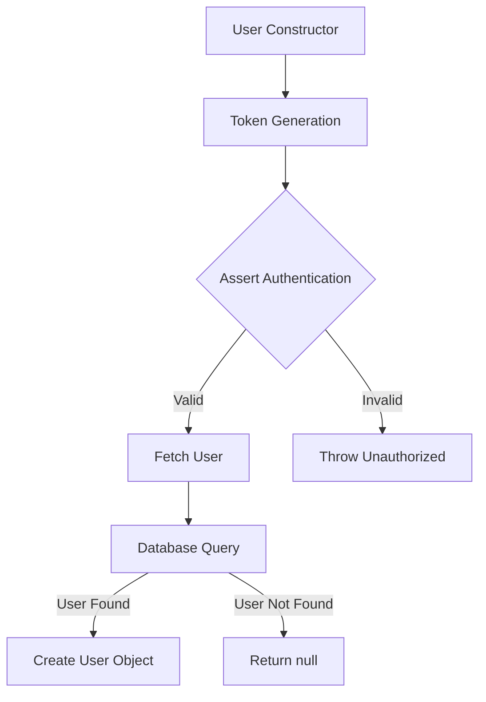
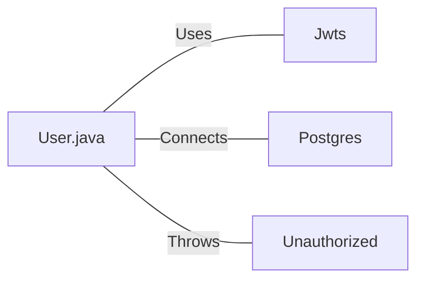

# User.java: User Authentication and Database Interaction

## Overview

This Java class, `User`, handles user authentication, token generation, and database interactions for user retrieval. It includes methods for creating JWT tokens, validating authentication, and fetching user data from a PostgreSQL database.

## Process Flow

## Insights

- The class uses JWT (JSON Web Tokens) for authentication.
- Database queries are constructed using string concatenation, which is a security risk.
- The `fetch` method retrieves user data from a PostgreSQL database.
- Error handling is implemented, but exceptions are printed to standard error.
- The class uses a custom `Unauthorized` exception for authentication failures.

## Dependencies

- `Jwts`: Used for JWT token generation and parsing
- `Postgres`: Provides database connection (assumed to be a custom class)
- `Unauthorized`: Custom exception class for authentication failures (not shown in the provided code)

## Data Manipulation (SQL)

| Entity | Attributes | Data Type | Description |
|--------|------------|-----------|-------------|
| users  | user_id    | String    | Unique identifier for the user |
|        | username   | String    | User's username |
|        | password   | String    | User's hashed password |

`users`: SELECT operation to fetch user data based on the provided username

## Vulnerabilities

1. SQL Injection: The `fetch` method constructs the SQL query using string concatenation with user input (`un`), making it vulnerable to SQL injection attacks. An attacker could manipulate the `un` parameter to execute arbitrary SQL commands.

2. Insecure Password Storage: The `hashedPassword` field suggests that passwords might be stored as hashes, but the implementation details are not visible. Ensure that a secure hashing algorithm with salt is used.

3. Exception Handling: Exceptions are printed to standard error, which might leak sensitive information in production environments.

4. Token Security: The JWT token generation uses HMAC-SHA, but the key size is not specified. Ensure that a sufficiently large key size is used (at least 256 bits for HMAC-SHA256).

5. Database Connection Management: The database connection is closed in the `try` block, which might not execute if an exception occurs. Consider using try-with-resources or closing the connection in a `finally` block.

6. Hardcoded Database Credentials: The `Postgres.connection()` method likely contains hardcoded database credentials, which is a security risk. Consider using environment variables or a secure configuration management system.

7. Lack of Input Validation: There's no visible input validation for the `username` parameter in the `fetch` method, which could lead to various security issues.

To address these vulnerabilities, implement prepared statements for database queries, use secure password hashing algorithms, improve exception handling, ensure proper key management for JWT tokens, and add input validation for all user-supplied data.
