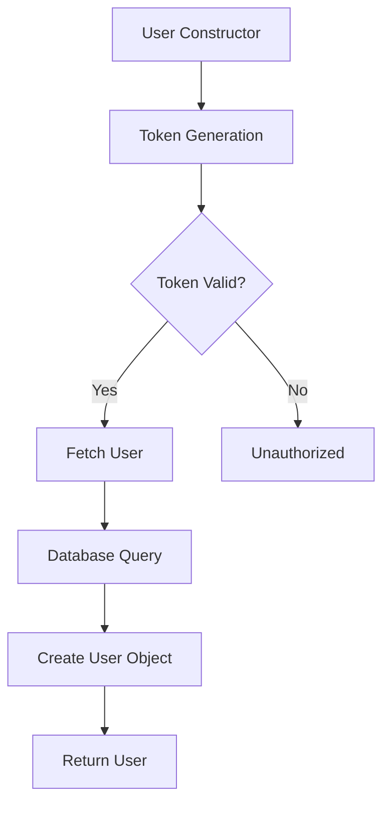
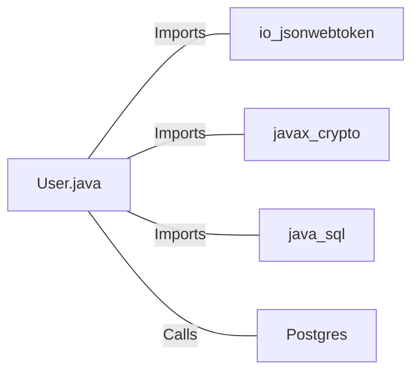

# User.java: User Authentication and Management

## Overview

This Java class, `User`, is responsible for user authentication, token generation, and database operations related to user management. It includes methods for creating user objects, generating JWT tokens, validating tokens, and fetching user data from a database.

## Process Flow

## Insights

- The class uses JWT (JSON Web Tokens) for authentication.
- User data is stored in a PostgreSQL database.
- The `fetch` method uses a prepared statement to prevent SQL injection.
- Token generation and validation use HMAC-SHA256 algorithm.
- Database connection is closed in a finally block to ensure proper resource management.

## Dependencies

- `io.jsonwebtoken`: Used for JWT token generation and parsing
- `javax.crypto.SecretKey`: Used for cryptographic key generation
- `java.sql`: Used for database operations
- `Postgres`: Custom class used to establish database connection

## Data Manipulation (SQL)

| Entity | Operation | Description |
|--------|-----------|-------------|
| `users` | SELECT | Fetches user data based on the provided username |

Table structure for `users`:

| Column Name | Data Type | Description |
|-------------|-----------|-------------|
| user_id | String | Unique identifier for the user |
| username | String | User's username |
| password | String | User's hashed password |

## Vulnerabilities

1. **Insecure Secret Handling**: The `token` and `assertAuth` methods use the provided secret directly as bytes, which may lead to weak keys if the secret is not properly generated or managed.

2. **Exception Handling**: The `fetch` method catches all exceptions and prints the stack trace, which might expose sensitive information in production environments.

3. **Token Expiration**: The generated JWT tokens do not include an expiration time, which could lead to tokens being valid indefinitely if not properly managed.

4. **Password Storage**: The `hashedPassword` field suggests that passwords might be stored as hashes, but the implementation details are not visible. Ensure that a strong, salted hashing algorithm is used.

5. **SQL Injection Protection**: While prepared statements are used, which is good, the query string is printed to the console, potentially exposing sensitive information.

6. **Error Messages**: The `Unauthorized` exception includes the error message from the JWT parsing, which might provide too much information to potential attackers.

7. **Database Connection Management**: While the connection is closed in a finally block, which is good practice, consider using try-with-resources for more robust resource management.

8. **Lack of Input Validation**: There's no visible input validation for the username when fetching a user, which could potentially lead to unexpected behavior or attacks.
