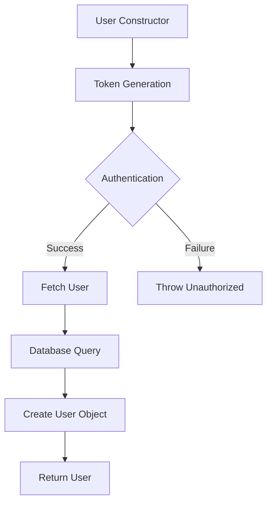
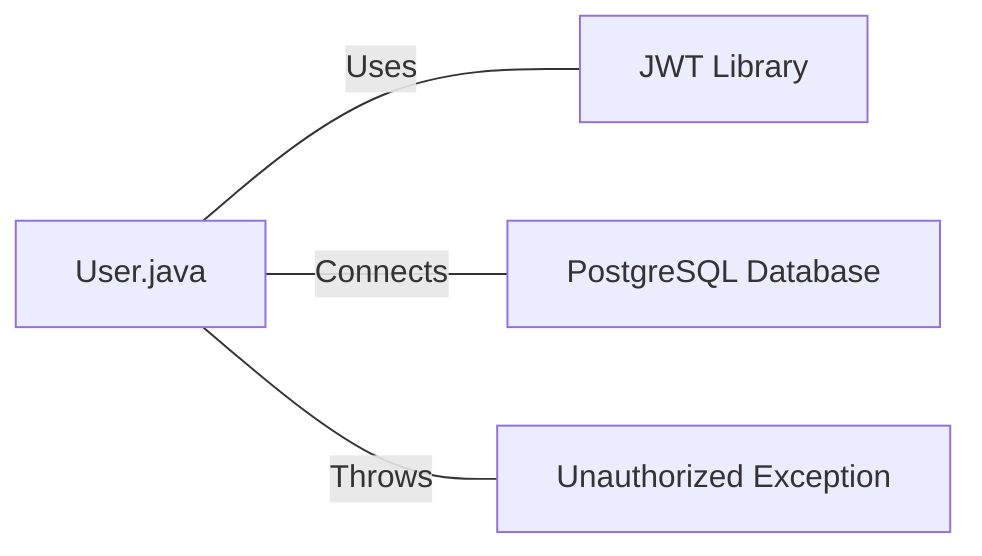

# User.java: User Authentication and Database Interaction

## Overview

This Java class, `User`, handles user authentication, token generation, and database interactions for user retrieval. It includes methods for creating JWT tokens, validating authentication, and fetching user data from a PostgreSQL database.

## Process Flow

## Insights

- The class uses JWT (JSON Web Tokens) for authentication.
- User data is stored in a PostgreSQL database.
- The `fetch` method uses a potentially unsafe SQL query construction.
- Error handling is implemented, but exceptions are printed to standard error.
- The class includes both authentication and data access responsibilities.

## Dependencies

- `jwt`: Uses the `io.jsonwebtoken` library for JWT token generation and parsing.
- `postgres`: Connects to a PostgreSQL database using the `Postgres.connection()` method.
- `unauthorized`: Throws a custom `Unauthorized` exception when authentication fails.

## Data Manipulation (SQL)

| Entity | Operation | Description |
|--------|-----------|-------------|
| `users` | SELECT | Retrieves user information based on the username. The query selects all columns from the `users` table, limiting the result to one row. |

## Vulnerabilities

1. **SQL Injection**: The `fetch` method constructs an SQL query by directly concatenating user input (`un`) into the query string. This is a severe security vulnerability that could allow malicious users to manipulate the query and potentially access or modify unauthorized data.

2. **Insecure Password Storage**: The `hashedPassword` field suggests that passwords might be stored as hashes, but the implementation details are not visible. It's crucial to ensure that passwords are properly hashed and salted before storage.

3. **Exception Handling**: The code prints stack traces to standard error, which could potentially expose sensitive information in production environments.

4. **Token Generation**: The `token` method uses HMAC-SHA for signing, but doesn't specify which SHA algorithm (e.g., SHA-256, SHA-512). It's important to use a secure hashing algorithm.

5. **Hardcoded Database Credentials**: While not visible in this snippet, the `Postgres.connection()` method likely contains hardcoded database credentials, which is a security risk.

6. **Connection Handling**: The database connection is closed in the `try` block, which might not execute if an exception occurs. It should be in a `finally` block or use try-with-resources.

7. **Lack of Prepared Statements**: The code uses a `Statement` instead of a `PreparedStatement`, which is less secure and more prone to SQL injection attacks.

8. **Error Messages**: Detailed error messages are being returned to the client, which could potentially reveal sensitive information about the system architecture or database structure.

These vulnerabilities should be addressed to improve the security of the application.
