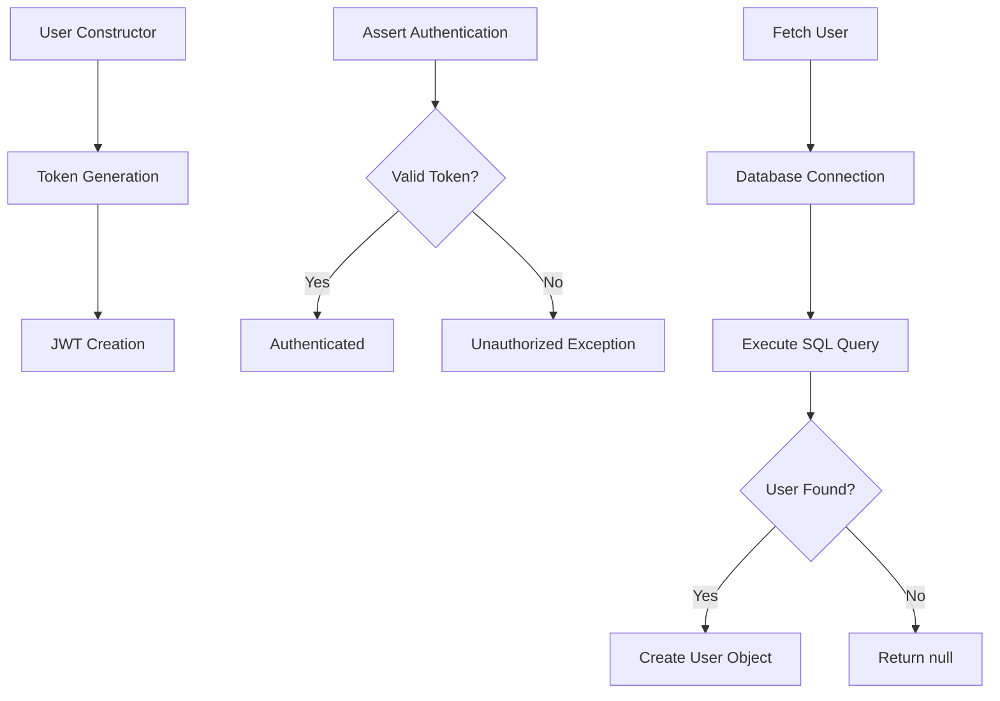
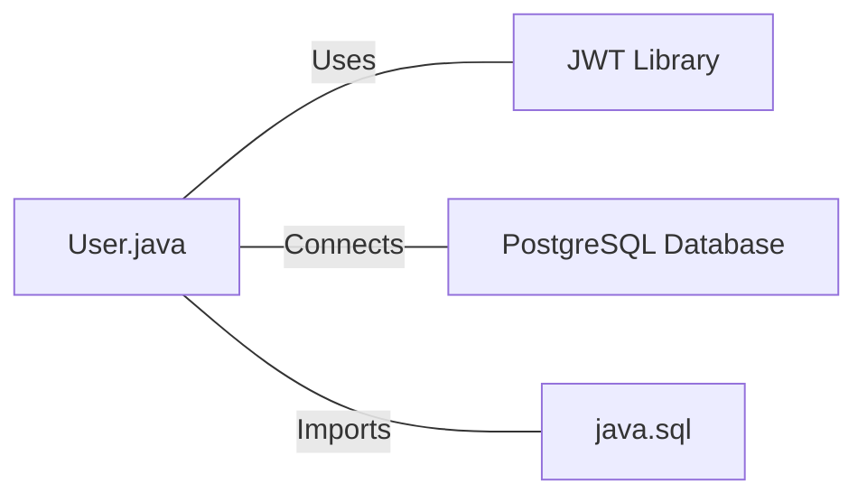

# User.java: User Authentication and Database Interaction

## Overview

This Java class, `User`, handles user authentication, token generation, and database interactions for user retrieval. It includes methods for creating JWT tokens, validating authentication, and fetching user data from a PostgreSQL database.

## Process Flow

## Insights

- The class uses JWT (JSON Web Tokens) for authentication purposes.
- User data is stored in a PostgreSQL database.
- The `fetch` method uses a potentially unsafe SQL query construction.
- Error handling is implemented, but exceptions are printed to standard error.
- The class doesn't include password hashing or verification methods.

## Dependencies

- `JWT Library`: Used for token generation and validation (io.jsonwebtoken package)
- `PostgreSQL Database`: Stores and retrieves user information
- `java.sql`: Provides database connectivity and query execution

## Data Manipulation (SQL)

`users`: SELECT operation to fetch user data based on username

| Column Name | Data Type | Description |
|-------------|-----------|-------------|
| user_id     | String    | Unique identifier for the user |
| username    | String    | User's username |
| password    | String    | User's hashed password |

## Vulnerabilities

1. SQL Injection: The `fetch` method constructs the SQL query by directly concatenating user input (`un`) into the query string. This is a severe security vulnerability that could allow malicious users to manipulate the query and potentially access or modify unauthorized data.

2. Weak Secret Key Handling: The `token` and `assertAuth` methods convert the secret string directly to bytes without proper key derivation. This may result in weak keys if the secret is not sufficiently long or complex.

3. Exception Handling: The `assertAuth` method prints the stack trace of exceptions, which might leak sensitive information in production environments.

4. Plaintext Passwords: The `User` class stores passwords in the `hashedPassword` field, but there's no evidence of actual hashing. Storing plaintext passwords is a significant security risk.

5. Inefficient Database Connection: The `fetch` method opens and closes a database connection for each query, which is inefficient for high-volume applications.

6. Lack of Prepared Statements: The use of string concatenation for SQL queries instead of prepared statements increases vulnerability to SQL injection and reduces query efficiency.

7. Unlimited Token Validity: The generated JWT tokens don't include expiration claims, potentially allowing them to be valid indefinitely.

8. Insecure Error Messages: Detailed error messages from database operations are printed to the console, potentially exposing sensitive information.

These vulnerabilities should be addressed to improve the security and reliability of the application.
