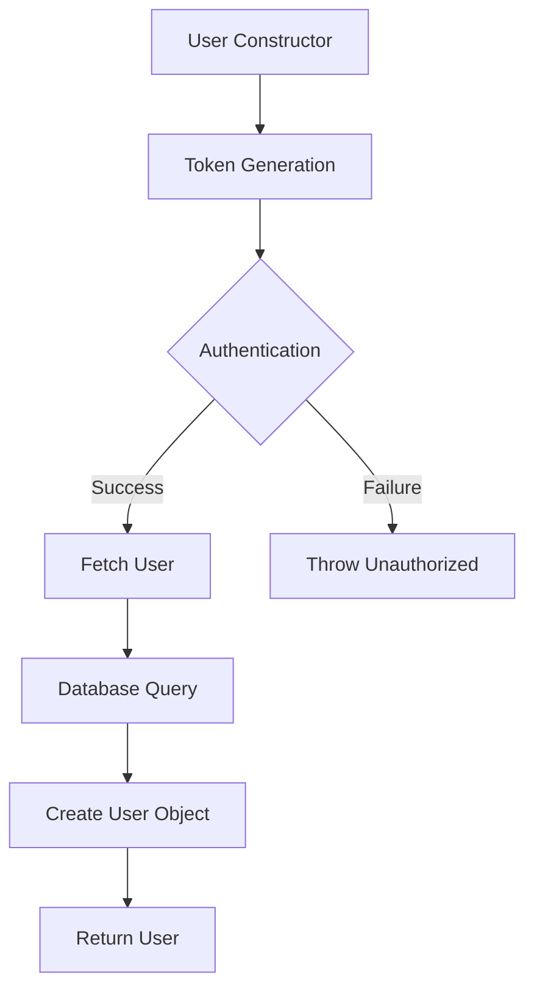
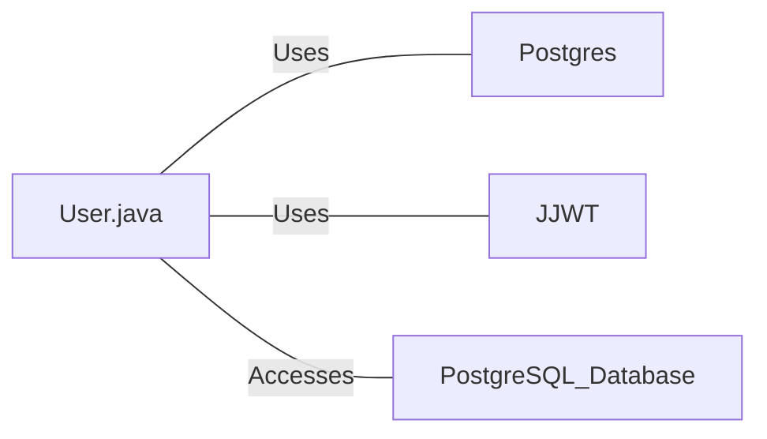

# User.java: User Authentication and Database Interaction

## Overview

This Java class, `User`, handles user authentication, token generation, and database interactions for user retrieval. It includes methods for creating JWT tokens, validating authentication, and fetching user data from a PostgreSQL database.

## Process Flow

## Insights

- The class uses JWT (JSON Web Tokens) for authentication.
- User data is stored in a PostgreSQL database.
- The `fetch` method uses a potentially unsafe SQL query construction.
- Error handling is implemented, but exceptions are printed to standard error.
- The class doesn't handle password hashing or verification directly.

## Dependencies

- `Postgres`: Used for database connection. Likely a custom class for managing PostgreSQL connections.
- `JJWT`: Java JWT library used for token generation and parsing.
- `PostgreSQL_Database`: The database where user information is stored and retrieved.

## Data Manipulation (SQL)

| Entity | Description |
|--------|-------------|
| `users` | SELECT operation to fetch user details based on username |

## Vulnerabilities

1. **SQL Injection**: The `fetch` method constructs the SQL query by directly concatenating the user input (`un`) into the query string. This is a severe security vulnerability that could allow malicious users to manipulate the query and potentially access or modify unauthorized data.

2. **Insecure Error Handling**: The class prints stack traces and error messages to standard output and error streams. This could potentially expose sensitive information in production environments.

3. **Weak Secret Key Handling**: The `token` and `assertAuth` methods convert the secret string directly to bytes for key generation. This approach might not be secure for all types of secrets and could lead to weak keys if the secret is not properly chosen.

4. **Lack of Input Validation**: There's no validation on the input parameters, which could lead to unexpected behavior or security issues.

5. **Inefficient Resource Management**: The database connection in the `fetch` method is closed, but the `Statement` is not explicitly closed, which could lead to resource leaks.

6. **Insecure Password Storage**: While the class stores hashed passwords, there's no indication of salt usage or modern hashing algorithms, which are crucial for secure password storage.

7. **Overly Broad Exception Handling**: The `fetch` method catches all exceptions, which could mask specific errors and make debugging more difficult.
