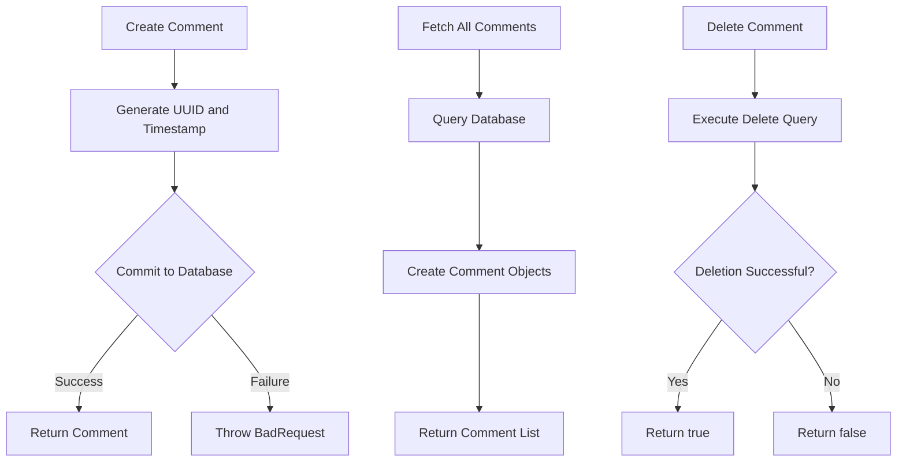
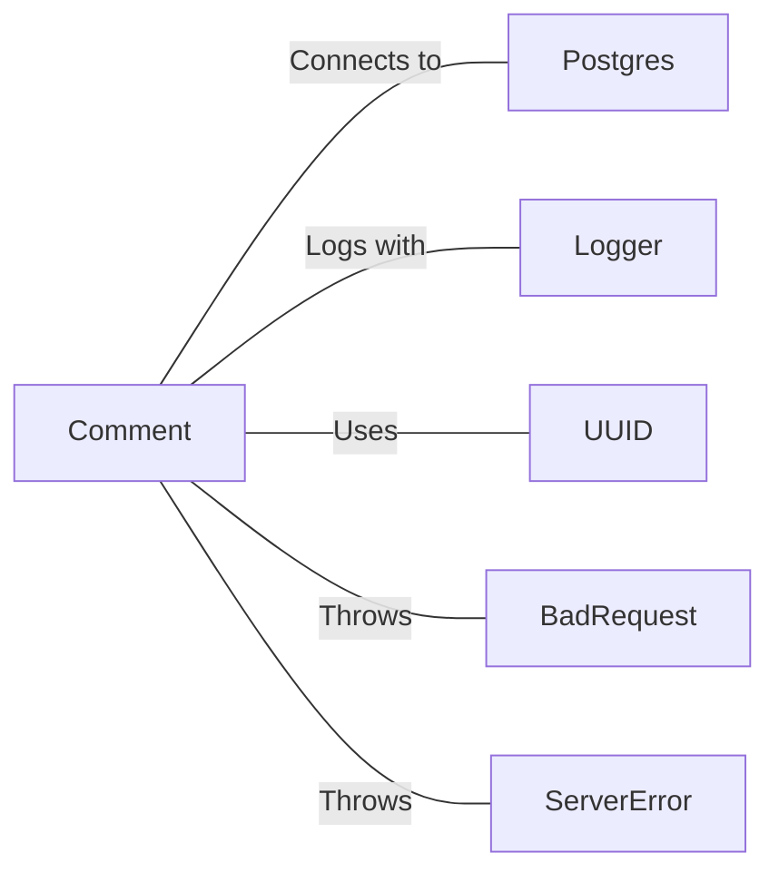

# Comment.java: Comment Management System

## Overview

This Java class, `Comment`, manages comment-related operations including creation, retrieval, and deletion of comments. It interacts with a PostgreSQL database to persist and fetch comment data.

## Process Flow

## Insights

- Uses UUID for generating unique comment IDs
- Implements CRUD operations (Create, Read, Delete) for comments
- Utilizes prepared statements for database operations, enhancing security
- Implements error logging using Java's built-in Logger
- Uses try-with-resources for proper resource management in database operations

## Dependencies

- `Postgres`: Provides database connection for comment operations
- `Logger`: Used for logging errors and important information
- `UUID`: Generates unique identifiers for new comments
- `BadRequest`: Custom exception thrown when unable to save a comment
- `ServerError`: Custom exception thrown for general server errors

## Data Manipulation (SQL)

| Entity Name | Description |
|-------------|-------------|
| `comments`  | Table storing comment information |

SQL Operations:
- `SELECT`: Retrieves all comments from the database
- `INSERT`: Adds a new comment to the database
- `DELETE`: Removes a comment from the database based on its ID

## Vulnerabilities

1. SQL Injection Vulnerability: The `fetchAll()` method uses a raw SQL query without parameterization, which could lead to SQL injection attacks if user input is directly used in the query construction.

2. Potential Resource Leak: In the `fetchAll()` method, the database connection and statement are not properly closed in a finally block or using try-with-resources, which could lead to resource leaks.

3. Unclosed ResultSet: The ResultSet in the `fetchAll()` method is not explicitly closed, which could lead to resource leaks.

4. Duplicate Code: The `delete()` and `commit()` methods have duplicate code for creating PreparedStatement, which could be refactored to improve maintainability.

5. Exception Handling: The `create()` method catches all exceptions and wraps them in a ServerError, which might mask specific database-related exceptions that could be handled more gracefully.

6. Lack of Input Validation: There's no visible input validation for the comment body or username, which could lead to storing malformed or malicious data.

7. Potential Null Pointer Exception: The `fetchAll()` method doesn't check if the database connection is successfully established before using it, which could lead to a NullPointerException.

To address these vulnerabilities, consider using parameterized queries consistently, implementing proper resource management with try-with-resources, adding input validation, and improving exception handling and error reporting.
