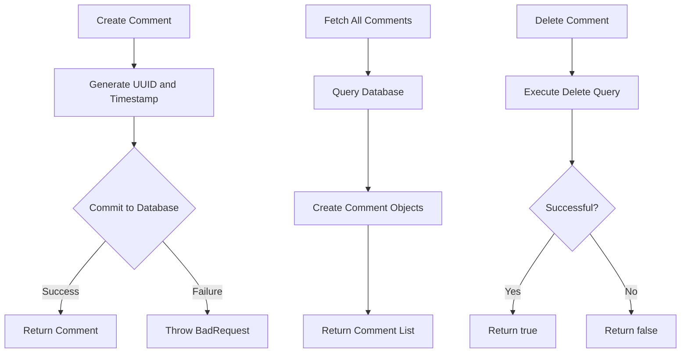
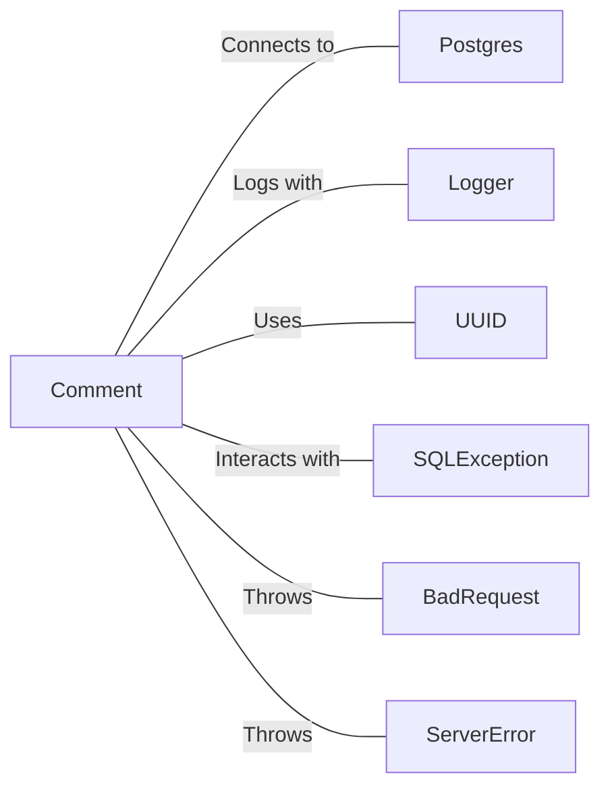

# Comment.java: Comment Management System

## Overview

This Java class, `Comment`, manages comment-related operations including creation, retrieval, and deletion of comments. It interacts with a PostgreSQL database to persist and fetch comment data.

## Process Flow

## Insights

- Uses UUID for generating unique comment IDs
- Implements CRUD operations: Create, Read (fetch all), and Delete
- Utilizes prepared statements for database operations, enhancing security
- Implements error handling and logging for database operations
- Uses timestamps for tracking comment creation time

## Dependencies

- `Postgres`: Provides database connection for comment operations
- `Logger`: Used for logging errors and exceptions
- `UUID`: Generates unique identifiers for comments
- `SQLException`: Handled for database-related exceptions
- `BadRequest`: Custom exception thrown when unable to save a comment
- `ServerError`: Custom exception thrown for general server errors

## Data Manipulation (SQL)

### Table Structure

| Column Name | Data Type | Description |
|-------------|-----------|-------------|
| id          | VARCHAR   | Unique identifier for the comment |
| username    | VARCHAR   | Username of the comment author |
| body        | TEXT      | Content of the comment |
| created_on  | TIMESTAMP | Timestamp when the comment was created |

### SQL Operations

- `comments`: 
  - SELECT: Retrieves all comments from the database
  - INSERT: Adds a new comment to the database
  - DELETE: Removes a specific comment from the database based on its ID

## Vulnerabilities

1. SQL Injection Vulnerability: The `fetchAll()` method uses a raw SQL query without parameterization, which could lead to SQL injection attacks if user input is directly used in the query.

2. Resource Leakage: In the `fetchAll()` method, the database connection and statement are not properly closed in a `finally` block or try-with-resources statement, which could lead to resource leaks.

3. Inconsistent Error Handling: The class uses a mix of custom exceptions (`BadRequest`, `ServerError`) and direct exception logging, which may lead to inconsistent error handling across the application.

4. Lack of Input Validation: There's no visible input validation for the comment body or username, which could potentially allow malicious data to be stored in the database.

5. Potential Race Condition: The `create()` method generates a UUID and timestamp before committing to the database, which could potentially lead to race conditions in high-concurrency scenarios.

6. Inefficient Data Fetching: The `fetchAll()` method retrieves all comments without any pagination or limiting mechanism, which could be inefficient for large datasets.

7. Hardcoded SQL Queries: SQL queries are hardcoded within the methods, making it difficult to maintain and potentially leading to SQL syntax errors if not carefully managed.

To address these vulnerabilities, consider using prepared statements consistently, implementing proper resource management, standardizing error handling, adding input validation, using database-generated timestamps, implementing pagination for data fetching, and using an ORM or query builder to manage SQL queries more safely and efficiently.
