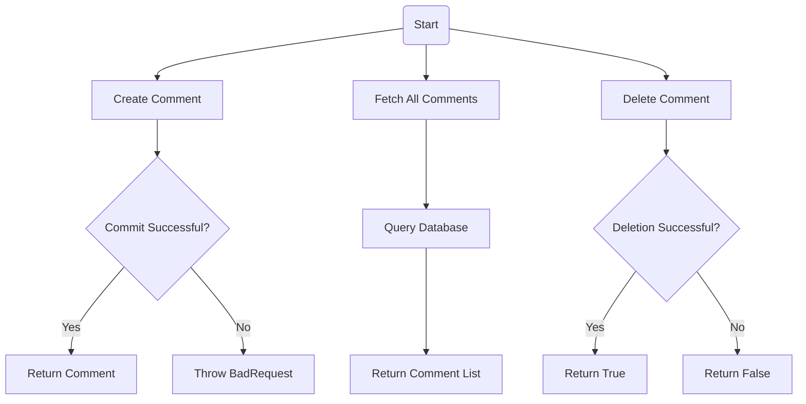
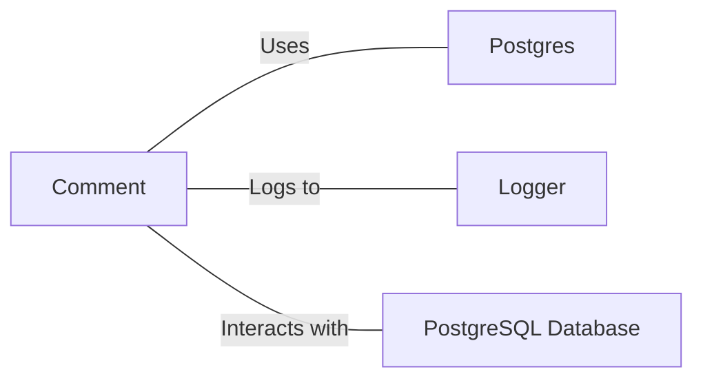

# Comment.java: Comment Management System

## Overview

This Java class, `Comment`, manages comment-related operations including creation, retrieval, and deletion of comments. It interacts with a PostgreSQL database to persist and fetch comment data.

## Process Flow

## Insights

- Uses UUID for generating unique comment IDs
- Implements CRUD operations (Create, Read, Delete) for comments
- Utilizes prepared statements for database operations, enhancing security
- Implements error logging using Java's built-in Logger
- Handles database connections through a separate `Postgres` class

## Dependencies

- `Postgres`: Used for database connection management
- `Logger`: Utilized for error logging
- `PostgreSQL Database`: Stores and retrieves comment data

## Data Manipulation (SQL)

| Entity    | Attributes | Type      | Description                     |
|-----------|------------|------------|---------------------------------|
| comments  | id         | String    | Unique identifier for comment   |
|           | username   | String    | User who created the comment    |
|           | body       | String    | Content of the comment          |
|           | created_on | Timestamp | When the comment was created    |

SQL Operations:
- `comments`: SELECT all comments
- `comments`: INSERT new comment
- `comments`: DELETE comment by id

## Vulnerabilities

1. SQL Injection Vulnerability: The `fetchAll()` method uses a raw SQL query without parameterization, which could lead to SQL injection attacks if user input is directly used in the query.

2. Unclosed Resources: In the `fetchAll()` method, the database connection and statement are not properly closed in a `finally` block, which could lead to resource leaks.

3. Exception Handling: The `commit()` method catches SQLException but doesn't properly handle it, potentially hiding important error information.

4. Inconsistent Error Handling: Some methods throw custom exceptions (`BadRequest`, `ServerError`) while others return boolean values or log errors. This inconsistency could lead to unpredictable behavior and make error handling more difficult for consumers of this class.

5. Potential Null Pointer Exception: The `delete()` method doesn't check if the connection or prepared statement is null before using them.

6. Lack of Input Validation: There's no validation on input parameters, which could lead to unexpected behavior or security issues if invalid data is provided.

7. Inefficient Resource Management: New database connections are created for each operation instead of using connection pooling, which could lead to performance issues under high load.
