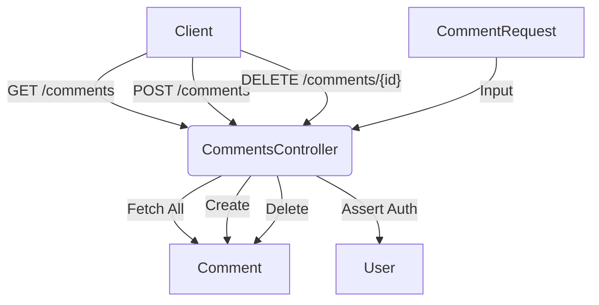
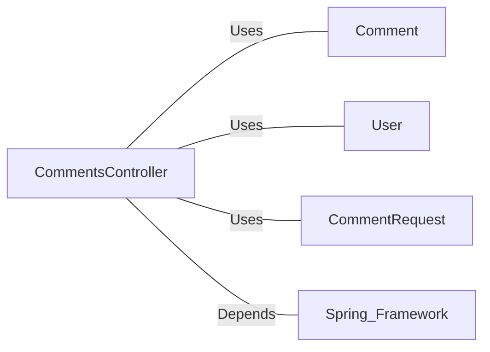

# CommentsController.java: RESTful API for Comment Management

## Overview

This file defines a Spring Boot REST controller for managing comments, including endpoints for fetching, creating, and deleting comments. It also includes CORS configuration and authentication checks.

## Process Flow

## Insights

- The controller uses Spring Boot's `@RestController` and `@EnableAutoConfiguration` annotations.
- CORS is configured to allow requests only from `http://localhost:8080`.
- Authentication is required for accessing comments, using a secret and token.
- The controller handles GET, POST, and DELETE operations for comments.
- Custom exception classes (`BadRequest` and `ServerError`) are defined for error handling.
- The `CommentRequest` class is used as a data transfer object for creating comments.

## Dependencies

- `Comment`: Used for fetching, creating, and deleting comments
- `User`: Used for authentication assertion
- `CommentRequest`: Data transfer object for comment creation
- `Spring Framework`: Provides annotations and functionality for REST API development

## Vulnerabilities

1. **Insufficient Authentication**: The `createComment` and `deleteComment` methods do not perform authentication checks, potentially allowing unauthorized access to these operations.

2. **Lack of Input Validation**: There's no visible input validation for the comment creation process, which could lead to injection attacks or storage of malicious content.

3. **Hardcoded CORS Configuration**: The CORS configuration is hardcoded to allow requests from `http://localhost:8080`. This might cause issues in different environments and could be too permissive if not properly managed in production.

4. **Potential Information Leakage**: The `ServerError` class might expose sensitive information if the exception messages are not properly sanitized before being sent to the client.

5. **Lack of Rate Limiting**: There's no visible rate limiting mechanism, which could make the API vulnerable to abuse or denial of service attacks.

6. **Insecure Direct Object Reference**: The `deleteComment` method uses the `id` directly from the path variable without checking if the user has permission to delete that specific comment.

7. **Potential SQL Injection**: Depending on how the `Comment.fetch_all()`, `Comment.create()`, and `Comment.delete()` methods are implemented, there might be a risk of SQL injection if proper parameterization is not used.

8. **Lack of Logging**: There's no visible logging mechanism, which could make it difficult to track and investigate potential security incidents.
