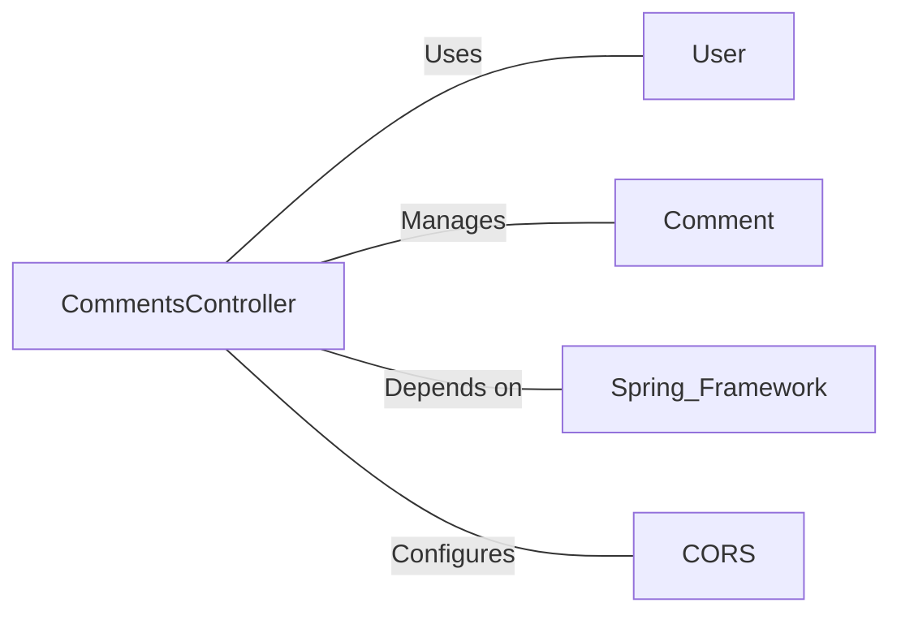

# CommentsController.java: RESTful API for Comment Management

## Overview

This file defines a Spring Boot REST controller for managing comments, including endpoints for fetching, creating, and deleting comments. It also includes cross-origin resource sharing (CORS) configuration and authentication checks.

## Process Flow

```mermaid
graph TD
    A[Start] --> B[Initialize CommentsController]
    B --> C{Endpoint Request}
    C -->|GET /comments| D[Fetch All Comments]
    C -->|POST /comments| E[Create Comment]
    C -->|DELETE /comments/{id}| F[Delete Comment]
    D --> G[Authenticate User]
    G -->|Success| H[Return Comments]
    G -->|Failure| I[Authentication Error]
    E --> J[Create New Comment]
    F --> K[Delete Specified Comment]
    H --> L[End]
    I --> L
    J --> L
    K --> L
```

## Insights

- The controller uses Spring Boot's `@RestController` and `@EnableAutoConfiguration` annotations for RESTful API setup.
- CORS is configured for all endpoints using `@CrossOrigin` with origins specified by `${allowed.origins}`.
- Authentication is required for the GET endpoint using a secret and token.
- The POST and DELETE endpoints don't explicitly check authentication, which could be a security concern.
- The `CommentRequest` class is used to deserialize incoming JSON for comment creation.
- Exception handling is implemented for bad requests and server errors.

## Dependencies



- `User`: Used for authentication in the `comments` method.
- `Comment`: Represents the comment entity and provides methods for fetching, creating, and deleting comments.
- `Spring Framework`: Provides annotations and functionality for creating a RESTful API.
- `CORS`: Cross-Origin Resource Sharing configuration is applied to all endpoints.

## Data Manipulation (SQL)

While there are no explicit SQL statements in this code, the `Comment` class likely interacts with a database. The following operations are implied:

- `Comment.fetch_all()`: Retrieves all comments from the database.
- `Comment.create(username, body)`: Inserts a new comment into the database.
- `Comment.delete(id)`: Removes a comment from the database based on its ID.

## Vulnerabilities

1. Lack of Authentication: The `createComment` and `deleteComment` methods don't explicitly check for authentication, which could allow unauthorized users to create or delete comments.

2. Potential SQL Injection: If the `Comment` class methods don't properly sanitize inputs, there could be a risk of SQL injection, especially in the `create` and `delete` methods.

3. Exposed Application Secret: The `app.secret` is injected into the controller, which might be exposed if there's an information leak vulnerability.

4. Broad CORS Configuration: The CORS configuration allows origins specified by an external property. If this is set too broadly, it could lead to security issues.

5. Missing Input Validation: There's no visible input validation for the comment body or username, which could lead to storing malicious content or oversized data.

6. Potential Information Disclosure: The `BadRequest` and `ServerError` classes might expose sensitive information if the exception messages are not properly sanitized before being sent to the client.

7. Serialization Vulnerability: The `CommentRequest` class implements `Serializable` without a `serialVersionUID`, which could lead to deserialization issues if the class structure changes.

These vulnerabilities should be addressed to improve the security of the application.
