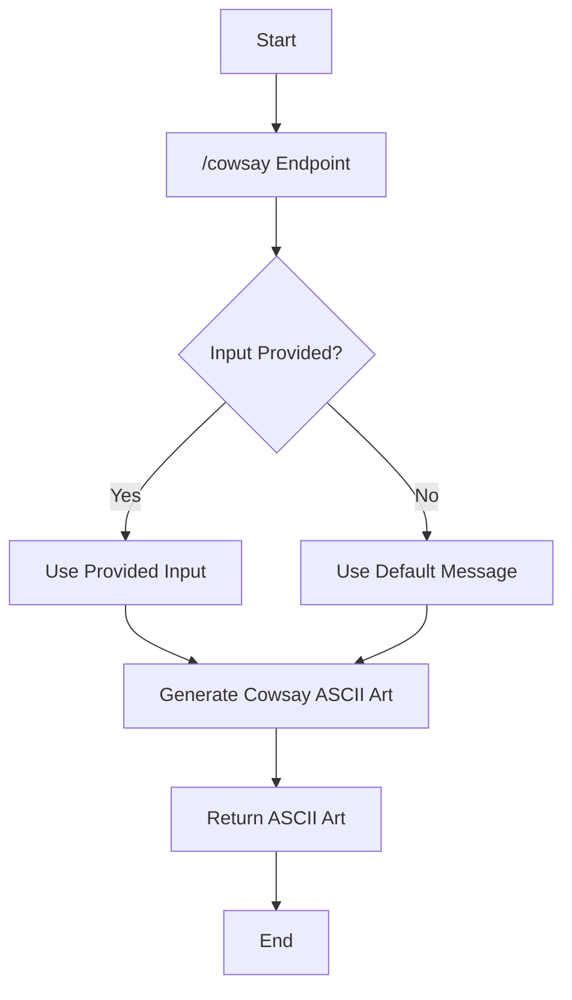
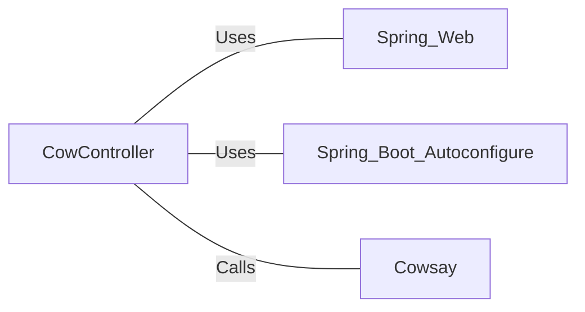

# CowController.java: RESTful Cowsay Service Controller

## Overview

CowController is a Spring Boot REST controller that provides a single endpoint for generating Cowsay messages. It utilizes the Cowsay utility to create ASCII art cow images with custom messages.

## Process Flow

## Insights

- The controller uses Spring Boot's auto-configuration feature for simplified setup.
- It exposes a single REST endpoint "/cowsay" that accepts an optional input parameter.
- If no input is provided, it uses a default message "I love Linux!".
- The Cowsay utility is used to generate the ASCII art cow with the given or default message.

## Dependencies

- `Spring_Web`: Used for REST controller annotations and request handling
- `Spring_Boot_Autoconfigure`: Enables auto-configuration for the Spring Boot application
- `Cowsay`: External utility called to generate the ASCII art cow with the message

## Vulnerabilities

1. **Potential Command Injection**: The `Cowsay.run(input)` method call might be vulnerable to command injection if the `Cowsay` utility is not properly sanitizing the input. An attacker could potentially inject malicious commands if the input is passed directly to a system command.

2. **Lack of Input Validation**: There's no explicit input validation or sanitization on the `input` parameter. This could lead to unexpected behavior or potential security issues if malformed or malicious input is provided.

3. **Unrestricted Input Length**: The endpoint doesn't limit the length of the input string, which could potentially lead to resource exhaustion or denial of service if extremely large inputs are provided.

4. **Syntax Error**: There's a line containing only `test` after the return statement. This is a syntax error and would prevent the code from compiling. It should be removed.

5. **Serializable Interface**: The class implements `Serializable` but doesn't define a `serialVersionUID`. While not a direct vulnerability, it's considered a best practice to define this field for classes implementing `Serializable` to ensure version compatibility during deserialization.

To mitigate these vulnerabilities, consider implementing proper input validation, sanitization, and length restrictions. Also, ensure that the `Cowsay` utility is implemented securely without allowing command injection. Remove the erroneous `test` line, and consider adding a `serialVersionUID` if serialization is actually needed for this controller.
