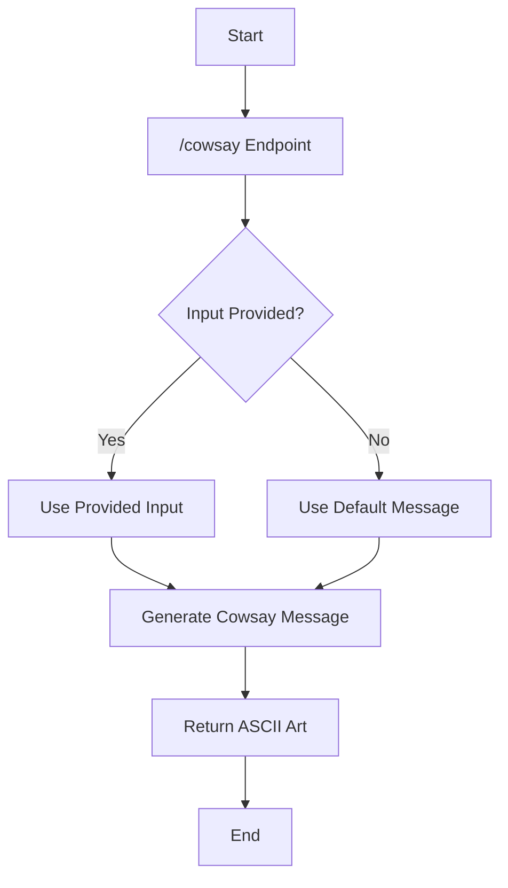
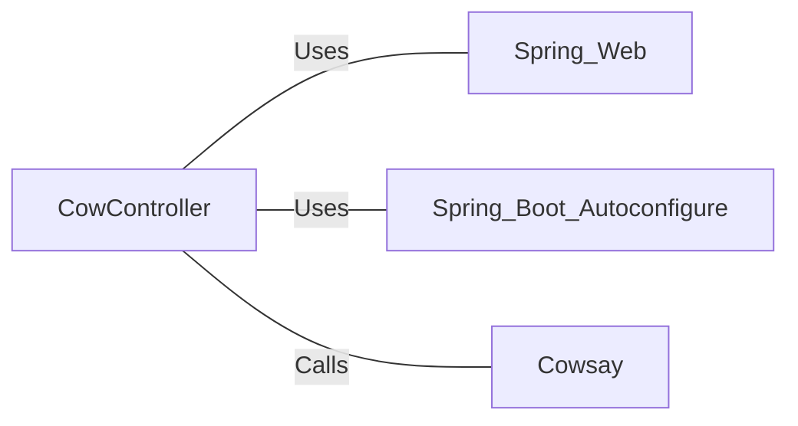

# CowController.java: RESTful Cowsay Service Controller

## Overview

This Java class, `CowController`, is a Spring Boot REST controller that provides an endpoint for generating Cowsay messages. It uses the `Cowsay` utility to create ASCII art messages featuring a cow.

## Process Flow

## Insights

- The controller uses Spring Boot's auto-configuration feature.
- It exposes a single GET endpoint at `/cowsay`.
- The endpoint accepts an optional `input` parameter.
- If no input is provided, it uses the default message "I love Linux!".
- The `Cowsay.run()` method is used to generate the ASCII art message.

## Dependencies

- `Spring_Web`: Used for REST controller annotations and request mapping.
- `Spring_Boot_Autoconfigure`: Enables auto-configuration for the Spring Boot application.
- `Cowsay`: External utility called to generate the ASCII art message.

## Vulnerabilities

1. **Potential Command Injection**: The `Cowsay.run()` method is called with user-provided input. If the `Cowsay` utility is not properly implemented or sanitized, this could lead to command injection vulnerabilities. It's crucial to ensure that the `Cowsay` utility properly sanitizes and escapes user input to prevent any potential security risks.

2. **Lack of Input Validation**: The controller doesn't perform any input validation on the user-provided message. While the default value is safe, users can potentially input very long strings or special characters that could cause unexpected behavior or even crashes in the `Cowsay` utility. Implementing input validation (e.g., length limits, character restrictions) would improve the security and stability of the service.

3. **No Rate Limiting**: The endpoint doesn't implement any rate limiting. This could potentially allow for denial of service attacks if an attacker sends a large number of requests in a short time. Implementing rate limiting would help mitigate this risk.

4. **Exposure of System Information**: The default message "I love Linux!" potentially reveals information about the underlying system. While not a direct vulnerability, it's generally considered good practice to avoid disclosing unnecessary system information.

5. **Lack of Error Handling**: The controller doesn't implement any explicit error handling. If the `Cowsay.run()` method throws an exception, it could result in unhandled server errors being exposed to the client. Proper error handling and logging would improve the robustness and security of the service.
