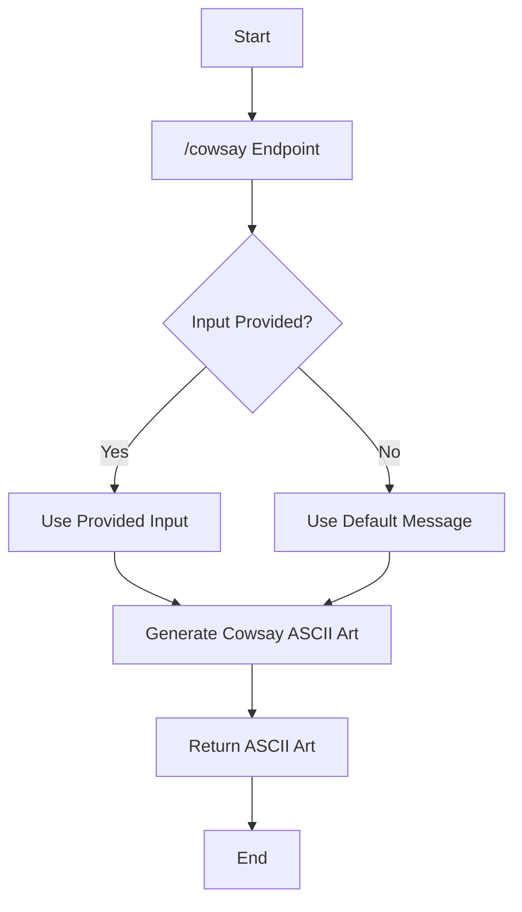
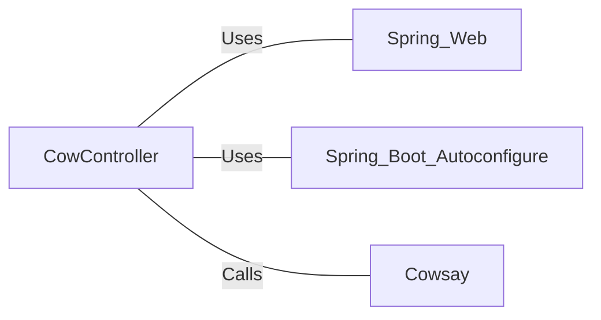

# CowController.java: RESTful Cowsay Service Controller

## Overview

CowController is a Spring Boot REST controller that provides a single endpoint for generating Cowsay messages. It utilizes the Cowsay utility to create ASCII art cow images with custom messages.

## Process Flow

## Insights

- The controller uses Spring Boot's auto-configuration feature for simplified setup.
- It exposes a single GET endpoint at "/cowsay".
- The endpoint accepts an optional "input" parameter for customizing the Cowsay message.
- If no input is provided, it defaults to "I love Linux!".
- The actual Cowsay generation is delegated to a separate `Cowsay` class.

## Dependencies

- `Spring_Web`: Used for REST controller annotations and request mapping.
- `Spring_Boot_Autoconfigure`: Enables auto-configuration for the Spring Boot application.
- `Cowsay`: A utility class that generates the Cowsay ASCII art (not shown in the provided code snippet).

## Vulnerabilities

1. **Potential Command Injection**: The code doesn't show how the `Cowsay.run()` method is implemented. If it directly passes user input to a system command without proper sanitization, it could lead to command injection vulnerabilities.

2. **Lack of Input Validation**: There's no visible input validation or sanitization on the user-provided input. This could potentially lead to issues if malicious input is provided, such as very long strings or special characters that might break the Cowsay formatting or cause unexpected behavior.

3. **No Rate Limiting**: The endpoint doesn't appear to have any rate limiting, which could make it vulnerable to denial of service attacks if an attacker sends a large number of requests in a short time.

4. **Exposure of System Information**: Depending on how the Cowsay utility is implemented, it might reveal system information (like the version of Cowsay installed) which could be used by attackers to target specific vulnerabilities.

5. **Cross-Site Scripting (XSS)**: If the output of the Cowsay utility is rendered directly in HTML without proper escaping, it could lead to XSS vulnerabilities if malicious scripts are injected into the input.

To mitigate these vulnerabilities, implement proper input validation, sanitize user input, add rate limiting, ensure the `Cowsay.run()` method is implemented securely, and properly escape any output that might be rendered in HTML.
