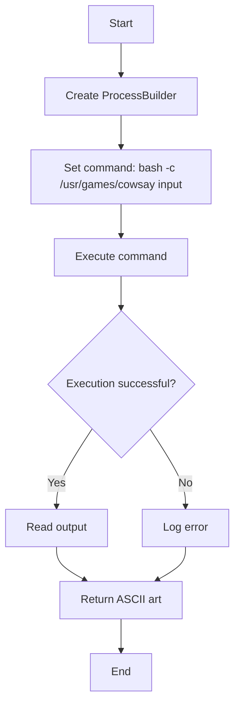
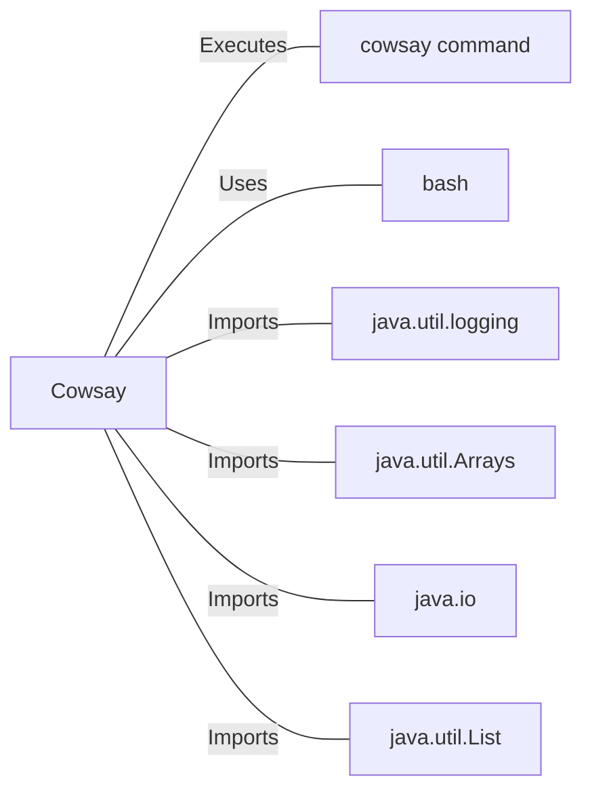

# Cowsay.java: ASCII Art Generator Using Cowsay Command

## Overview

Cowsay.java is a Java class that provides functionality to generate ASCII art using the `cowsay` command-line tool. It executes the `cowsay` command with a given input and returns the resulting ASCII art as a string.

## Process Flow

## Insights

- The class uses `ProcessBuilder` to execute the `cowsay` command.
- Input is passed directly to the command without sanitization, which could lead to security vulnerabilities.
- The output is captured using a `BufferedReader` and stored in a `StringBuilder`.
- Error handling is implemented using a try-catch block, with errors logged using a `Logger`.
- The class is designed as a utility class with a private constructor and a static `run` method.

## Dependencies

- `cowsay_command`: Executes the `/usr/games/cowsay` command-line tool to generate ASCII art
- `bash`: Uses bash to execute the cowsay command
- `java.util.logging`: Imports Logger for logging information and errors
- `java.util.Arrays`: Imports Arrays utility for creating command list
- `java.io`: Imports BufferedReader and InputStreamReader for reading command output
- `java.util.List`: Imports List for storing command arguments

## Vulnerabilities

1. Command Injection: The `run` method directly concatenates user input into the command string without any sanitization. This can lead to command injection vulnerabilities if an attacker provides malicious input.

2. Lack of Input Validation: There's no validation or sanitization of the input parameter, which could lead to unexpected behavior or security issues.

3. Potential Resource Leak: The `BufferedReader` is not explicitly closed after use, which could lead to resource leaks in certain scenarios.

4. Insecure Logging: The command string, which includes user input, is logged without any sanitization. This could potentially expose sensitive information in log files.

5. Error Handling: While errors are logged, the method still returns an empty string in case of an exception, which might not be the expected behavior and could lead to silent failures.

6. Hardcoded Path: The path to the cowsay command is hardcoded, which might cause issues if the command is located elsewhere on different systems.

To address these vulnerabilities, consider implementing input validation, using command arguments instead of string concatenation, properly closing resources, sanitizing logged information, and improving error handling.
