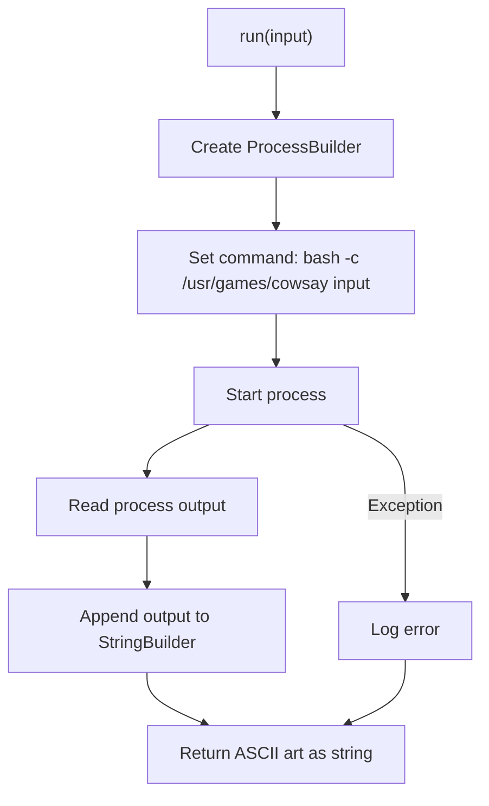
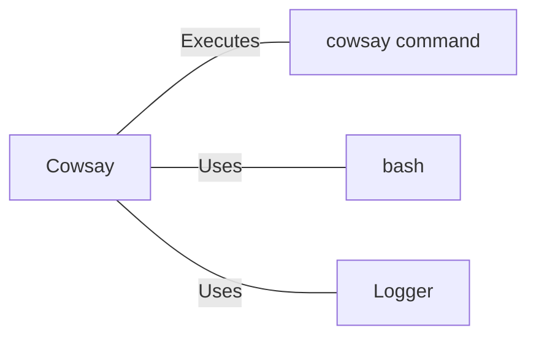

# Cowsay.java: ASCII Art Generator Using Cowsay Command

## Overview

Cowsay.java is a Java class that provides functionality to generate ASCII art using the `cowsay` command-line tool. It executes the `cowsay` command with user input and returns the resulting ASCII art as a string.

## Process Flow

## Insights

- The class uses `ProcessBuilder` to execute the `cowsay` command.
- Input is passed directly to the `cowsay` command without sanitization.
- The class implements logging using Java's `Logger`.
- A private constructor is used to prevent instantiation of the class.
- The `run` method is static, allowing it to be called without creating an instance of the class.

## Dependencies

- `cowsay_command`: Executes the `/usr/games/cowsay` command to generate ASCII art
- `bash`: Uses the bash shell to execute the command
- `Logger`: Uses Java's logging utility for logging information and errors

## Vulnerabilities

1. Command Injection: The `run` method is vulnerable to command injection attacks. User input is directly concatenated into the command string without any sanitization or validation. An attacker could potentially inject malicious commands by manipulating the `input` parameter.

2. Inconsistent Command Execution: There's a discrepancy between the logged command and the actual executed command. The logged command uses string concatenation, while the executed command uses separate arguments. This inconsistency could lead to unexpected behavior and makes the code harder to maintain.

3. Resource Leakage: The `BufferedReader` is not properly closed after use. This could lead to resource leaks, especially if the method is called frequently.

4. Lack of Input Validation: There's no validation on the input length or content, which could lead to excessive resource consumption or unexpected behavior if very large inputs are provided.

5. Synchronization Issues: The `run` method is not synchronized, which could lead to race conditions if multiple threads attempt to use it simultaneously.

6. Error Handling: While exceptions are logged, the method always returns a string, even if an error occurs. This could lead to silent failures where the caller might not realize an error has occurred.

7. Hardcoded Path: The path to the `cowsay` command is hardcoded, which could cause issues if the command is located elsewhere on different systems.

To address these vulnerabilities, implement proper input sanitization, use `ProcessBuilder` consistently, close resources properly, add input validation, consider synchronization needs, improve error handling, and consider making the command path configurable.
