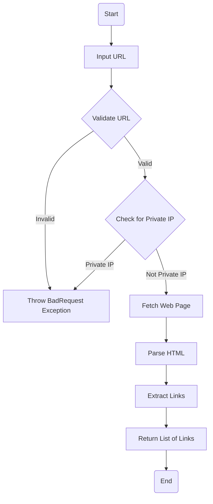
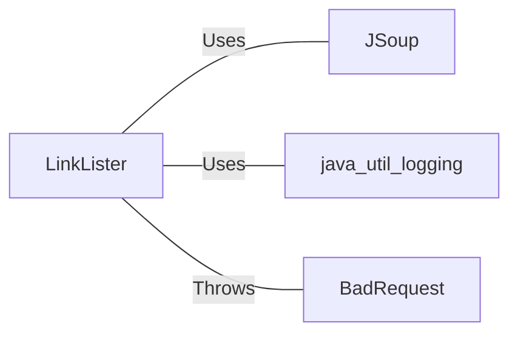

# LinkLister.java: Web Page Link Extractor

## Overview

LinkLister is a Java class that provides functionality to extract links from a given URL. It offers two methods for link extraction, with the second method (getLinksV2) including additional security checks to prevent access to private IP addresses.

## Process Flow

## Insights

- Uses JSoup library for HTML parsing and link extraction
- Implements two methods for link extraction: getLinks and getLinksV2
- getLinksV2 includes security checks to prevent access to private IP addresses
- Utilizes java.util.logging for logging
- Throws a custom BadRequest exception for error handling

## Dependencies

- `JSoup`: Used for connecting to URLs, parsing HTML, and extracting links
- `java.util.logging`: Used for logging information
- `BadRequest`: Custom exception class used for error handling

## Vulnerabilities

1. Potential Denial of Service (DoS) vulnerability:
   - The code doesn't limit the number of links it can extract or the size of the web page it can process. This could lead to excessive memory usage or processing time for large web pages.

2. Incomplete private IP address check:
   - The check for private IP addresses doesn't cover all possible ranges. For example, it misses the 172.16.0.0 to 172.31.255.255 range (only checks if it starts with "172.").

3. Lack of timeout for URL connection:
   - There's no timeout set for the Jsoup.connect(url).get() call, which could lead to hanging connections if the target server is slow or unresponsive.

4. Potential for SSRF (Server-Side Request Forgery):
   - While there's a check for private IP addresses, it doesn't prevent other potentially dangerous URLs (e.g., localhost, 0.0.0.0, or domain names resolving to private IPs).

5. Lack of proper input validation:
   - The code doesn't validate the input URL format before processing, which could lead to unexpected behavior or exceptions.

6. Exposure of sensitive information:
   - The logger is set to log the host of the URL being processed, which could potentially expose sensitive information in log files.

To address these vulnerabilities, consider implementing proper input validation, complete private IP address checking, setting connection timeouts, limiting the size of processed data, and reviewing the logging practices.
