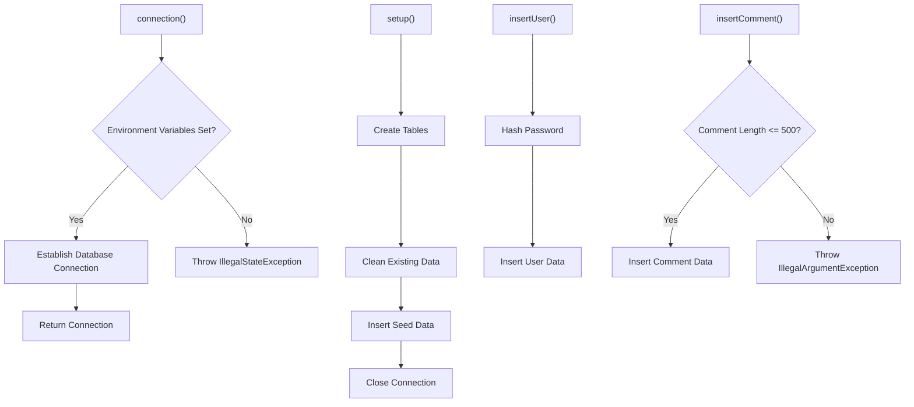
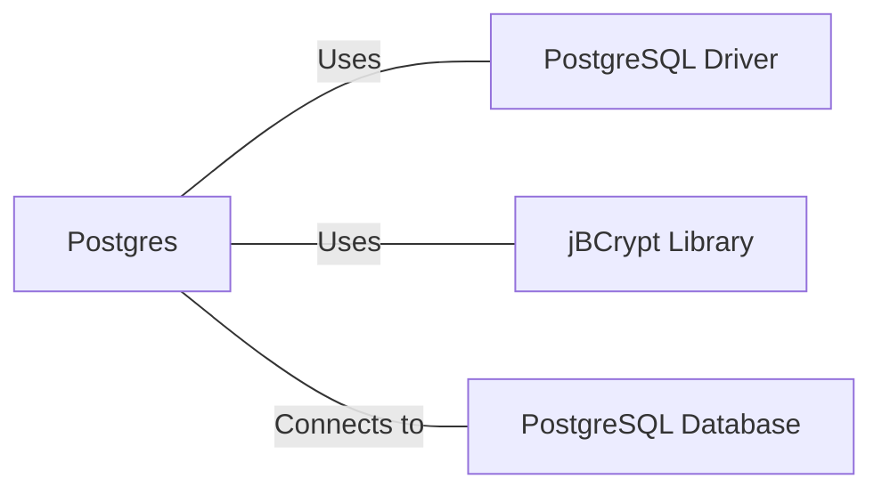

# Postgres.java: Database Connection and Setup Utility

## Overview

This Java class, `Postgres`, provides utility methods for establishing a connection to a PostgreSQL database, setting up the database schema, and performing basic operations such as user and comment insertion.

## Process Flow

## Insights

- Uses environment variables for database connection details, enhancing security.
- Implements BCrypt for password hashing, a strong cryptographic method.
- Creates two tables: `users` and `comments`.
- Provides methods for inserting users and comments with prepared statements.
- Includes error logging using Java's built-in Logger.
- Implements a length check for comment bodies to prevent oversized inputs.

## Dependencies

- `postgresql_driver`: Used for establishing a connection to the PostgreSQL database.
- `jbcrypt`: Utilized for password hashing and verification.
- `postgresql_database`: The actual PostgreSQL database to which the application connects.

## Data Manipulation (SQL)

### Table Structures

| Table Name | Columns | Data Type | Description |
|------------|---------|-----------|-------------|
| users | user_id | VARCHAR(36) | Primary Key |
|  | username | VARCHAR(50) | Unique, Not Null |
|  | password | VARCHAR(255) | Not Null |
|  | created_on | TIMESTAMP | Not Null |
|  | last_login | TIMESTAMP | |
| comments | id | VARCHAR(36) | Primary Key |
|  | username | VARCHAR(36) | |
|  | body | VARCHAR(500) | |
|  | created_on | TIMESTAMP | Not Null |

### SQL Operations

- `users`: CREATE TABLE, DELETE (for cleanup), INSERT (for user creation)
- `comments`: CREATE TABLE, DELETE (for cleanup), INSERT (for comment creation)

## Vulnerabilities

1. **Hardcoded Credentials**: The code includes hardcoded usernames and passwords for seed data. This is a security risk if the code is exposed or if these credentials are used in a production environment.

2. **Connection Pooling Absence**: The code creates a new database connection for each operation. This can lead to performance issues and resource exhaustion under high load. Implementing connection pooling would be more efficient.

3. **Unclosed Resources**: The `PreparedStatement` and `Connection` objects are not always properly closed in `insertUser` and `insertComment` methods. This can lead to resource leaks.

4. **Exception Handling**: The code catches general `Exception` types in several places. More specific exception handling would allow for better error management and debugging.

5. **Potential SQL Injection**: While the code uses prepared statements for user and comment insertion, which prevents SQL injection, any direct use of `Statement.executeUpdate()` with concatenated strings (if present in other parts of the application) could be vulnerable to SQL injection.

6. **Sensitive Information Logging**: The code logs database connection failures with the full exception message. This could potentially expose sensitive information in log files.

7. **Weak Password Policy**: There's no enforcement of a strong password policy when inserting users. This could lead to weak passwords in the system.

8. **Lack of Input Validation**: Apart from the comment length check, there's no validation on user inputs (e.g., username format, password complexity).

9. **Environment Variable Dependency**: The application relies on environment variables for database configuration. If these are not set correctly, it could lead to runtime errors or potential security issues if default values are used.
