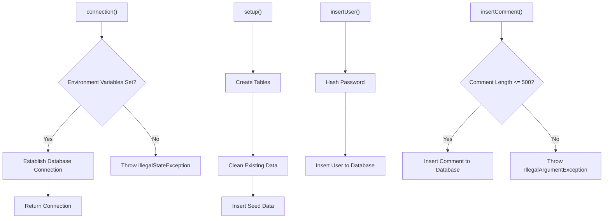
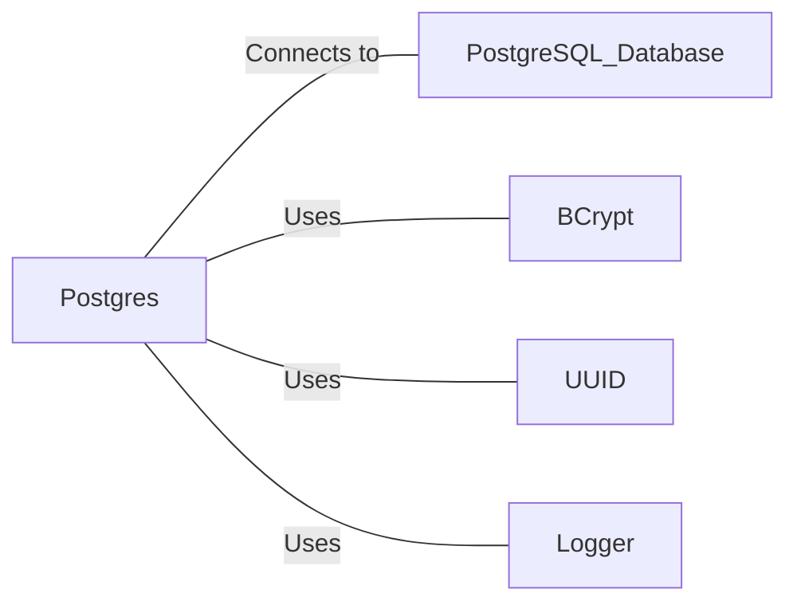

# Postgres.java: Database Connection and Setup Utility

## Overview

This Java class, `Postgres`, provides utility methods for establishing a connection to a PostgreSQL database, setting up the database schema, and performing basic operations such as user and comment insertion.

## Process Flow

## Insights

- Uses environment variables for database connection details, enhancing security.
- Implements BCrypt for password hashing, a secure hashing algorithm.
- Creates two tables: `users` and `comments`.
- Provides methods for inserting users and comments with proper error handling.
- Uses prepared statements to prevent SQL injection.
- Implements logging for error tracking and informational purposes.
- Clears password variable after use, improving security.
- Limits comment length to 500 characters.

## Dependencies

- `PostgreSQL_Database`: Connects to the database using JDBC driver
- `BCrypt`: Used for password hashing and verification
- `UUID`: Generates unique identifiers for users and comments
- `Logger`: Logs information and error messages

## Data Manipulation (SQL)

### Table Structures

| Table Name | Columns | Data Type | Description |
|------------|---------|-----------|-------------|
| users | user_id | VARCHAR(36) | Primary Key |
|  | username | VARCHAR(50) | Unique, Not Null |
|  | password | VARCHAR(255) | Not Null |
|  | created_on | TIMESTAMP | Not Null |
|  | last_login | TIMESTAMP | |
| comments | id | VARCHAR(36) | Primary Key |
|  | username | VARCHAR(36) | |
|  | body | VARCHAR(500) | |
|  | created_on | TIMESTAMP | Not Null |

### SQL Operations

- `users`: CREATE TABLE, DELETE, INSERT operations
- `comments`: CREATE TABLE, DELETE, INSERT operations

## Vulnerabilities

1. **Hardcoded Credentials**: The code includes hardcoded usernames and passwords for seed data. This is a security risk if the code is exposed or if these credentials are used in a production environment.

2. **Connection Pooling Absence**: The code creates a new database connection for each operation. This can lead to performance issues and resource exhaustion under high load. Implementing connection pooling would be more efficient.

3. **Unclosed Resources**: The `PreparedStatement` and `Connection` objects are not always properly closed in `finally` blocks. This can lead to resource leaks.

4. **Exception Handling**: The code catches general `Exception` types in some places, which can mask specific errors and make debugging more difficult.

5. **Logging Sensitive Information**: The code logs exception messages, which might include sensitive information. It's better to log custom messages and use proper log levels.

6. **Lack of Input Validation**: While there's a length check for comments, there's no input validation for usernames or other user inputs, which could lead to injection attacks or unexpected behavior.

7. **Environment Variable Dependency**: The reliance on environment variables without fallback options or proper configuration management could lead to deployment issues or accidental exposure of sensitive information.

8. **Potential SQL Injection in setup() Method**: The `setup()` method uses `Statement` instead of `PreparedStatement` for creating tables and deleting data, which could potentially be vulnerable to SQL injection if the table names were dynamically generated (although they're not in this case).

9. **Weak Password Policy**: There's no enforcement of password strength requirements, allowing potentially weak passwords to be set.

10. **Lack of Transaction Management**: The code doesn't use transactions, which could lead to data inconsistencies if an operation fails midway.
