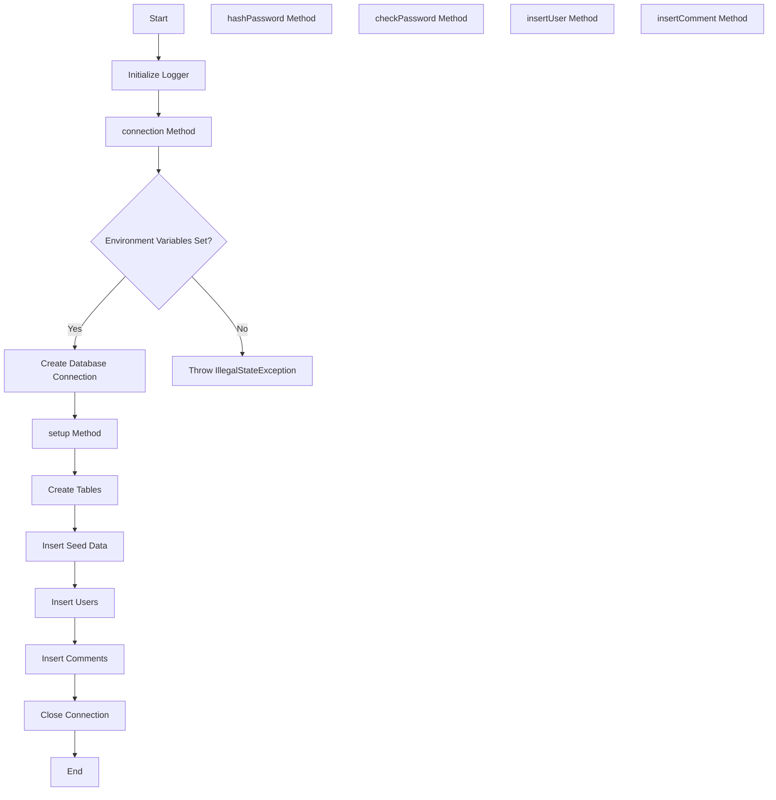
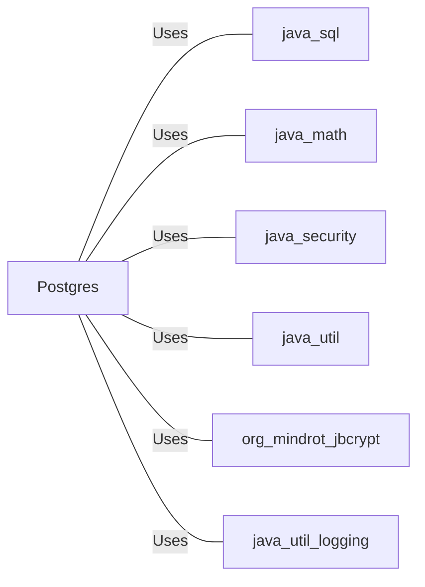

# Postgres.java: Database Connection and Setup Utility

## Overview

This Java class, `Postgres`, provides utility methods for establishing a connection to a PostgreSQL database, setting up the database schema, and performing basic operations such as user and comment insertion.

## Process Flow

## Insights

- Uses environment variables for database connection details, enhancing security.
- Implements BCrypt for password hashing and verification.
- Creates two tables: `users` and `comments`.
- Provides methods for inserting users and comments with prepared statements.
- Includes error handling and logging throughout the class.
- Uses UUID for generating unique identifiers.
- Limits comment body length to 500 characters.

## Dependencies

- `java.sql`: Used for database connections and SQL operations
- `java.math.BigInteger`: Imported but not used in the provided code
- `java.security.MessageDigest`: Imported but not used in the provided code
- `java.security.NoSuchAlgorithmException`: Imported but not used in the provided code
- `java.util.UUID`: Used for generating unique identifiers
- `org.mindrot.jbcrypt.BCrypt`: Used for password hashing and verification
- `java.util.logging.Logger`: Used for logging operations and errors

## Data Manipulation (SQL)

### Table Structures

| Table Name | Columns | Data Type | Description |
|------------|---------|-----------|-------------|
| users | user_id | VARCHAR(36) | Primary Key |
| | username | VARCHAR(50) | Unique, Not Null |
| | password | VARCHAR(255) | Not Null |
| | created_on | TIMESTAMP | Not Null |
| | last_login | TIMESTAMP | |
| comments | id | VARCHAR(36) | Primary Key |
| | username | VARCHAR(36) | |
| | body | VARCHAR(500) | |
| | created_on | TIMESTAMP | Not Null |

### SQL Operations

- `users`: CREATE TABLE, DELETE, INSERT operations for user management
- `comments`: CREATE TABLE, DELETE, INSERT operations for comment management

## Vulnerabilities

1. **Hardcoded Credentials**: The code inserts seed data with hardcoded usernames and passwords. This is a security risk, especially for the admin account.

2. **Connection Pooling Absence**: The code creates a new database connection for each operation, which can be inefficient and may lead to resource exhaustion under high load.

3. **Exception Handling**: The code catches general `Exception` in several places, which may mask specific errors and make debugging difficult.

4. **Password Policy**: There's no enforcement of a strong password policy when inserting users.

5. **SQL Injection**: While the code uses prepared statements, which mitigates SQL injection risks, the `setup` method uses direct string concatenation for creating tables. This could potentially be exploited if the environment variables contain malicious SQL.

6. **Error Messages**: Detailed error messages are logged, which could potentially expose sensitive information if logs are accessible to unauthorized individuals.

7. **Resource Leaks**: In some methods, database connections and prepared statements are not properly closed in a `finally` block, which could lead to resource leaks.

8. **Lack of Input Validation**: Apart from the comment length check, there's no validation on user input, which could lead to various security issues.

9. **Insecure Random Number Generation**: The use of `UUID.randomUUID()` for generating IDs is not cryptographically secure and could potentially be predicted.

10. **Environment Variable Dependency**: The reliance on environment variables for database configuration, while generally a good practice, could be a vulnerability if the environment is not properly secured.
