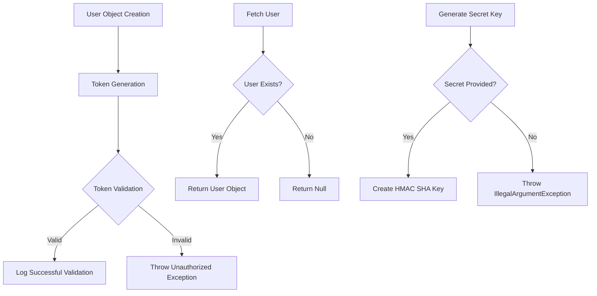
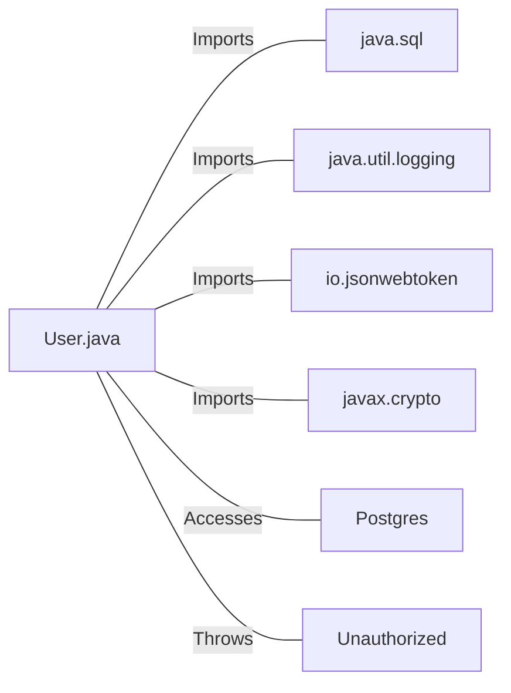

# User.java: User Authentication and Management System

## Overview

This Java class, `User`, is responsible for user authentication, token generation, and database operations related to user management. It provides functionality for creating user objects, generating and validating JWT tokens, and fetching user information from a database.

## Process Flow

## Insights

- Uses JWT (JSON Web Tokens) for user authentication
- Implements a method to fetch user data from a PostgreSQL database
- Includes error handling and logging for various operations
- Utilizes prepared statements to prevent SQL injection attacks
- Stores passwords in hashed format for security
- Generates secret keys for JWT signing

## Dependencies

- `java.sql`: Used for database connections and operations
- `java.util.logging`: Provides logging functionality
- `io.jsonwebtoken`: Used for JWT token generation and validation
- `javax.crypto`: Used for cryptographic operations
- `Postgres`: Custom class for database connection (not shown in the provided code)
- `Unauthorized`: Custom exception class (not shown in the provided code)

## Data Manipulation (SQL)

| Entity | Attributes | Data Type | Description |
|--------|------------|-----------|-------------|
| users  | user_id    | String    | Unique identifier for the user |
|        | username   | String    | User's username |
|        | password   | String    | User's hashed password |

`users`: SELECT operation to fetch user information based on the provided username

## Vulnerabilities

1. **Insufficient Error Handling**: The `fetch` method throws a generic `RuntimeException` when there's an error fetching a user. This could potentially expose sensitive information in stack traces if not properly caught and handled in the calling code.

2. **Potential SQL Injection**: While the code uses prepared statements, which generally protect against SQL injection, the `username` parameter in the `fetch` method is directly used in the SQL query. If this method is called with user-supplied input without proper validation, it could still be vulnerable to SQL injection attacks.

3. **Weak Secret Key Generation**: The `generateKey` method uses the provided secret string directly to create an HMAC SHA key. If the secret is not sufficiently long or complex, it could lead to weak encryption. It's generally recommended to use a secure random number generator for key generation.

4. **Password Storage**: While the code stores passwords in a hashed format, it doesn't specify the hashing algorithm used. If a weak hashing algorithm is employed, it could make the passwords vulnerable to cracking attempts.

5. **Lack of Input Validation**: There's no input validation on the username or password fields when creating a User object. This could potentially allow for the creation of users with invalid or malicious data.

6. **Token Expiration**: The JWT token generation doesn't include an expiration time. Tokens that don't expire can pose a security risk if they're compromised, as they remain valid indefinitely.

7. **Logging Sensitive Information**: The code logs the username when a token is validated. Depending on the logging configuration, this could potentially expose sensitive information in log files.

8. **Exception Handling in Token Validation**: The `assertAuth` method catches all exceptions and throws a generic `Unauthorized` exception. This could mask specific issues and make debugging more difficult.
