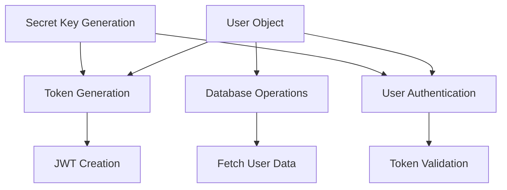
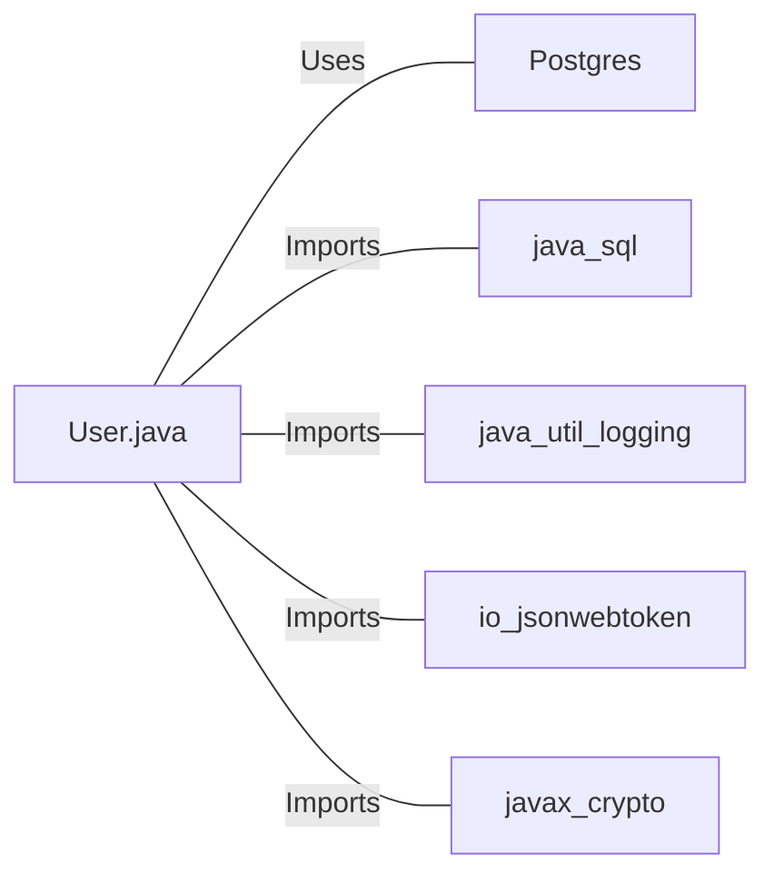

# User.java: User Authentication and Management System

## Overview

This Java class, `User`, is responsible for user authentication, token generation, and database operations related to user management. It includes methods for creating and validating JWT tokens, fetching user data from a database, and generating secret keys for token signing.

## Process Flow

## Insights

- The class uses JWT (JSON Web Tokens) for user authentication.
- Database operations are performed using prepared statements to prevent SQL injection.
- The class implements logging for various operations and error handling.
- User passwords are stored as hashed values in the database.
- The `fetch` method retrieves user data from a PostgreSQL database.
- Secret keys for JWT signing are generated using HMAC-SHA algorithm.

## Dependencies

- `Postgres`: Used for database connection
- `java.sql`: Utilized for database operations (Connection, PreparedStatement, ResultSet)
- `java.util.logging`: Used for logging operations and errors
- `io.jsonwebtoken`: Imported for JWT creation and validation
- `javax.crypto.SecretKey`: Used for generating and handling secret keys

## Data Manipulation (SQL)

| Entity | Attributes | Data Type | Description |
|--------|------------|-----------|-------------|
| users  | user_id    | String    | Unique identifier for the user |
|        | username   | String    | User's username |
|        | password   | String    | Hashed password of the user |

`users`: SELECT operation to fetch user data based on the username

## Vulnerabilities

1. **Insecure Logging**: The class logs sensitive information like usernames and token validation results. This could lead to information disclosure if log files are compromised.

2. **Exception Handling**: The `fetch` method throws a generic `RuntimeException` when there's an error fetching user data. This could potentially expose sensitive information about the database or application structure in stack traces.

3. **Password Storage**: While the passwords are referred to as "hashedPassword", there's no explicit mention of salt usage. Without proper salting, the hashed passwords could be vulnerable to rainbow table attacks.

4. **Token Expiration**: The JWT token generation doesn't include an expiration time. This could lead to tokens being valid indefinitely, which is a security risk if a token is compromised.

5. **Secret Key Handling**: The `generateKey` method uses the raw bytes of the secret string for key generation. Depending on how this secret is managed and stored, it could be vulnerable to exposure.

6. **Database Connection Management**: While the code uses try-with-resources for proper resource management, it's not clear if the `Postgres.connection()` method properly manages connection pooling, which could lead to resource exhaustion under high load.

7. **Lack of Input Validation**: The `fetch` method doesn't validate the input username before using it in the SQL query. While it uses a prepared statement (which prevents SQL injection), additional input validation could enhance security.

8. **Error Messages**: The error messages in the `assertAuth` method could potentially leak information about the token's validity to an attacker.

To address these vulnerabilities, consider implementing more secure logging practices, improving exception handling, using salted password hashing, adding token expiration, enhancing secret key management, implementing proper input validation, and using more generic error messages for authentication failures.
