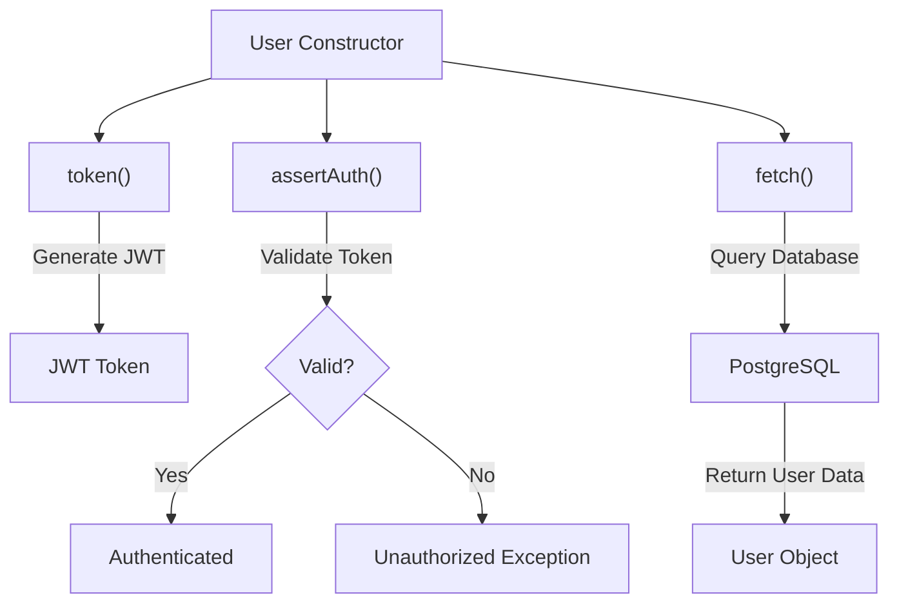
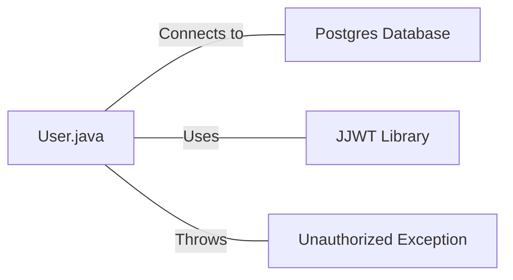

# User.java: User Authentication and Database Interaction

## Overview

This Java class, `User`, handles user authentication, token generation, and database interactions for user retrieval. It includes methods for creating JWT tokens, validating authentication, and fetching user data from a PostgreSQL database.

## Process Flow

## Insights

- The class uses JWT (JSON Web Tokens) for authentication.
- User data is stored in a PostgreSQL database.
- The `fetch` method uses a prepared statement to prevent SQL injection.
- Error handling is implemented, but exceptions are printed to standard error.
- The `assertAuth` method validates JWT tokens.
- The class does not handle password hashing or verification directly.

## Dependencies

- `Postgres`: Used to establish a database connection for user data retrieval.
- `JJWT`: Java JWT library used for token generation and validation.
- `Unauthorized`: Custom exception class thrown when authentication fails.

## Data Manipulation (SQL)

| Entity | Operation | Description |
|--------|-----------|-------------|
| `users` | SELECT | Retrieves user data based on the username. Limits the result to 1 row. |

## Vulnerabilities

1. **Insecure Secret Handling**: The `token` and `assertAuth` methods use the secret key directly as a string, which is then converted to bytes. This approach is not secure for handling sensitive cryptographic material.

2. **Exception Information Disclosure**: In the `assertAuth` method, the full exception message is included in the `Unauthorized` exception, which could potentially expose sensitive information.

3. **Weak Error Handling**: In the `fetch` method, exceptions are caught and printed, but the method continues to execute, potentially returning null or incomplete data.

4. **Potential Resource Leak**: In the `fetch` method, the `PreparedStatement` is not closed in a `finally` block, which could lead to resource leaks.

5. **Lack of Input Validation**: There's no input validation for the username in the `fetch` method, which could potentially lead to unexpected behavior or security issues.

6. **Insecure Password Storage**: The `hashedPassword` field suggests that passwords might be stored as hashes, but there's no evidence of secure hashing practices in this code.

7. **Verbose Error Logging**: Printing full stack traces and error messages to standard output/error could expose sensitive information in production environments.

8. **Lack of Connection Pooling**: The database connection is opened and closed for each query, which is inefficient and could lead to performance issues under high load.
