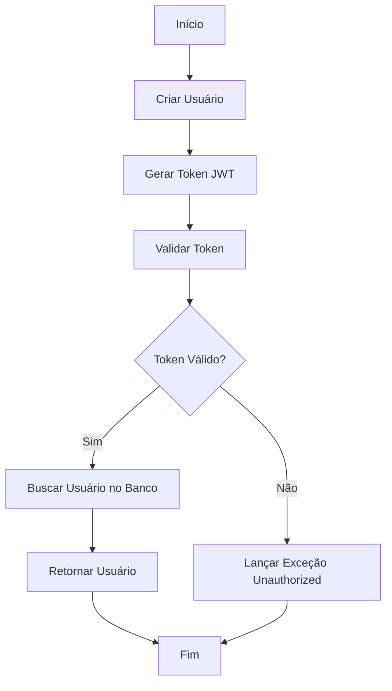
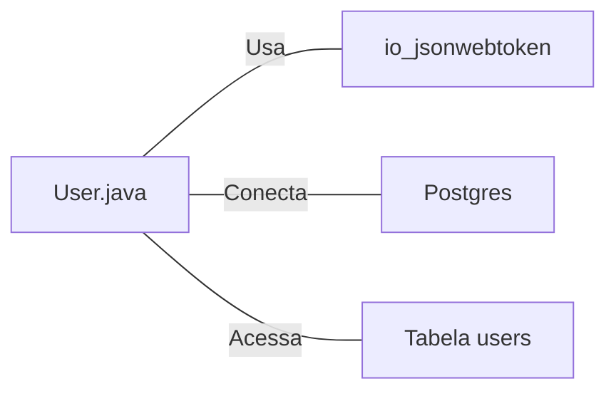

# User.java: Gerenciamento de Usuários e Autenticação

## Visão Geral

Esta classe `User` é responsável pelo gerenciamento de usuários, incluindo autenticação e recuperação de informações do banco de dados. Ela oferece funcionalidades para criar tokens JWT, validar autenticação e buscar usuários no banco de dados.

## Fluxo do Processo

## Insights

- A classe utiliza JWT (JSON Web Tokens) para autenticação.
- Há uma conexão com um banco de dados PostgreSQL para buscar informações de usuários.
- A classe armazena informações sensíveis como ID, nome de usuário e senha hash.
- Existe um método para buscar usuários no banco de dados usando uma consulta SQL.

## Dependências

- `io.jsonwebtoken`: Utilizado para geração e validação de tokens JWT.
- `Postgres`: Classe que fornece conexão com o banco de dados PostgreSQL.
- `users`: Tabela no banco de dados que armazena informações dos usuários.

## Manipulação de Dados (SQL)

`users`: Tabela que armazena informações dos usuários.

| Coluna     | Tipo    | Descrição                    |
|------------|---------|------------------------------|
| user_id    | String  | Identificador único do usuário |
| username   | String  | Nome de usuário              |
| password   | String  | Senha hash do usuário        |

Operação SQL:
- `SELECT`: Busca um usuário específico pelo nome de usuário.

## Vulnerabilidades

1. **Injeção SQL**: O método `fetch` é vulnerável a ataques de injeção SQL. A consulta SQL é construída concatenando diretamente o parâmetro `un` (nome de usuário) sem nenhuma sanitização ou uso de prepared statements.

2. **Exposição de Informações Sensíveis**: A classe possui um atributo público `password` com uma senha em texto claro ("demoPlainTextPassword"). Isso é uma prática extremamente insegura.

3. **Manipulação Insegura de Senhas**: As senhas são armazenadas como "hashedPassword", mas não há evidências de que estejam sendo adequadamente hasheadas antes do armazenamento.

4. **Gerenciamento Inseguro de Chaves**: O segredo usado para assinar os tokens JWT é passado como uma string e convertido em bytes, o que pode levar a problemas de segurança se não for gerenciado adequadamente.

5. **Tratamento de Exceções Inadequado**: As exceções são impressas no console, o que pode levar à exposição de informações sensíveis em logs de produção.

6. **Conexão com o Banco de Dados não Fechada Adequadamente**: No método `fetch`, a conexão com o banco de dados é fechada dentro do bloco `try`, o que significa que ela não será fechada se uma exceção for lançada antes desse ponto.

7. **Falta de Validação de Entrada**: Não há validação do nome de usuário antes de usá-lo na consulta SQL, o que pode levar a problemas de segurança e integridade dos dados.

8. **Uso de Algoritmo de Assinatura Não Especificado**: O método `token` não especifica explicitamente o algoritmo de assinatura para o JWT, o que pode levar a vulnerabilidades se o algoritmo padrão for fraco.

Estas vulnerabilidades representam riscos significativos de segurança e devem ser abordadas imediatamente para proteger os dados dos usuários e a integridade do sistema.
