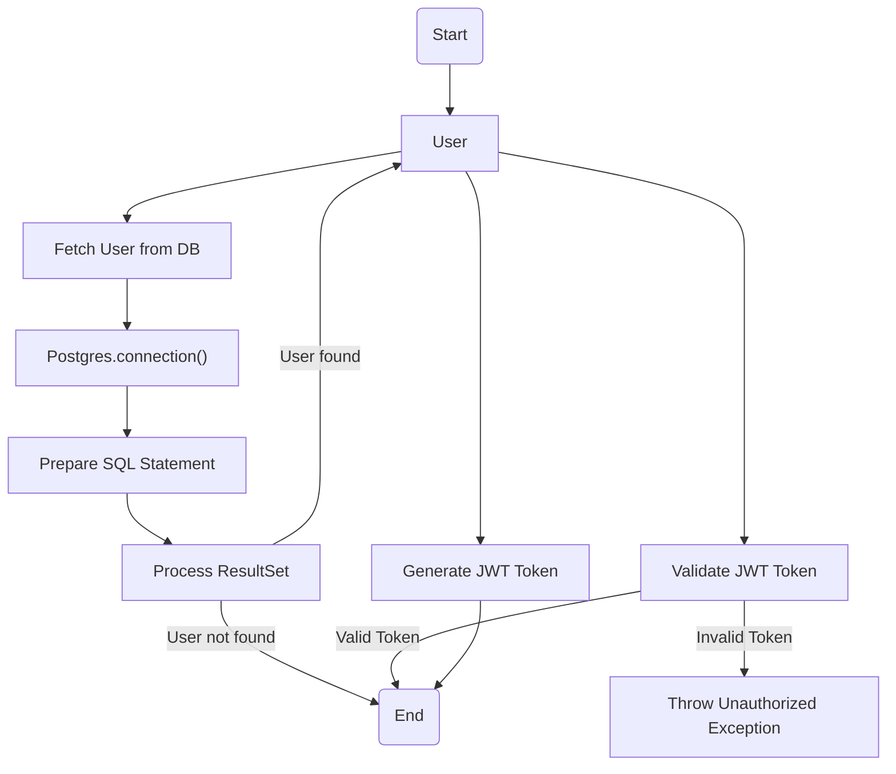
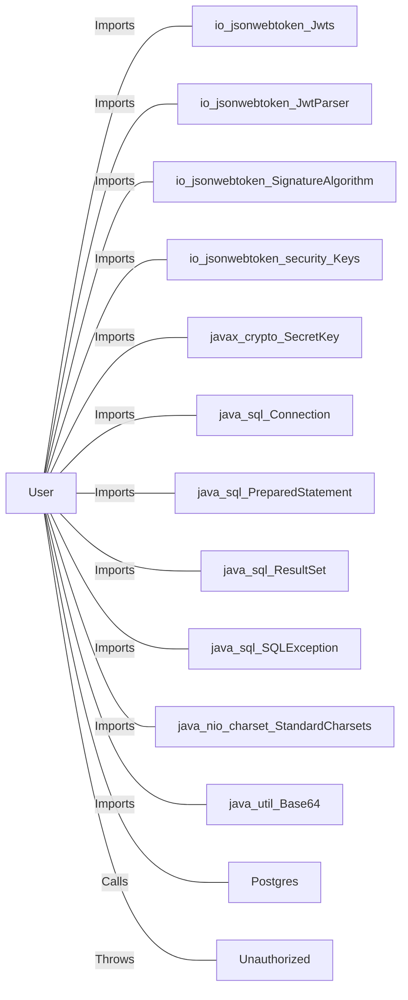

# User.java: User Authentication and Data Access

## Overview

This class encapsulates user-related data and provides secure methods for JWT token generation/validation and user retrieval from a PostgreSQL database. It is designed to prevent common security vulnerabilities such as SQL Injection and improper JWT handling.

## Process Flow

## Insights

- Uses strong cryptographic practices for JWT token generation and validation (HMAC SHA-256).
- Employs `PreparedStatement` to prevent SQL Injection in user lookup.
- Handles database connection and resource management with try-with-resources.
- Throws a custom `Unauthorized` exception on JWT validation failure.
- User attributes (`id`, `username`, `hashedPassword`) are public, which may not be ideal for encapsulation.

## Dependencies

- `io.jsonwebtoken.Jwts` : Used for building and parsing JWT tokens (Imports).
- `io.jsonwebtoken.JwtParser` : Used for parsing JWT tokens (Imports).
- `io.jsonwebtoken.SignatureAlgorithm` : Specifies the algorithm for signing JWTs (Imports).
- `io.jsonwebtoken.security.Keys` : Utility for key generation (Imports).
- `javax.crypto.SecretKey` : Represents the secret key for HMAC (Imports).
- `java.sql.Connection`, `PreparedStatement`, `ResultSet`, `SQLException` : JDBC classes for database access (Imports).
- `java.nio.charset.StandardCharsets` : Specifies UTF-8 encoding (Imports).
- `java.util.Base64` : For encoding/decoding (Imports).
- `Postgres` : Provides the database connection (Calls).
- `Unauthorized` : Custom exception thrown on authentication failure (Throws).

## Data Manipulation (SQL)

| Attribute   | Type   | Description                |
|-------------|--------|----------------------------|
| user_id     | String | Unique identifier for user  |
| username    | String | Username of the user        |
| password    | String | Hashed password             |

- `users`: SELECT operation to retrieve a user by username (with a limit of 1).

## Vulnerabilities

- Public fields (`id`, `username`, `hashedPassword`) may expose sensitive data and break encapsulation. Consider using private fields with getters/setters.
- The `fetch` method prints database errors to standard error, which could potentially leak information in production environments. Use proper logging and error handling.
- The class assumes the existence of a custom `Unauthorized` exception and a `Postgres` class for database connections, which must be implemented securely.
