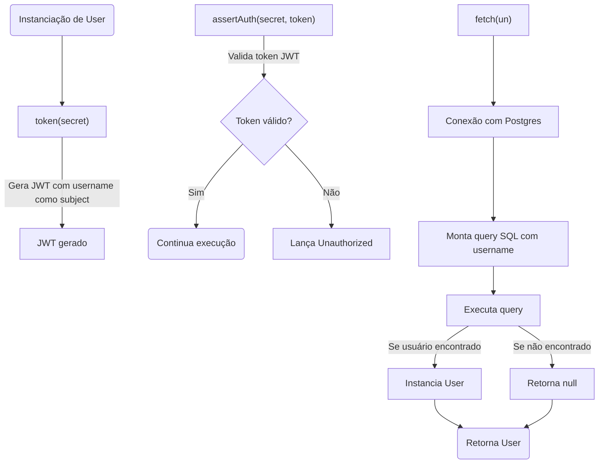
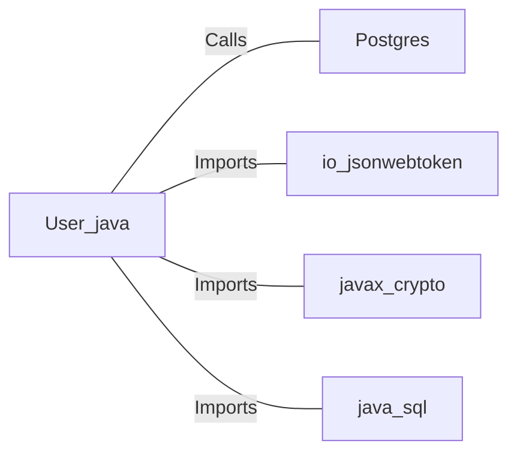

# User.java: Gerenciamento de Usuário e Autenticação JWT

## Overview

Esta classe representa um modelo de usuário com funcionalidades para autenticação baseada em JWT, além de métodos para buscar usuários em um banco de dados PostgreSQL. Inclui geração e validação de tokens JWT e manipulação de dados do usuário.

## Process Flow

## Insights

- A classe implementa um modelo de usuário com atributos públicos: `id`, `username` e `hashedPassword`.
- Geração de tokens JWT utiliza o username como subject e uma chave secreta fornecida.
- Validação de tokens JWT é feita com a mesma chave secreta, lançando exceção personalizada em caso de falha.
- O método `fetch` busca um usuário no banco de dados PostgreSQL pelo username, mas constrói a query SQL de forma insegura.
- O método `fetch` pode retornar `null` caso o usuário não seja encontrado ou ocorra uma exceção.
- Uso de bibliotecas externas para manipulação de JWT (`io.jsonwebtoken`).

## Vulnerabilities

- **SQL Injection**: O método `fetch` concatena diretamente o parâmetro `un` (username) na query SQL, permitindo injeção de comandos SQL maliciosos. Exemplo: o valor de `un` pode ser manipulado para executar comandos adicionais, como `DROP TABLE USERS`.
- **Exposição de Stack Trace**: Em caso de exceção, o stack trace é impresso no console, o que pode expor detalhes sensíveis do sistema em ambientes de produção.
- **Atributos Públicos**: Os atributos `id`, `username` e `hashedPassword` são públicos, o que pode expor dados sensíveis inadvertidamente.
- **Tratamento de Exceções**: O método `fetch` captura exceções genéricas e retorna `null`, dificultando o diagnóstico de falhas específicas.

## Dependencies

- `Postgres` : Utilizado para obter a conexão com o banco de dados PostgreSQL (`Calls`). O método `Postgres.connection()` é chamado para criar a conexão.
- `io_jsonwebtoken` : Biblioteca para geração e validação de tokens JWT (`Imports`).
- `javax_crypto` : Utilizado para manipulação de chaves secretas (`Imports`).
- `java_sql` : Utilizado para manipulação de conexões, statements e result sets SQL (`Imports`).

## Data Manipulation (SQL)

| Campo      | Tipo      | Descrição                        |
|------------|-----------|----------------------------------|
| user_id    | String    | Identificador único do usuário   |
| username   | String    | Nome de usuário                  |
| password   | String    | Senha (armazenada como hash)     |

- `users`: Utilizado no método `fetch` para buscar informações do usuário pelo campo `username` (SELECT). 

**Nota:** A query SQL construída é vulnerável a SQL Injection.
