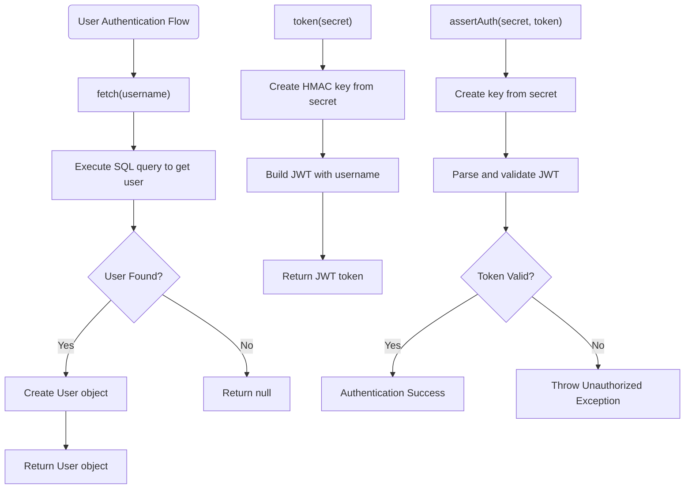
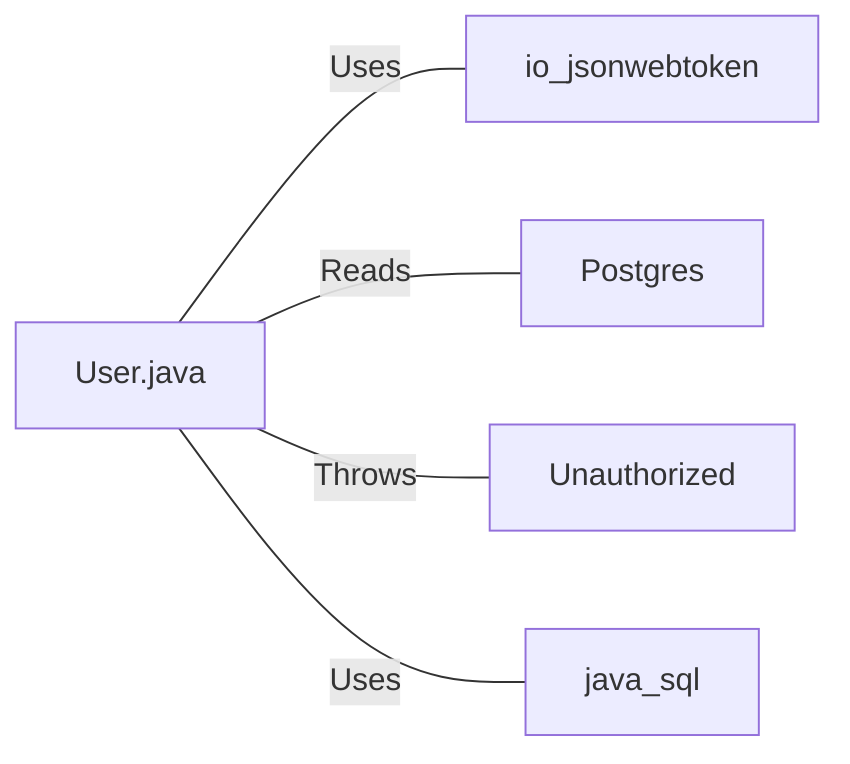

# User.java: User Authentication and Database Access Manager

## Overview
User.java manages user authentication, JWT token generation/validation, and database operations for retrieving user information from a PostgreSQL database.

## Process Flow

## Insights
- The class handles three main responsibilities: user data storage, JWT token generation, and token validation
- User authentication is performed using JWT (JSON Web Token) with HMAC-SHA signing
- The `fetch` method retrieves user information from a PostgreSQL database
- User passwords are stored in hashed format as indicated by the `hashedPassword` field

## Dependencies

- `io.jsonwebtoken` : Used for JWT token generation and validation
- `Postgres` : Used to establish database connections via the `Postgres.connection()` method
- `Unauthorized` : Custom exception class thrown when authentication fails
- `java.sql` : Used for database operations (Connection, Statement, ResultSet)

## Vulnerabilities
1. **SQL Injection**: The `fetch` method constructs SQL queries by directly concatenating user input (`un` parameter) without sanitization or prepared statements, making it vulnerable to SQL injection attacks.

2. **Weak Key Management**: The JWT secret key is passed as a string parameter and converted to bytes without proper key derivation or secure storage mechanisms.

3. **Insecure Error Handling**: Exception stack traces are printed to standard output, potentially exposing sensitive information about the application structure and database.

4. **Malformed SQL Query**: The query includes an incomplete "SELECT TOP" statement at the end, which could cause SQL syntax errors or unexpected behavior.

5. **No Connection Pooling**: Database connections are opened and closed for each request without proper connection pooling, which could lead to resource exhaustion under high load.

6. **No Password Verification**: While passwords are stored in hashed format, there's no method to verify passwords during authentication.
