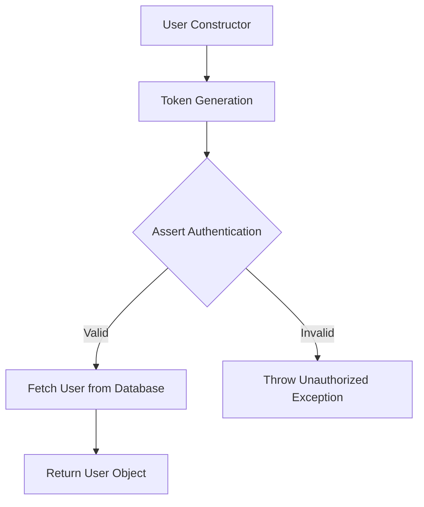
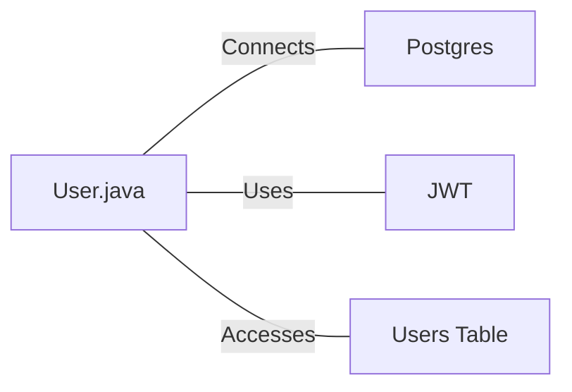

# User.java: User Authentication and Database Interaction

## Overview

This Java class, `User`, manages user authentication, token generation, and database interactions for user retrieval.

## Process Flow

## Insights

- The class uses JWT (JSON Web Tokens) for authentication.
- User data is fetched from a PostgreSQL database.
- The `fetch` method uses a potentially unsafe SQL query construction.
- Error handling is implemented, but exceptions are printed to standard error.

## Dependencies

- `Postgres`: Used to establish a database connection
- `JWT`: Utilized for token generation and authentication
- `users_table`: Database table accessed to fetch user information

## Data Manipulation (SQL)

| Entity | Description |
|--------|-------------|
| `users` | SELECT operation to fetch user details based on username |

## Vulnerabilities

1. **SQL Injection Vulnerability**: The `fetch` method constructs an SQL query by directly concatenating user input (`un`) into the query string. This is a severe security risk as it allows for potential SQL injection attacks.

2. **Weak Secret Key Handling**: The `token` and `assertAuth` methods convert a string secret directly to bytes for key generation. This approach might not be secure for all types of secrets and could lead to weak keys if the secret is not properly chosen.

3. **Exception Information Disclosure**: The `assertAuth` method prints the full stack trace of exceptions, which could potentially expose sensitive information about the application's structure and execution flow.

4. **Insecure Database Connection**: The code doesn't show how the database connection is secured. It's important to ensure that database connections are properly secured and use prepared statements to prevent SQL injection.

5. **Lack of Input Validation**: There's no visible input validation for the username parameter in the `fetch` method, which could lead to various security issues beyond SQL injection.

6. **Plaintext Password Storage**: The `hashedPassword` field name suggests that passwords might be stored as hashes, but there's no visible hashing mechanism in the provided code. If passwords are indeed stored in plaintext, this is a significant security risk.

7. **Unlimited Query Results**: The SQL query in the `fetch` method uses `LIMIT 1`, which is good for performance but might hide the fact that multiple users with the same username could exist, potentially leading to logical errors or security issues.

To address these vulnerabilities, consider using prepared statements for database queries, implementing proper input validation, securely managing secrets, using strong password hashing algorithms, and following secure coding practices for exception handling and information disclosure.
