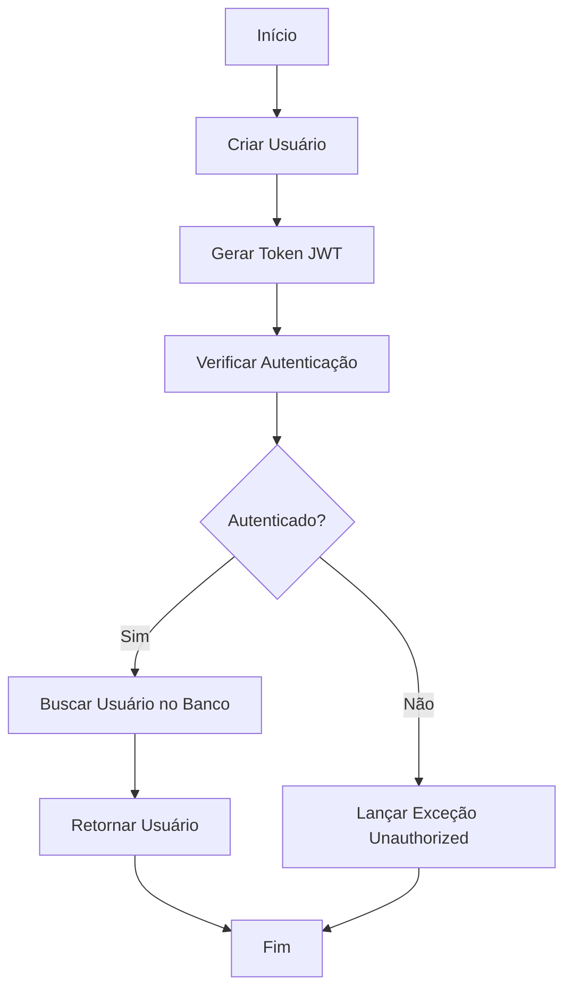
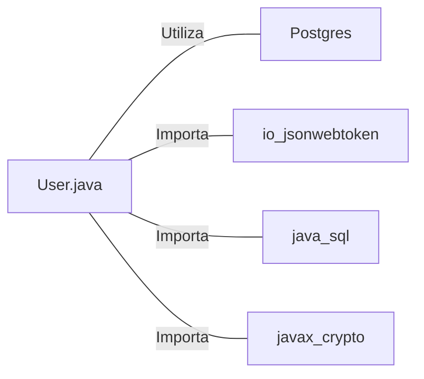

# User.java: Gerenciamento de Usuários e Autenticação

## Visão Geral

Esta classe `User` é responsável pelo gerenciamento de usuários, incluindo autenticação, geração de tokens JWT e recuperação de informações do usuário do banco de dados.

## Fluxo do Processo

## Insights

- A classe utiliza JWT (JSON Web Tokens) para autenticação.
- Há uma vulnerabilidade de SQL Injection na consulta de usuário.
- A senha do usuário é armazenada em texto simples como uma variável pública.
- O método `fetch` utiliza uma conexão com banco de dados PostgreSQL.
- A chave secreta para JWT é convertida de string para bytes sem considerar a codificação.

## Dependências

- `Postgres`: Utilizado para estabelecer conexão com o banco de dados PostgreSQL.
- `io.jsonwebtoken`: Biblioteca utilizada para geração e verificação de tokens JWT.
- `java.sql`: Utilizado para operações de banco de dados (Connection, Statement, ResultSet).
- `javax.crypto`: Utilizado para operações criptográficas (SecretKey).

## Manipulação de Dados (SQL)

`users`: SELECT - Busca um usuário pelo nome de usuário.

| Coluna    | Tipo   | Descrição                    |
|-----------|--------|------------------------------|
| user_id   | String | Identificador único do usuário |
| username  | String | Nome de usuário              |
| password  | String | Senha do usuário (hash)      |

## Vulnerabilidades

1. **SQL Injection**: O método `fetch` concatena diretamente o parâmetro `un` na query SQL, tornando-a vulnerável a ataques de SQL Injection.

2. **Armazenamento inseguro de senha**: A variável `password` é declarada como pública e armazena a senha em texto simples, o que é uma prática extremamente insegura.

3. **Exposição de informações sensíveis**: O código imprime a query SQL completa no console, o que pode expor informações sensíveis em logs.

4. **Tratamento inadequado de exceções**: As exceções são impressas no console, o que pode revelar detalhes sensíveis sobre a implementação ou erros do sistema.

5. **Uso inseguro de chave secreta**: A conversão da chave secreta de string para bytes não especifica a codificação, o que pode levar a problemas de segurança em diferentes ambientes.

6. **Falta de validação de entrada**: Não há validação do nome de usuário antes de usá-lo na query SQL, aumentando o risco de ataques.

7. **Gerenciamento inadequado de recursos**: A conexão com o banco de dados é fechada dentro do bloco try, o que pode levar a vazamentos de recursos em caso de exceções.

8. **Retorno de objeto nulo**: O método `fetch` pode retornar null se nenhum usuário for encontrado, o que pode causar NullPointerExceptions se não for tratado adequadamente.
