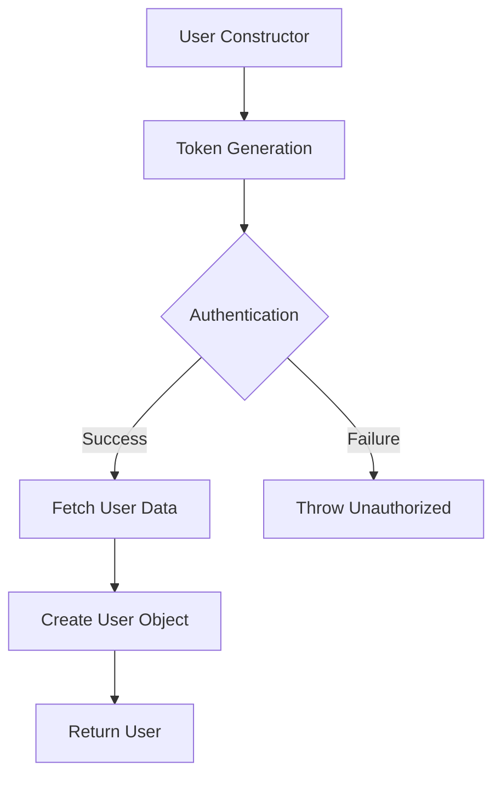

# User.java: User Authentication and Management

## Overview

This Java class, `User`, is responsible for user authentication, token generation, and database operations related to user management. It includes methods for creating user tokens, validating authentication, and fetching user data from a database.

## Process Flow

## Insights

- The class uses JWT (JSON Web Tokens) for authentication.
- User data is fetched from a PostgreSQL database using prepared statements.
- The class implements basic security measures such as hashed passwords and token-based authentication.
- Error handling is implemented, but detailed error messages are not exposed to the client.

## Dependencies

- `Postgres`: Used to establish a database connection for user data retrieval.
- `JWTS`: Utilized for JWT token generation and parsing.
- `users table`: Database table accessed to fetch user information.

## Data Manipulation (SQL)

| Entity | Description |
|--------|-------------|
| `users` | SELECT operation to fetch user data based on the username |

## Vulnerabilities

1. **Weak Secret Key Handling**: The `token` and `assertAuth` methods use the provided secret directly as bytes for the HMAC-SHA key. This approach might not be secure if the secret is not sufficiently long or complex.

2. **Potential SQL Injection**: Although prepared statements are used, which generally protect against SQL injection, the method of constructing the query string could be improved for better security.

3. **Password Storage**: The class stores hashed passwords, but the hashing method is not specified. It's crucial to use a strong, salted hashing algorithm (e.g., bcrypt, Argon2) for password storage.

4. **Error Handling**: While the code attempts to handle errors securely by not exposing stack traces, it might still leak sensitive information through error messages in some cases.

5. **Token Expiration**: The JWT tokens generated do not include an expiration time, which could lead to tokens being valid indefinitely if not properly managed.

6. **Lack of Input Validation**: There's no visible input validation for usernames or other user data, which could potentially lead to security issues or unexpected behavior.

7. **Insecure Logging**: System.err.println is used for logging errors, which might not be appropriate for a production environment and could potentially leak sensitive information.

8. **Missing Authorization Checks**: The `fetch` method doesn't include any authorization checks, potentially allowing any user to fetch another user's data if they know the username.
