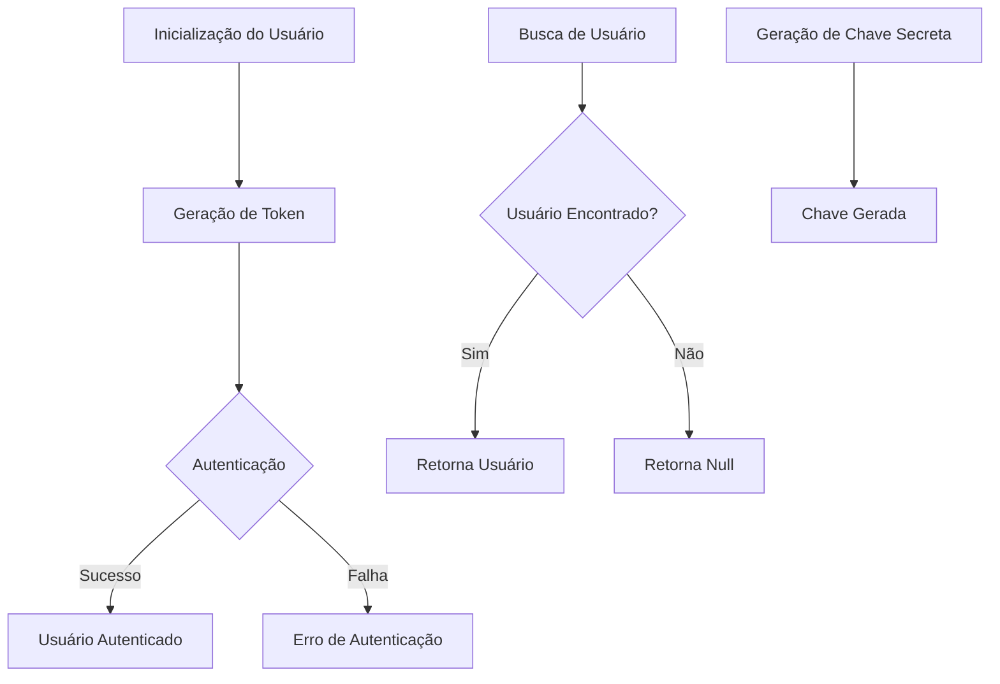
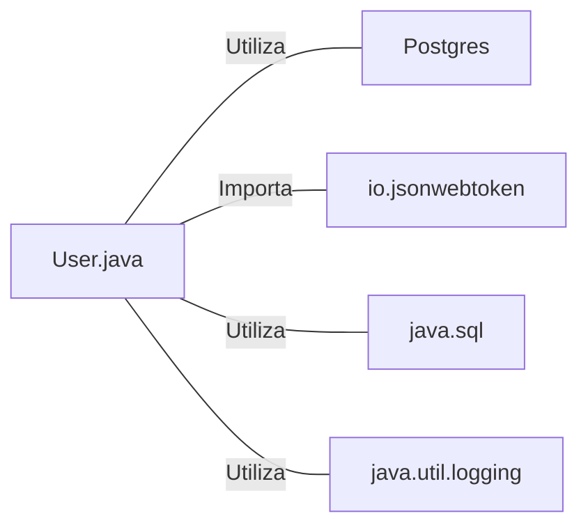

# User.java: Gerenciamento de Usuários e Autenticação

## Visão Geral

Esta classe `User` é responsável pelo gerenciamento de usuários, autenticação e geração de tokens JWT. Ela fornece funcionalidades para buscar usuários do banco de dados, gerar e validar tokens de autenticação, e gerenciar informações básicas do usuário.

## Fluxo do Processo

## Insights

- A classe utiliza JWT (JSON Web Tokens) para autenticação.
- Implementa um método para buscar usuários do banco de dados PostgreSQL.
- Utiliza PreparedStatement para prevenir injeção de SQL.
- Possui um mecanismo de logging para rastrear eventos importantes e erros.
- A senha do usuário é armazenada de forma hasheada.
- Implementa validação de token JWT.
- Utiliza uma chave secreta para assinar e validar tokens JWT.

## Dependências

- `Postgres`: Utilizado para estabelecer conexão com o banco de dados PostgreSQL.
- `io.jsonwebtoken`: Biblioteca utilizada para geração e validação de tokens JWT.
- `java.sql`: Utilizado para operações de banco de dados (Connection, PreparedStatement, ResultSet).
- `java.util.logging`: Utilizado para logging de informações e erros.

## Manipulação de Dados (SQL)

| Entidade | Operação | Descrição |
|----------|----------|-----------|
| `users`  | SELECT   | Busca um usuário pelo nome de usuário, retornando user_id, username e password. |

## Vulnerabilidades

1. **Armazenamento de Senhas**: Embora a senha seja referida como "hashedPassword", não há evidência clara de que esteja sendo aplicado um algoritmo de hash seguro. É crucial usar algoritmos de hash seguros e específicos para senhas, como bcrypt, Argon2 ou PBKDF2.

2. **Exposição de Informações Sensíveis**: O método `getHashedPassword()` permite acesso direto à senha hasheada, o que pode ser um risco de segurança se mal utilizado.

3. **Tratamento de Exceções**: O método `fetch()` captura todas as exceções e as relança como `RuntimeException`. Isso pode ocultar problemas específicos e dificultar o tratamento adequado de erros.

4. **Segurança do Token JWT**: 
   - Não há expiração definida para os tokens gerados, o que pode levar a tokens válidos por tempo indeterminado.
   - Não há verificação de claims adicionais (como 'exp' para expiração) na validação do token.

5. **Geração de Chave Secreta**: O método `generateKey()` usa diretamente os bytes da string secreta. Para maior segurança, seria melhor usar um gerador de chaves criptograficamente seguro.

6. **Logging de Informações Sensíveis**: O logging do nome de usuário durante a validação do token pode expor informações sensíveis nos logs.

7. **Consulta SQL Limitada**: A consulta SQL usa `LIMIT 1`, o que é bom para eficiência, mas pode mascarar problemas se houver usuários duplicados no banco de dados.

8. **Ausência de Preparação para Concorrência**: Não há mecanismos evidentes para lidar com acessos concorrentes, o que pode ser um problema em ambientes multi-threaded.
