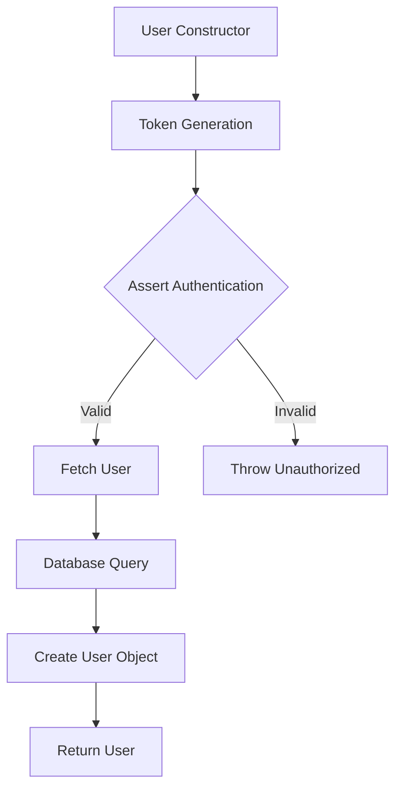
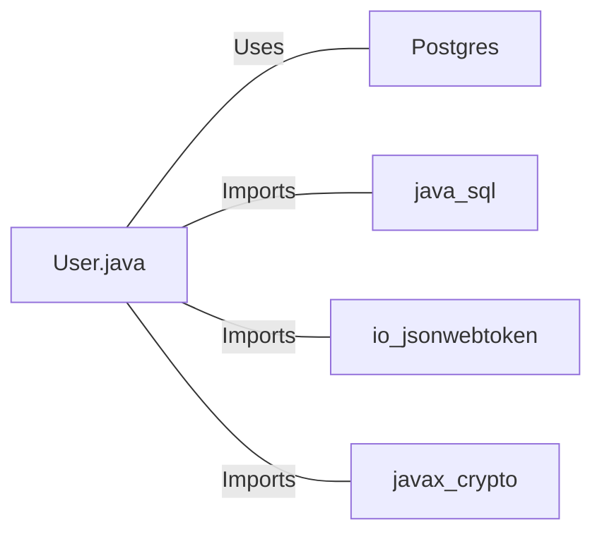

# User.java: User Authentication and Database Interaction

## Overview

This Java class, `User`, handles user authentication, token generation, and database interactions for user retrieval. It includes methods for creating JWT tokens, validating authentication, and fetching user data from a PostgreSQL database.

## Process Flow

## Insights

- The class uses JWT (JSON Web Tokens) for authentication.
- User data is stored in a PostgreSQL database.
- The `fetch` method uses a potentially unsafe SQL query construction.
- Error handling is implemented, but exceptions are printed to standard error.
- The class doesn't handle password hashing or verification directly.

## Dependencies

- `Postgres`: Used for database connection
- `java.sql`: Utilized for database operations (Connection, Statement, ResultSet)
- `io.jsonwebtoken`: Employed for JWT token generation and parsing
- `javax.crypto`: Used for cryptographic operations (SecretKey)

## Data Manipulation (SQL)

| Entity | Description |
|--------|-------------|
| `users` | SELECT operation to fetch user data based on username |

## Vulnerabilities

1. SQL Injection: The `fetch` method constructs an SQL query by directly concatenating user input (`un`) into the query string. This is a severe security vulnerability that could allow malicious users to manipulate the query and potentially access or modify unauthorized data.

2. Insecure Error Handling: The class prints stack traces and error messages to standard output and error streams. This could potentially expose sensitive information in production environments.

3. Weak Secret Key Handling: The `token` and `assertAuth` methods convert the secret string directly to bytes for key generation. This approach might not be secure for all types of secrets and could lead to weak keys if the secret is not properly chosen.

4. Lack of Input Validation: There's no validation on the input parameters, which could lead to unexpected behavior or security issues.

5. Potential Resource Leak: In the `fetch` method, the database connection is closed, but the Statement object is not explicitly closed, which could lead to resource leaks.

6. Returning Null: The `fetch` method returns `null` if no user is found or an exception occurs, which could lead to NullPointerExceptions if not handled properly by the calling code.

7. Storing Passwords: The class seems to store passwords in the database. It's unclear if these are properly hashed and salted, which is crucial for password security.

8. Unlimited Query Results: The SQL query uses `LIMIT 1`, but this is applied after fetching all matching rows, which could be inefficient for large datasets.
