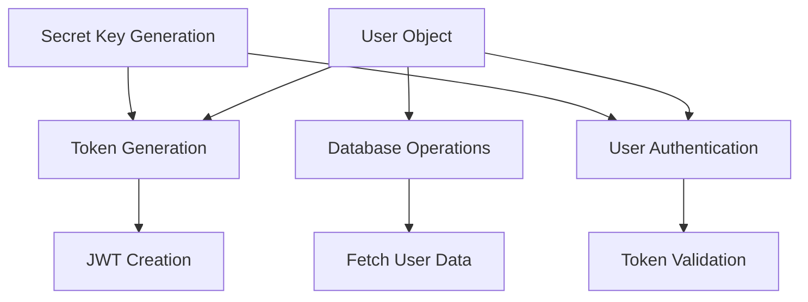
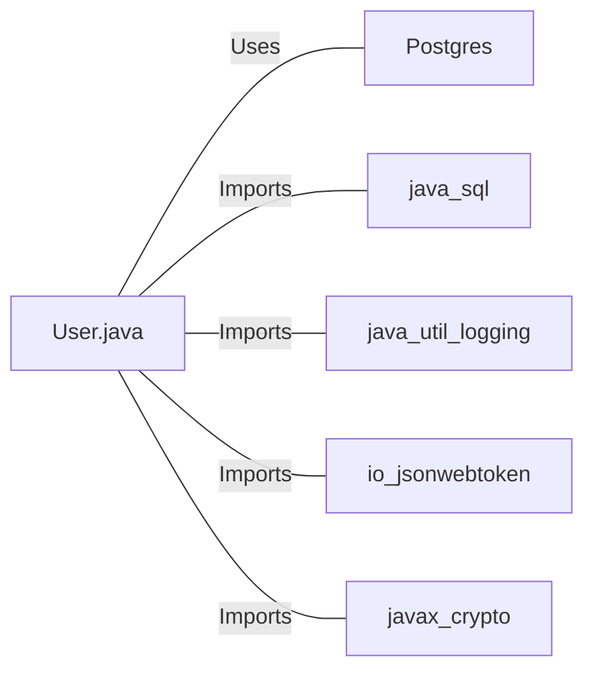

# User.java: User Authentication and Management System

## Overview

This Java class, `User`, is responsible for user authentication, token generation, and database operations related to user management. It includes methods for creating and validating JWT tokens, fetching user data from a database, and generating secret keys for token signing.

## Process Flow

## Insights

- The class uses JWT (JSON Web Tokens) for user authentication.
- Database operations are performed using prepared statements to prevent SQL injection.
- The class implements logging for various operations and error handling.
- User passwords are stored as hashed values in the database.
- The `fetch` method retrieves user data from a PostgreSQL database.
- Secret keys for JWT signing are generated using HMAC-SHA algorithm.

## Dependencies

- `Postgres`: Used for database connection
- `java.sql`: Utilized for database operations (Connection, PreparedStatement, ResultSet)
- `java.util.logging`: Employed for logging operations and errors
- `io.jsonwebtoken`: Used for JWT token generation and validation
- `javax.crypto`: Utilized for secret key generation

## Data Manipulation (SQL)

| Entity | Attributes | Data Type | Description |
|--------|------------|-----------|-------------|
| users  | user_id    | String    | Unique identifier for the user |
|        | username   | String    | User's username |
|        | password   | String    | Hashed password of the user |

`users`: SELECT operation to fetch user data based on the username

## Vulnerabilities

1. **Insecure Logging**: The class logs sensitive information like usernames, which could lead to information disclosure if logs are compromised.

2. **Exception Handling**: The `fetch` method throws a generic `RuntimeException` which may expose sensitive error details to the client.

3. **Password Storage**: While passwords are hashed, the method of hashing is not specified. It's crucial to use a strong, salted hashing algorithm (e.g., bcrypt, Argon2) for password storage.

4. **Token Expiration**: The JWT tokens generated do not include an expiration time, which could lead to tokens being valid indefinitely if not properly managed.

5. **Secret Key Management**: The `generateKey` method uses the provided secret directly to create the key. In a production environment, it's better to use a secure key management system.

6. **Database Connection Management**: While the code uses try-with-resources for proper connection closing, it relies on a `Postgres` class for connection management, which should be reviewed for proper connection pooling and security.

7. **Error Messages**: Some error messages (like "User not found") could potentially be used for user enumeration attacks.

8. **Missing Input Validation**: The class doesn't validate input for methods like `token` or `fetch`, which could lead to potential security issues if not properly handled at the API level.
