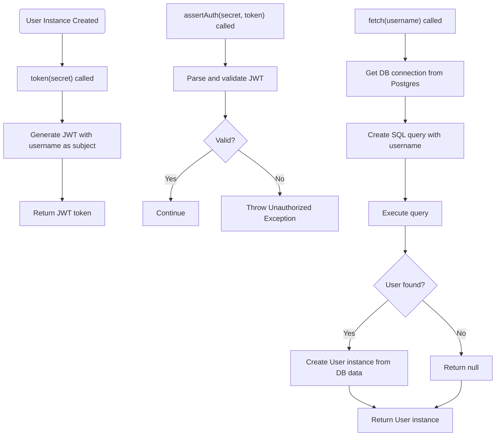
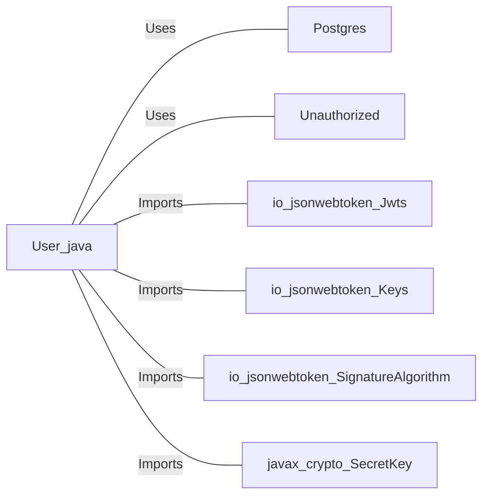

# User.java: User Authentication and JWT Management

## Overview

This class represents a user entity and provides methods for:
- Generating JWT tokens for authentication.
- Validating JWT tokens.
- Fetching user data from a PostgreSQL database.

## Process Flow

## Insights

- The class exposes user attributes (`id`, `username`, `hashedPassword`) as public fields.
- JWT tokens are generated using the username as the subject and a provided secret key.
- Token validation throws a custom `Unauthorized` exception on failure.
- User data is fetched from a PostgreSQL database using a dynamically constructed SQL query.
- The `fetch` method prints sensitive information (username and password) to the console, which is a security risk.
- The SQL query in `fetch` is vulnerable to SQL injection due to direct string concatenation.
- The code assumes the existence of a `Postgres` class with a `connection()` method and an `Unauthorized` exception class.

## Vulnerabilities

- **SQL Injection**: The `fetch` method constructs SQL queries by concatenating user input (`username`) directly into the query string, making it vulnerable to SQL injection attacks.
- **Sensitive Data Exposure**: The `fetch` method prints the username and password (even if hashed) to the console, which can lead to sensitive data leakage.
- **Public Fields**: User attributes are public, which can lead to unintended modification or exposure.
- **Improper Exception Handling**: Catching generic `Exception` and printing stack traces can expose internal details.
- **Potential JWT Weakness**: The security of JWT tokens depends entirely on the strength and secrecy of the provided secret.

## Dependencies

- `Postgres` : Used to obtain a database connection (`Postgres.connection()`), nature: Uses.
- `Unauthorized` : Custom exception thrown on failed authentication, nature: Uses.
- `io.jsonwebtoken.Jwts` : Used for building and parsing JWT tokens, nature: Imports.
- `io.jsonwebtoken.Keys` : Used for generating secret keys for JWT, nature: Imports.
- `io.jsonwebtoken.SignatureAlgorithm` : Used for specifying JWT signing algorithm, nature: Imports.
- `javax.crypto.SecretKey` : Used for cryptographic key representation, nature: Imports.

## Data Manipulation (SQL)

| Attribute   | Type   | Description                |
|-------------|--------|----------------------------|
| user_id     | String | Unique identifier for user |
| username    | String | Username of the user       |
| password    | String | User's hashed password     |

- `users`: SELECT operation to retrieve user data by username. The query is:  
  `select * from users where username = '<username>' limit 1`  
  **Note:** This query is vulnerable to SQL injection.
