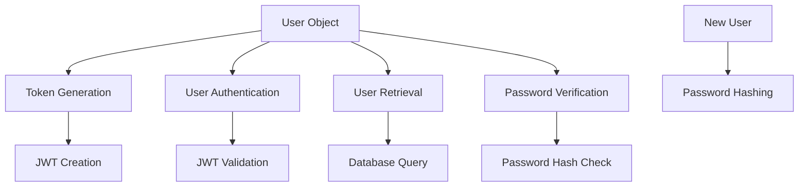
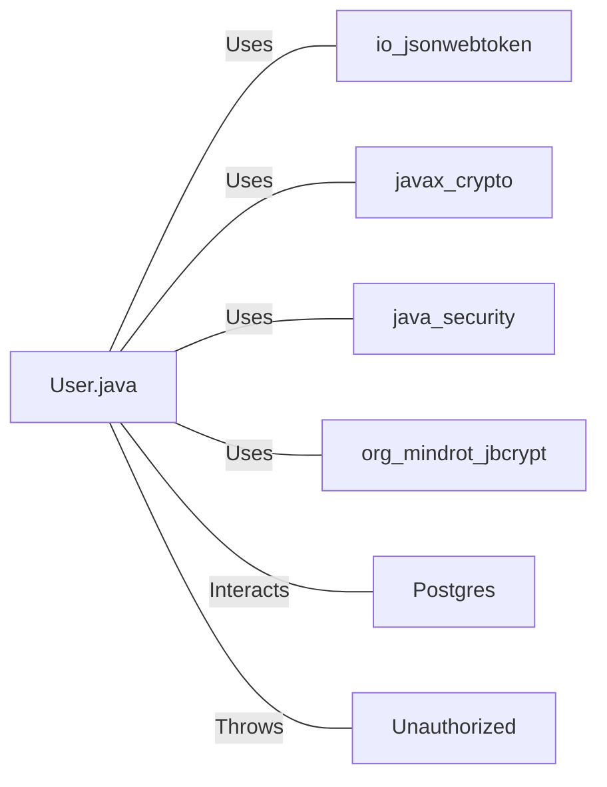

# User.java: User Authentication and Management System

## Overview

This Java class, `User`, is responsible for user authentication, token generation, and database operations. It includes methods for secure password hashing, JWT token generation and validation, and user data retrieval from a database.

## Process Flow

## Insights

- Uses JWT (JSON Web Tokens) for user authentication
- Implements secure password hashing using BCrypt
- Utilizes prepared statements to prevent SQL injection
- Includes error handling for database operations and token validation
- Supports user retrieval from a PostgreSQL database

## Dependencies

- `io.jsonwebtoken`: Used for JWT token generation and validation
- `javax.crypto`: Provides cryptographic operations for secure key generation
- `java.security`: Used for secure random number generation
- `org.mindrot.jbcrypt`: Implements BCrypt password hashing
- `Postgres`: Custom class for database connection management
- `Unauthorized`: Custom exception class for authentication failures

## Data Manipulation (SQL)

| Entity | Attributes | Data Type | Description |
|--------|------------|-----------|-------------|
| users  | user_id    | String    | Unique identifier for the user |
|        | username   | String    | User's username |
|        | password   | String    | Hashed password of the user |

- `users`: SELECT operation to fetch user details based on the username

## Vulnerabilities

1. **Insecure Secret Handling**: The `token` and `assertAuth` methods use a secret passed as a string parameter. This approach may lead to the secret being exposed in memory or logs. It's recommended to use secure key management systems or environment variables to handle secrets.

2. **Potential Resource Leak**: In the `fetch` method, the `PreparedStatement` is not properly closed in a `finally` block. This could lead to resource leaks if an exception occurs.

3. **Error Handling**: The `fetch` method catches SQLException but only prints the error message. It should consider logging the full stack trace and potentially rethrowing or handling the exception more robustly.

4. **Token Expiration**: The JWT token generation does not include an expiration time. This could lead to tokens being valid indefinitely, which is a security risk.

5. **Database Connection Management**: The database connection is opened and closed for each query in the `fetch` method. This approach might not be efficient for high-traffic applications and could benefit from connection pooling.

6. **Lack of Input Validation**: While SQL injection is prevented using prepared statements, there's no explicit input validation for usernames or passwords, which could potentially allow malformed or malicious input.
