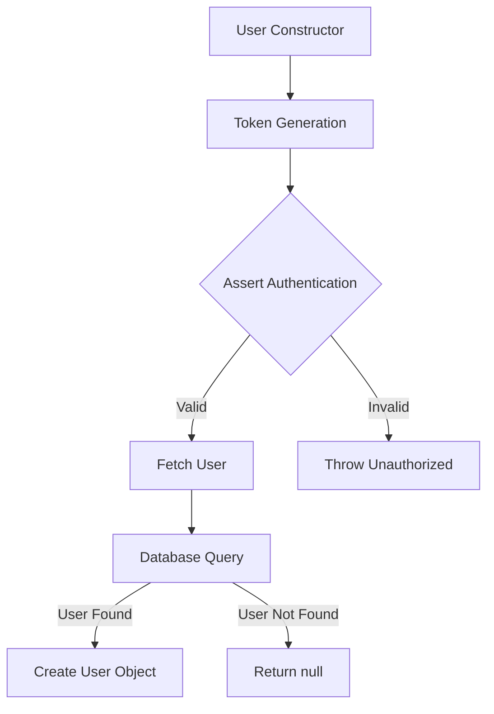
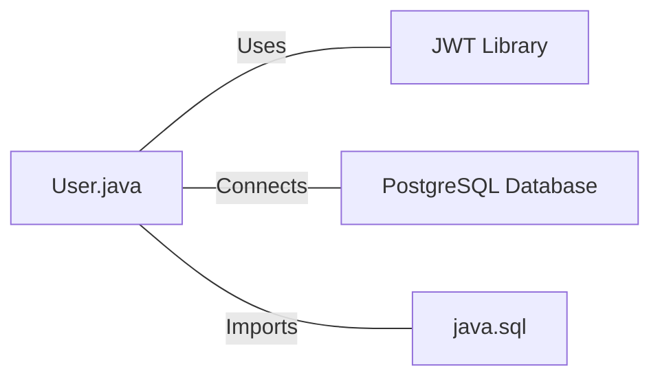

# User.java: User Authentication and Database Interaction

## Overview

This Java class, `User`, handles user authentication, token generation, and database interactions for user retrieval. It includes methods for creating JWT tokens, validating authentication, and fetching user data from a PostgreSQL database.

## Process Flow

## Insights

- The class uses JWT (JSON Web Tokens) for authentication.
- User data is stored in a PostgreSQL database.
- The `fetch` method uses a potentially unsafe SQL query construction.
- Error handling is implemented, but exceptions are printed to standard error.
- The class doesn't handle password hashing or verification directly.

## Dependencies

- `JWT Library`: Used for token generation and validation (io.jsonwebtoken package)
- `PostgreSQL Database`: Stores and retrieves user data
- `java.sql`: Provides classes for database connectivity and operations

## Data Manipulation (SQL)

`users`: SELECT operation to fetch user data based on username

| Column Name | Data Type | Description |
|-------------|-----------|-------------|
| user_id     | String    | Unique identifier for the user |
| username    | String    | User's username |
| password    | String    | User's hashed password |

## Vulnerabilities

1. SQL Injection: The `fetch` method constructs an SQL query by directly concatenating user input (`un`) into the query string. This is a severe security vulnerability that could allow malicious users to manipulate the query and potentially access or modify unauthorized data.

2. Weak Secret Key Handling: The `token` and `assertAuth` methods convert a string secret directly to bytes for use as an HMAC-SHA key. This approach may not provide sufficient entropy and could lead to weak keys if the secret string is not properly generated and managed.

3. Exception Handling: The `assertAuth` method prints the full stack trace of exceptions, which could potentially expose sensitive information in production environments.

4. Insecure Password Storage: While the class stores a `hashedPassword`, there's no evidence of proper password hashing being implemented. Storing passwords without proper hashing is a security risk.

5. Lack of Prepared Statements: The database query in the `fetch` method doesn't use prepared statements, which is the recommended approach to prevent SQL injection and improve performance.

6. No Connection Pooling: The database connection is opened and closed for each query, which can be inefficient for high-traffic applications.

7. Potential Resource Leak: In the `fetch` method, the `Statement` object is not explicitly closed, which could lead to resource leaks.

8. Insecure JWT Configuration: The JWT creation doesn't include important claims like expiration time (`exp`), issued at time (`iat`), or a unique identifier (`jti`), which are recommended for secure JWT usage.

These vulnerabilities should be addressed to improve the security and reliability of the application.
