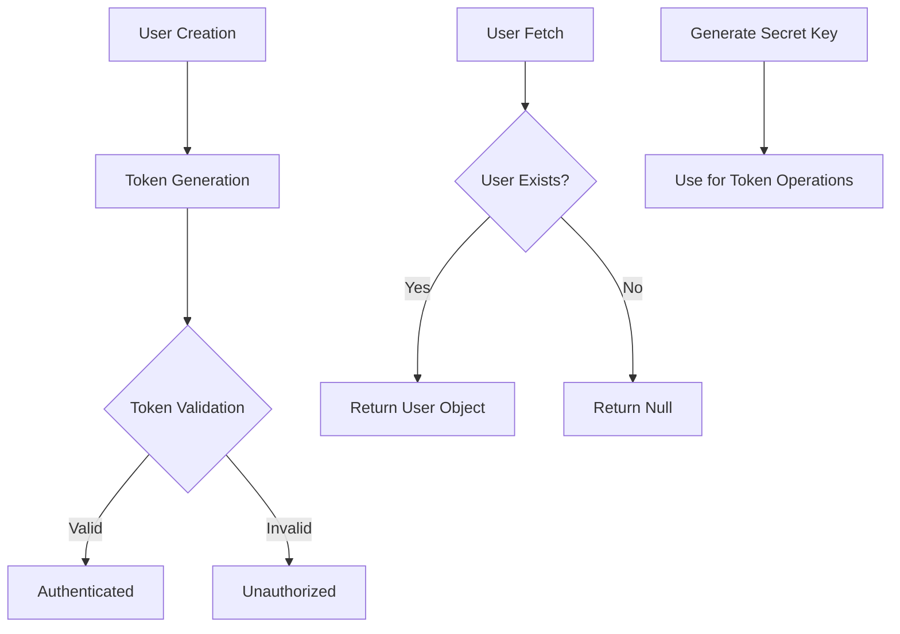
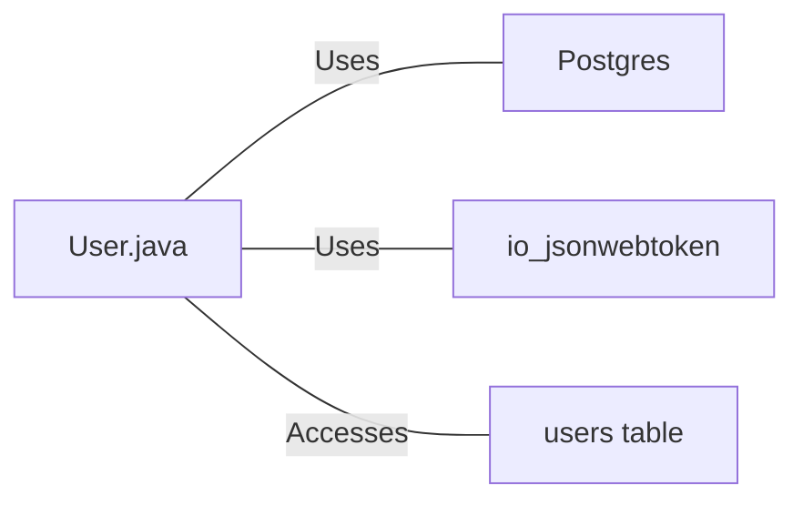

# User.java: User Authentication and Management System

## Overview

This Java class, `User`, is responsible for user authentication, token generation, and database operations related to user management. It includes methods for creating and validating JWT tokens, fetching user data from a database, and generating secret keys for token signing.

## Process Flow

## Insights

- Uses JWT (JSON Web Tokens) for user authentication
- Implements database operations to fetch user data
- Includes error handling and logging for various operations
- Uses prepared statements for database queries, which helps prevent SQL injection
- Implements a method to generate secret keys for token signing

## Dependencies

- `Postgres`: Used for database connection
- `io.jsonwebtoken`: Used for JWT token generation and validation
- `users table`: Database table accessed for user information

## Data Manipulation (SQL)

| Entity | Description |
|--------|-------------|
| `users` | SELECT operation to fetch user data based on username |

Table structure for `users`:

| Column Name | Data Type | Description |
|-------------|-----------|-------------|
| user_id     | String    | Unique identifier for the user |
| username    | String    | User's username |
| password    | String    | User's hashed password |

## Vulnerabilities

1. **Insecure Logging**: The class logs sensitive information such as usernames and token validation results. This could lead to information disclosure if log files are compromised.

2. **Exception Handling**: The `fetch` method catches all exceptions and throws a generic `RuntimeException`. This could mask specific database errors and make debugging more difficult.

3. **Password Storage**: The `password` field in the `users` table is referred to as "password" rather than "hashedPassword", which might indicate that passwords are stored in plain text. Passwords should always be hashed before storage.

4. **Token Expiration**: The JWT token generation does not include an expiration time. This could lead to tokens being valid indefinitely, which is a security risk.

5. **Secret Key Generation**: The `generateKey` method uses the raw bytes of the secret string for key generation. For production use, a more secure key generation method should be employed.

6. **Error Messages**: The error messages in the `assertAuth` method could potentially leak information about the token's validity to an attacker.

7. **Database Connection Handling**: While the code uses try-with-resources for proper connection closing, it doesn't implement connection pooling, which could lead to performance issues under high load.
