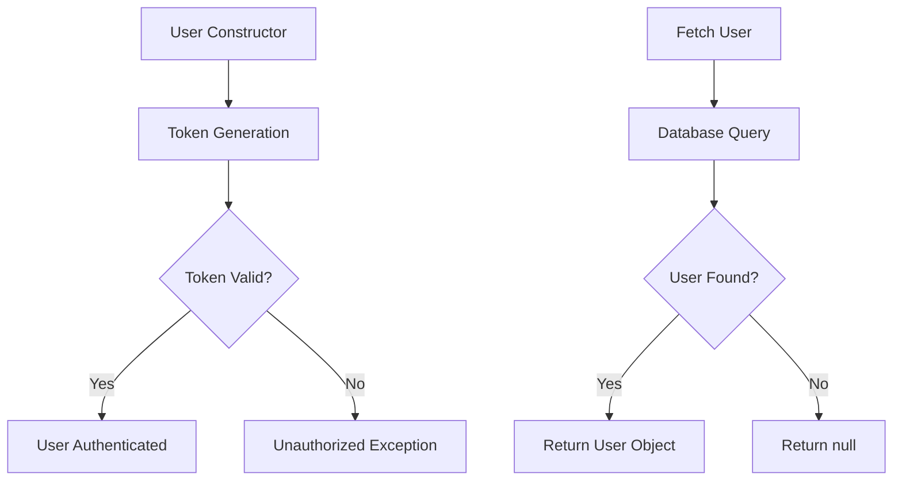
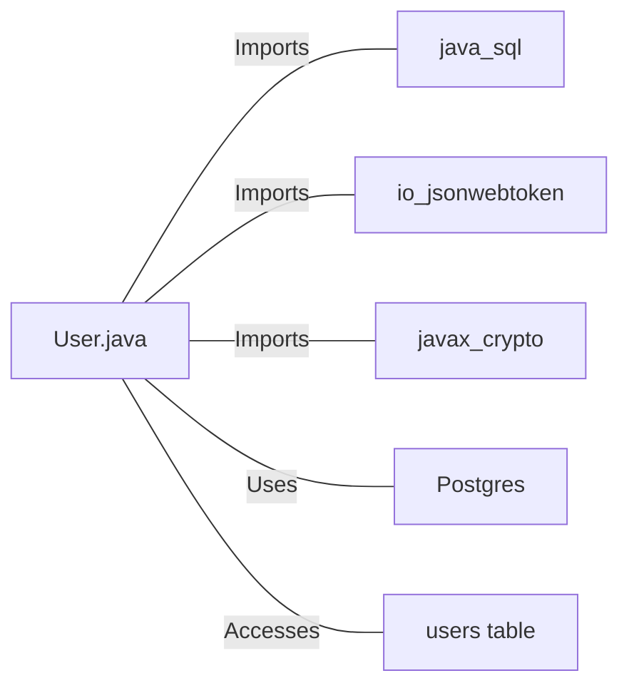

# User.java: User Authentication and Database Interaction

## Overview

This Java class, `User`, manages user authentication, token generation, and database interactions for user retrieval.

## Process Flow

## Insights

- Uses JWT (JSON Web Tokens) for user authentication
- Implements a method to generate tokens and another to validate them
- Utilizes prepared statements for database queries to prevent SQL injection
- Handles database connections and potential exceptions
- Stores user information including id, username, and hashed password

## Dependencies

- `java.sql`: Used for database connections and operations
- `io.jsonwebtoken`: Utilized for JWT token generation and validation
- `javax.crypto`: Used for cryptographic operations
- `Postgres`: Custom class for database connection (not shown in the provided code)
- `users table`: Database table accessed for user information

## Data Manipulation (SQL)

| Entity | Operation | Description |
|--------|-----------|-------------|
| users  | SELECT    | Retrieves user information based on the username |

Table structure for `users`:

| Column Name | Data Type | Description |
|-------------|-----------|-------------|
| user_id     | String    | Unique identifier for the user |
| username    | String    | User's username |
| password    | String    | User's hashed password |

## Vulnerabilities

1. **Weak Secret Key Handling**: The `token` and `assertAuth` methods use the provided secret string directly as bytes for the HMAC-SHA key. This approach might not be secure if the secret is not sufficiently long or complex. It's recommended to use a proper key derivation function.

2. **Exception Handling in `fetch` Method**: The `fetch` method catches all exceptions and only prints the stack trace. This could potentially expose sensitive information in logs. It's better to catch specific exceptions and handle them appropriately.

3. **Resource Management**: The database connection and prepared statement are not properly closed in a `finally` block. This could lead to resource leaks.

4. **Returning Null for Non-existent User**: The `fetch` method returns `null` if a user is not found. This could lead to null pointer exceptions if not handled properly by the calling code.

5. **Password Storage**: While the password is referred to as `hashedPassword`, there's no explicit hashing mechanism visible in the code. Ensure that passwords are properly hashed and salted before storage.

6. **Error Messages in Token Validation**: The `assertAuth` method includes the exception message in the `Unauthorized` exception. This could potentially expose sensitive information about the system to attackers.

7. **Lack of Input Validation**: There's no visible input validation for the username when fetching a user. This could potentially lead to unexpected behavior or security issues if malformed input is provided.
