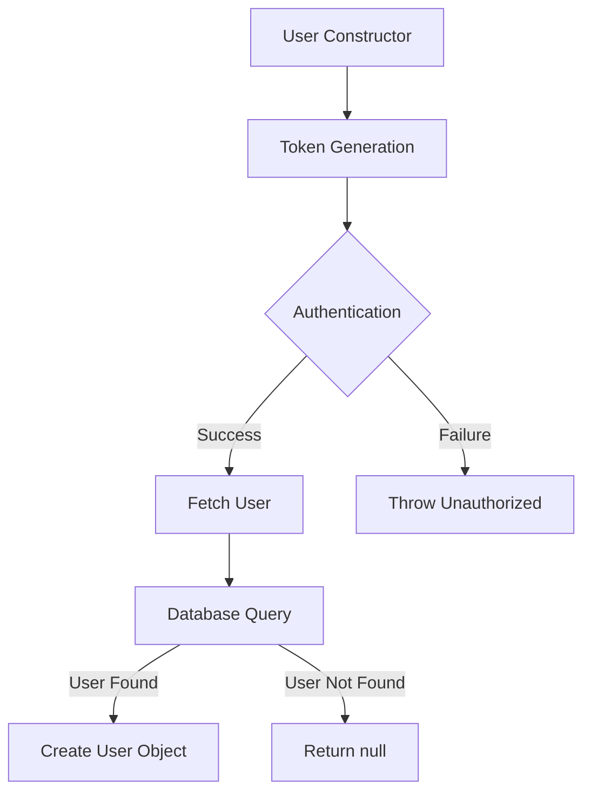
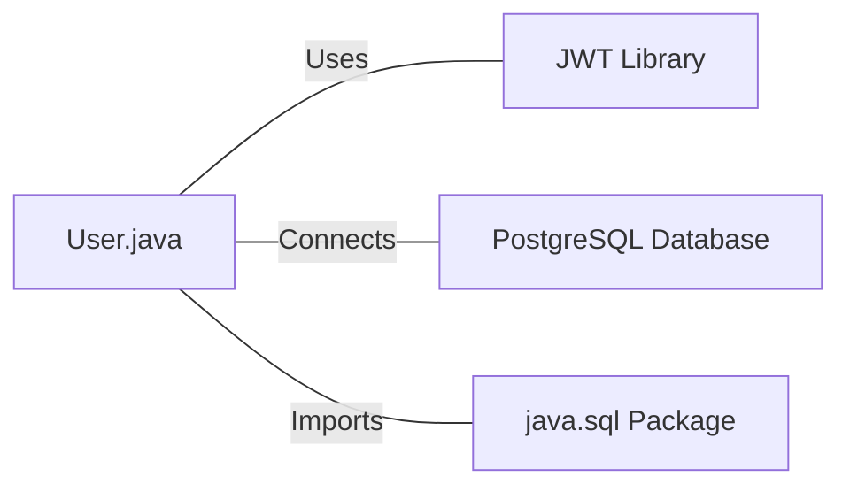

# User.java: User Authentication and Database Interaction

## Overview

This Java class, `User`, handles user authentication, token generation, and database interactions for user retrieval. It includes methods for creating JWT tokens, validating authentication, and fetching user data from a PostgreSQL database.

## Process Flow

## Insights

- The class uses JWT (JSON Web Tokens) for authentication.
- User data is stored in a PostgreSQL database.
- The `fetch` method contains a SQL injection vulnerability.
- The class handles both user creation and authentication processes.
- Error handling is implemented, but could be improved for better security.

## Dependencies

- `jwt`: Uses the `io.jsonwebtoken` library for JWT operations
- `postgres`: Connects to a PostgreSQL database for user data retrieval
- `java_sql`: Imports `java.sql` package for database operations

## Data Manipulation (SQL)

`users`: SELECT operation to fetch user data based on the username

| Column Name | Data Type | Description |
|-------------|-----------|-------------|
| user_id     | String    | Unique identifier for the user |
| username    | String    | User's username |
| password    | String    | User's hashed password |

## Vulnerabilities

1. SQL Injection: The `fetch` method is vulnerable to SQL injection attacks. The user input (`un`) is directly concatenated into the SQL query without proper sanitization or parameterization.

2. Weak Error Handling: In the `assertAuth` method, the full error message is printed to the stack trace, which could potentially expose sensitive information.

3. Insecure Password Storage: The `hashedPassword` field suggests that passwords might be stored as hashes, but the implementation details are not visible. Ensure that a secure hashing algorithm with salt is used.

4. Hardcoded Database Query: The SQL query in the `fetch` method contains a hardcoded `test;` which might be a leftover from testing and could cause unexpected behavior.

5. Potential Information Leakage: The `System.out.println(query);` in the `fetch` method could log sensitive information, including the raw SQL query with user input.

6. Inefficient Resource Management: The database connection is not properly closed in a `finally` block, which could lead to resource leaks.

7. Lack of Input Validation: There's no visible input validation for the `username` or `secret` parameters, which could lead to unexpected behavior or security issues.
