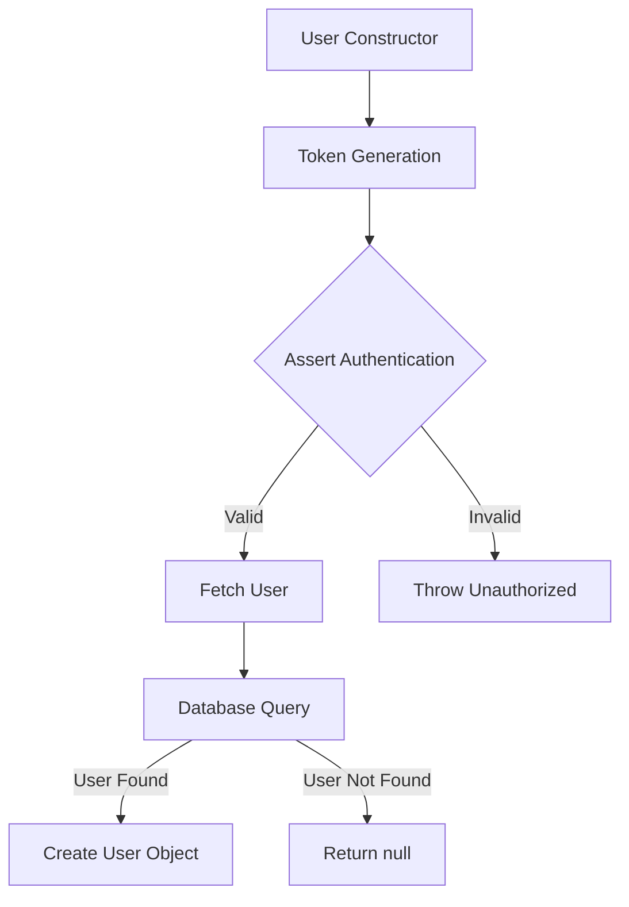
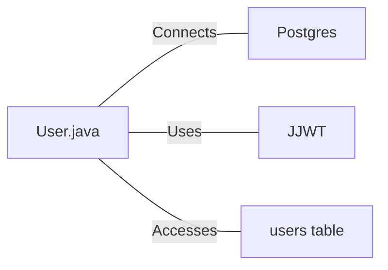

# User.java: User Authentication and Database Interaction

## Overview

This Java class, `User`, manages user authentication, token generation, and database interactions for user retrieval.

## Process Flow

## Insights

- The class uses JWT (JSON Web Tokens) for authentication.
- User data is fetched from a PostgreSQL database.
- The `fetch` method uses a prepared statement to prevent SQL injection.
- Error handling is implemented, but exceptions are printed to standard error.
- The class doesn't handle password hashing or verification directly.

## Dependencies

- `Postgres`: Used to establish a database connection
- `JJWT`: Java JWT library used for token generation and validation
- `users table`: Database table storing user information

## Data Manipulation (SQL)

| Entity | Description |
|--------|-------------|
| `users` | SELECT operation to fetch user details based on username |

## Vulnerabilities

1. **Insecure Secret Handling**: The `token` and `assertAuth` methods use the secret key directly as a byte array, which can be vulnerable if the secret is not properly protected.

2. **Exception Information Disclosure**: The `assertAuth` method prints the full stack trace of exceptions, which could potentially expose sensitive information.

3. **Weak Error Handling**: The `fetch` method catches all exceptions and returns null, which might hide critical errors.

4. **Potential Resource Leak**: The database connection in the `fetch` method might not be closed if an exception occurs before the `cxn.close()` statement.

5. **Lack of Input Validation**: There's no input validation for the username in the `fetch` method, which could lead to potential security issues.

6. **Plaintext Password Storage**: The `hashedPassword` field suggests that passwords might be stored in plaintext or using a weak hashing method.

7. **Inefficient Database Query**: The `LIMIT 1` clause in the SQL query is unnecessary since the method assumes only one user will be returned.

8. **Insecure JWT Configuration**: The JWT generation doesn't include important claims like expiration time, which could lead to tokens that are valid indefinitely.
