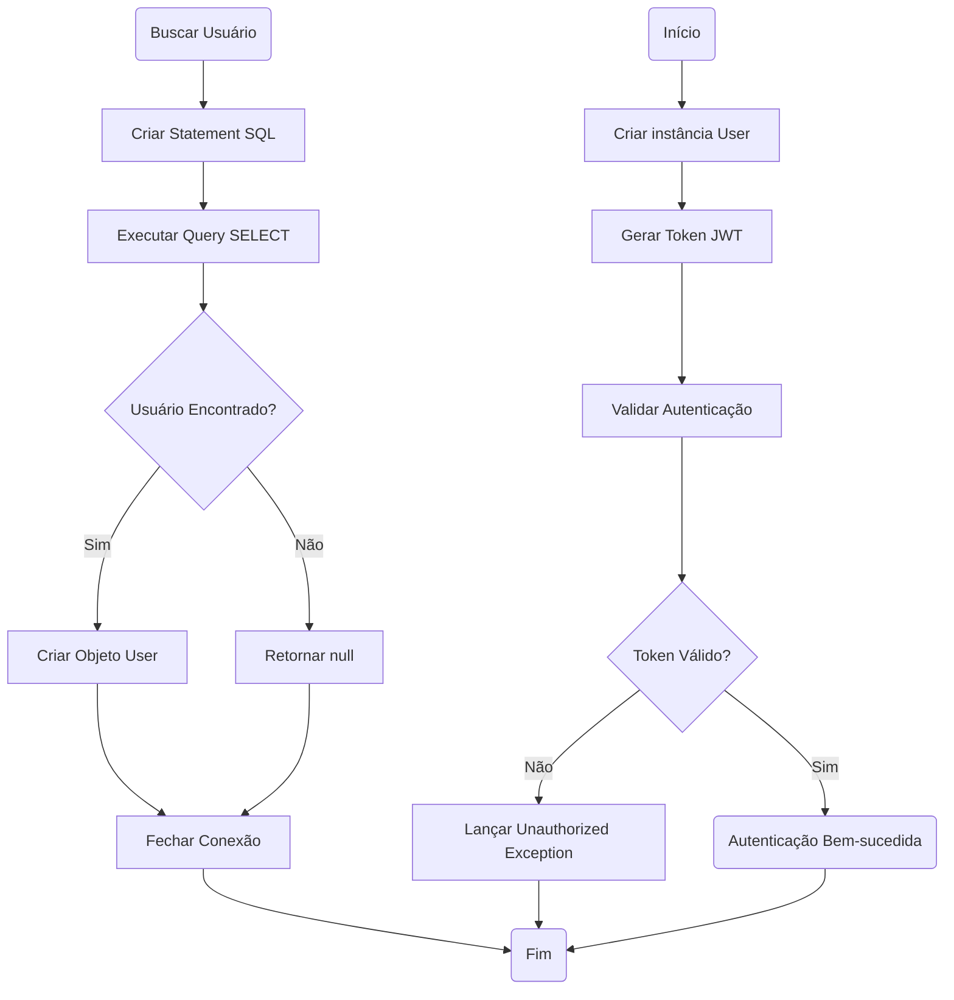
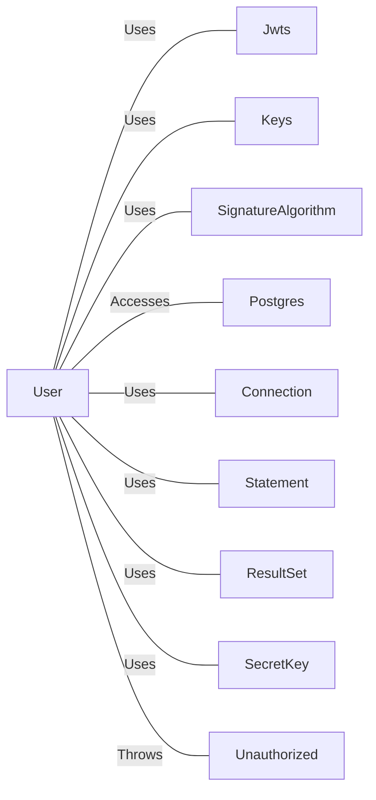

# User.java: Sistema de Autenticação e Gerenciamento de Usuários

## Overview

Esta classe implementa um sistema de autenticação baseado em JWT (JSON Web Token) e gerenciamento de usuários com acesso a banco de dados PostgreSQL. A classe fornece funcionalidades para criação de tokens JWT, validação de autenticação e busca de usuários no banco de dados.

## Process Flow

## Insights

- A classe combina autenticação JWT com acesso direto ao banco de dados PostgreSQL
- Utiliza HMAC-SHA para assinatura dos tokens JWT
- Implementa padrão de busca de usuário com limite de 1 resultado
- Possui tratamento básico de exceções com impressão de stack trace
- A validação de token lança exceção customizada `Unauthorized` em caso de falha
- O método `fetch` retorna `null` quando o usuário não é encontrado

## Dependencies

- `Jwts`: Biblioteca para criação e parsing de tokens JWT
- `Keys`: Utilitário para geração de chaves criptográficas HMAC
- `SignatureAlgorithm`: Enumeração de algoritmos de assinatura JWT
- `Postgres`: Classe para conexão com banco de dados PostgreSQL
- `Connection`: Interface JDBC para conexão com banco de dados
- `Statement`: Interface JDBC para execução de comandos SQL
- `ResultSet`: Interface JDBC para manipulação de resultados de consultas
- `SecretKey`: Interface para chaves criptográficas
- `Unauthorized`: Exceção customizada para falhas de autenticação

## Data Manipulation (SQL)

### Tabela: users

| Campo | Tipo | Descrição |
|-------|------|-----------|
| userid | String | Identificador único do usuário |
| username | String | Nome de usuário para login |
| password | String | Senha hash do usuário |

### Operações SQL

- `users`: Executa SELECT para buscar dados completos de um usuário específico por username com limite de 1 resultado

## Vulnerabilities

### 1. SQL Injection
- **Severidade**: Crítica
- **Localização**: Método `fetch()` na linha de construção da query
- **Descrição**: A query SQL é construída através de concatenação direta de strings sem sanitização: `"select * from users where username = '" + un + "' limit 1"`
- **Impacto**: Permite que atacantes executem comandos SQL arbitrários no banco de dados
- **Recomendação**: Utilizar PreparedStatement com parâmetros vinculados

### 2. Exposição de Informações Sensíveis
- **Severidade**: Alta
- **Localização**: Método `fetch()` - impressão da query no console
- **Descrição**: A query SQL completa é impressa no console, potencialmente expondo dados sensíveis em logs
- **Impacto**: Vazamento de informações em logs de sistema
- **Recomendação**: Remover ou condicionar a impressão de queries apenas em ambiente de desenvolvimento

### 3. Gerenciamento Inadequado de Recursos
- **Severidade**: Média
- **Localização**: Método `fetch()` - fechamento de Statement
- **Descrição**: O Statement não é fechado adequadamente no bloco finally, podendo causar vazamento de recursos
- **Impacto**: Esgotamento de recursos de conexão com o banco de dados
- **Recomendação**: Implementar try-with-resources ou garantir fechamento no bloco finally

### 4. Tratamento Inadequado de Exceções
- **Severidade**: Média
- **Localização**: Métodos `assertAuth()` e `fetch()`
- **Descrição**: Stack traces são impressos diretamente no console, expondo informações técnicas
- **Impacto**: Vazamento de informações sobre a estrutura interna da aplicação
- **Recomendação**: Implementar logging adequado e evitar exposição de stack traces em produção

### 5. Chave JWT Baseada em String
- **Severidade**: Média
- **Localização**: Métodos `token()` e `assertAuth()`
- **Descrição**: A chave JWT é gerada diretamente de uma string sem validação de entropia adequada
- **Impacto**: Possível comprometimento da segurança dos tokens se a chave for fraca
- **Recomendação**: Utilizar chaves com entropia adequada e armazenamento seguro
