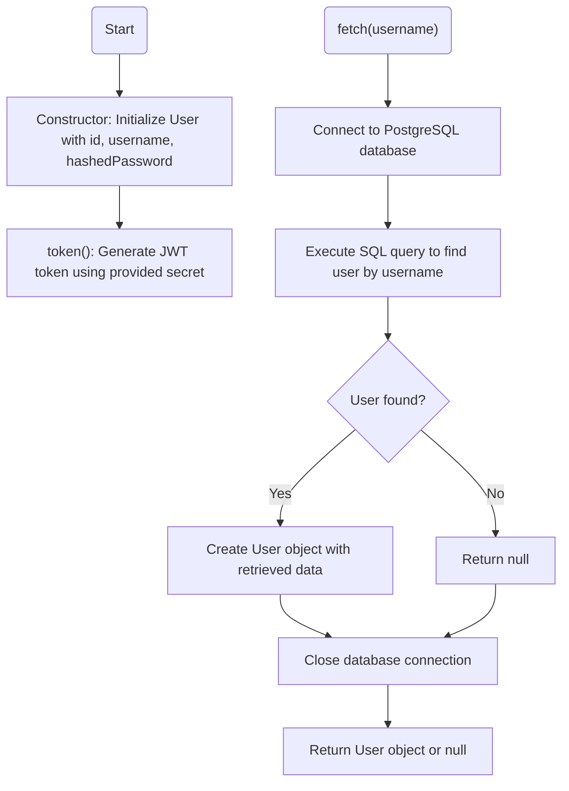
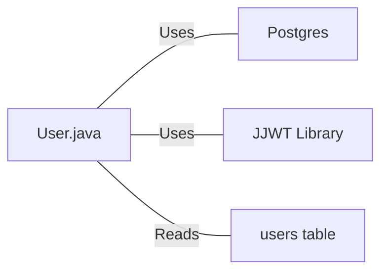

# User.java: User Authentication and Database Interaction

## Overview
The `User` class manages user authentication, token generation, and database interactions for retrieving user information from a PostgreSQL database.

## Process Flow

## Insights
- The class represents a user with basic attributes: id, username, and hashedPassword
- JWT (JSON Web Token) authentication is implemented using the JJWT library
- The token generation method creates a signed JWT with the username as the subject
- User data is retrieved from a PostgreSQL database based on username
- The class handles database connections through a separate `Postgres` utility class

## Dependencies

- `Postgres`: Used to establish database connections through the `connection()` method
- `JJWT Library`: Used for JWT token generation and signing
- `users table`: Database table containing user information with columns user_id, username, and password

## Vulnerabilities
1. **SQL Injection**: The `fetch()` method constructs SQL queries by directly concatenating user input (`un`) into the query string without any sanitization or prepared statements. This makes the application vulnerable to SQL injection attacks.

2. **Password Storage**: The class stores passwords in a variable named `hashedPassword`, but there's no evidence of actual hashing. The password appears to be stored and retrieved as-is from the database.

3. **Insecure Error Handling**: The exception handling in the `fetch()` method prints stack traces and error details to standard output, potentially exposing sensitive information.

4. **Connection Management**: Database connections might not be properly closed in case of exceptions, which could lead to connection leaks.

5. **JWT Security Issues**: The token generation uses the provided secret directly as bytes without proper key derivation or validation of secret strength.
