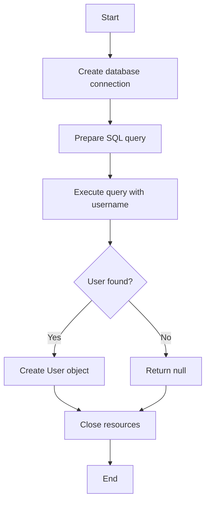
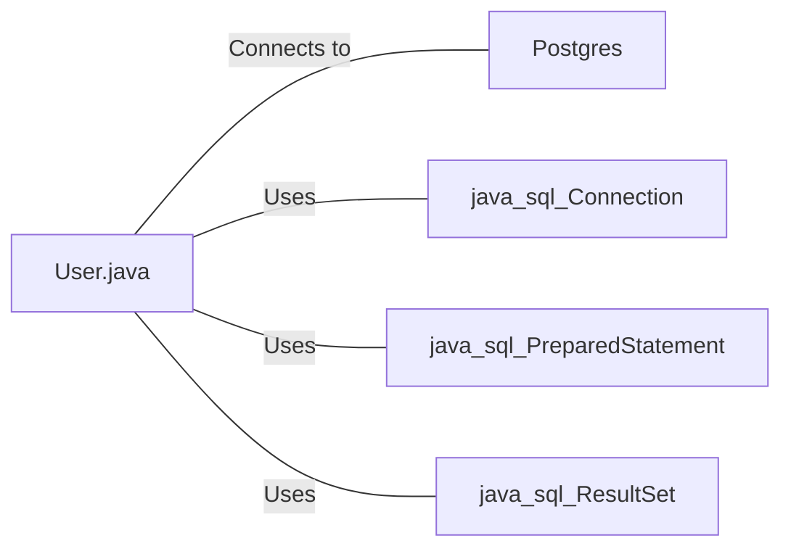

# User.java: User Data Management and Retrieval

## Overview

This Java class, `User`, manages user data and provides functionality to fetch user information from a database. It includes a method to retrieve a user by their username.

## Process Flow

## Insights

- The class uses a PostgreSQL database for data storage and retrieval.
- It implements a singleton pattern for database connection management through the `Postgres.connection()` method.
- The `fetch` method uses prepared statements to prevent SQL injection.
- Error handling is implemented using try-catch blocks.
- Resources (ResultSet, PreparedStatement, and Connection) are properly closed in the finally block to prevent resource leaks.

## Dependencies

- `Postgres`: Provides database connection management
- `java.sql.Connection`: Used for database connection handling
- `java.sql.PreparedStatement`: Used for preparing and executing SQL queries
- `java.sql.ResultSet`: Used for processing query results

## Data Manipulation (SQL)

| Entity Name | Description |
|-------------|-------------|
| `users`     | SELECT operation to fetch user data based on the provided username |

User attributes:

| Attribute | Type   | Description                |
|-----------|--------|----------------------------|
| user_id   | String | Unique identifier for user |
| username  | String | User's username            |
| password  | String | User's password            |

## Vulnerabilities

1. **Password Storage**: The password is stored and retrieved as plain text. This is a significant security risk. Passwords should be hashed and salted before storage.

2. **Exception Handling**: The code catches all exceptions and prints the stack trace. This could potentially expose sensitive information in production environments.

3. **Resource Management**: While resources are closed in the finally block, it's done in a nested try-catch. Using try-with-resources would be cleaner and less error-prone.

4. **Logging**: System.out.println() is used for logging. In a production environment, a proper logging framework should be used.

5. **Connection Management**: The database connection is obtained for each query. A connection pool should be used for better performance and resource management.

6. **Lack of Input Validation**: There's no validation on the input username before using it in the SQL query. While prepared statements protect against SQL injection, input validation is still a good practice.

7. **Returning Null**: The method returns null if no user is found. This could lead to NullPointerExceptions if not handled properly by the calling code. Consider using Optional<User> instead.
