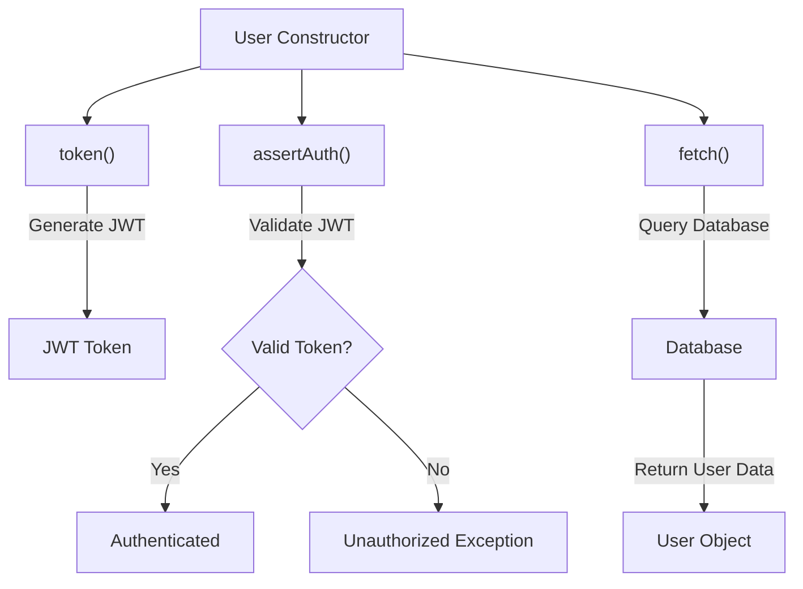
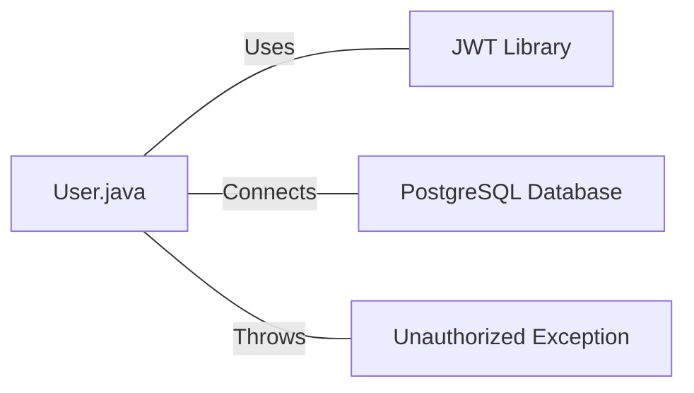

# User.java: User Authentication and Database Interaction

## Overview

This Java class, `User`, handles user authentication, token generation, and database interactions for user retrieval. It provides methods for creating user tokens, validating authentication, and fetching user data from a PostgreSQL database.

## Process Flow

## Insights

- The class uses JWT (JSON Web Tokens) for user authentication.
- Database queries are performed using prepared statements, which helps prevent SQL injection.
- The `fetch` method retrieves user data from a PostgreSQL database.
- Error handling is implemented for database operations and token validation.
- The class stores sensitive information like user IDs and hashed passwords.

## Dependencies

- `jwt`: Used for generating and validating JSON Web Tokens
- `postgres`: PostgreSQL database connection for user data retrieval
- `unauthorized`: Custom exception class for handling unauthorized access

## Data Manipulation (SQL)

| Entity | Description |
|--------|-------------|
| `users` | SELECT operation to fetch user data based on username |

Table Structure (inferred):

| Column Name | Data Type | Description |
|-------------|-----------|-------------|
| user_id     | String    | Unique identifier for the user |
| username    | String    | User's username |
| password    | String    | User's hashed password |

## Vulnerabilities

1. **Insecure Secret Key Handling**: The `token` and `assertAuth` methods convert the secret string directly to bytes, which may lead to weak keys if the secret is not properly generated or managed.

2. **Exception Information Disclosure**: In the `assertAuth` method, the full exception message is included in the `Unauthorized` exception, which could potentially expose sensitive information about the system.

3. **Inefficient Resource Management**: The `fetch` method doesn't use try-with-resources for managing database connections and prepared statements, which could lead to resource leaks if exceptions occur.

4. **Lack of Input Validation**: There's no input validation for the username in the `fetch` method, which could potentially lead to unexpected behavior or security issues if malformed input is provided.

5. **Sensitive Data Exposure**: The class stores the hashed password in a public field, which could be accessed directly, potentially exposing sensitive information.

6. **Weak Error Handling**: In the `fetch` method, exceptions are caught and printed, but the method continues to execute, potentially leading to null pointer exceptions or other unexpected behavior.

7. **Hardcoded Database Query**: The SQL query is hardcoded in the `fetch` method, which makes it difficult to maintain and could lead to SQL injection if not properly parameterized (although prepared statements are used, which mitigates this risk).

8. **Lack of Logging**: The class uses `System.out.println` for logging, which is not suitable for production environments and doesn't provide proper error tracking or monitoring capabilities.
