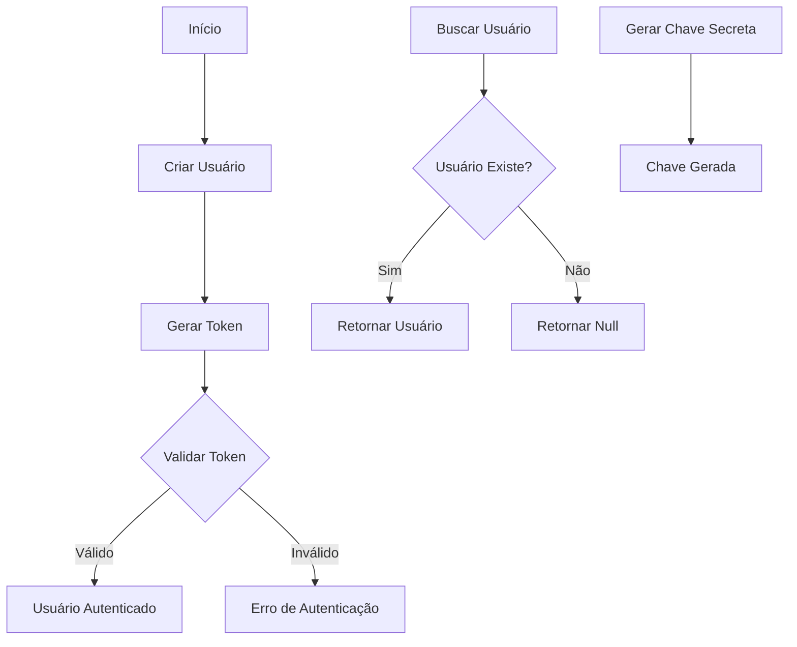
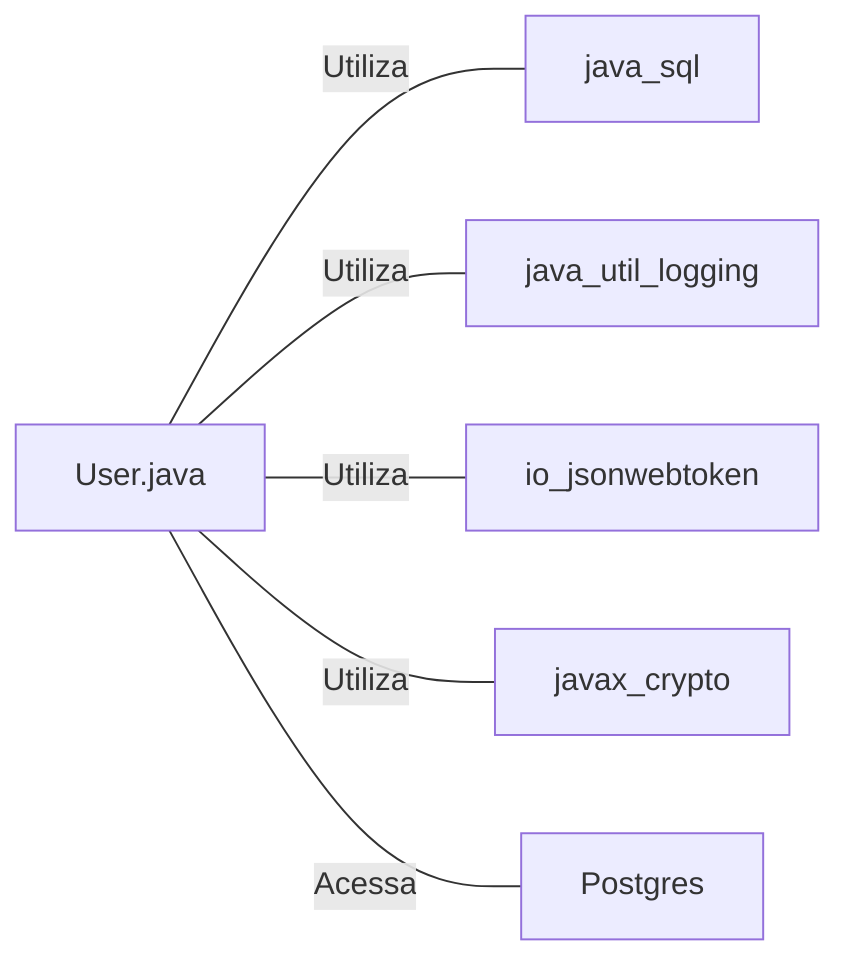

# User.java: Gerenciamento de Usuários e Autenticação

## Visão Geral

Esta classe `User` é responsável pelo gerenciamento de usuários, autenticação e geração de tokens JWT. Ela fornece funcionalidades para buscar usuários do banco de dados, gerar e validar tokens de autenticação, e gerenciar informações básicas do usuário.

## Fluxo do Processo

## Insights

- A classe utiliza JWT (JSON Web Tokens) para autenticação.
- Implementa um método para buscar usuários do banco de dados PostgreSQL.
- Utiliza PreparedStatement para prevenir injeção de SQL.
- Possui um mecanismo de logging para rastrear operações e erros.
- A senha do usuário é armazenada de forma hash.
- Implementa um método para gerar uma chave secreta para assinatura de tokens.

## Dependências

- `java.sql`: Utilizado para conexão e operações com banco de dados.
- `java.util.logging`: Utilizado para logging de informações e erros.
- `io.jsonwebtoken`: Utilizado para geração e validação de tokens JWT.
- `javax.crypto`: Utilizado para operações criptográficas.
- `Postgres`: Classe personalizada utilizada para obter conexão com o banco de dados PostgreSQL.

## Manipulação de Dados (SQL)

| Entidade | Operação | Descrição |
|----------|----------|-----------|
| `users`  | SELECT   | Busca um usuário pelo nome de usuário, retornando user_id, username e password. |

## Vulnerabilidades

1. **Armazenamento de Senhas**: A senha do usuário é armazenada como um hash, mas não há informações sobre o algoritmo de hash utilizado. Se for um algoritmo fraco ou sem salt, pode ser vulnerável a ataques de força bruta ou rainbow tables.

2. **Exposição de Informações Sensíveis**: O método `getHashedPassword()` permite acesso direto ao hash da senha, o que pode ser um risco de segurança se mal utilizado.

3. **Tratamento de Exceções**: Algumas exceções são capturadas e relançadas como `RuntimeException`, o que pode expor detalhes internos do sistema em caso de erro.

4. **Logging de Informações Sensíveis**: O logging do nome de usuário durante a validação do token pode expor informações sensíveis nos logs.

5. **Geração de Chave Secreta**: O método `generateKey()` usa diretamente os bytes da string secreta para gerar a chave. Isso pode ser inseguro se a string secreta não for suficientemente complexa ou longa.

6. **Ausência de Limite de Tentativas**: Não há implementação de limite de tentativas de autenticação, o que pode tornar o sistema vulnerável a ataques de força bruta.

7. **Conexão com o Banco de Dados**: A conexão com o banco de dados é obtida através de uma classe `Postgres`, mas não há informações sobre como essa conexão é gerenciada ou se utiliza um pool de conexões, o que pode levar a problemas de desempenho ou segurança.
