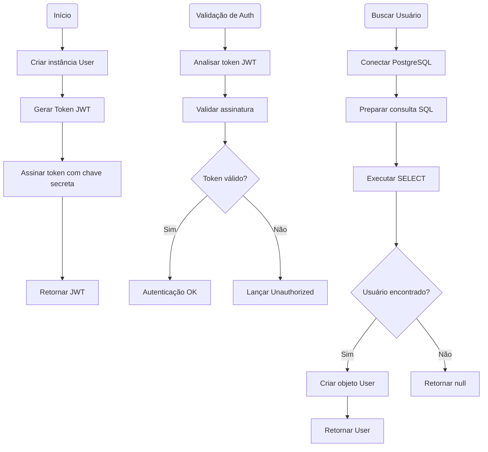
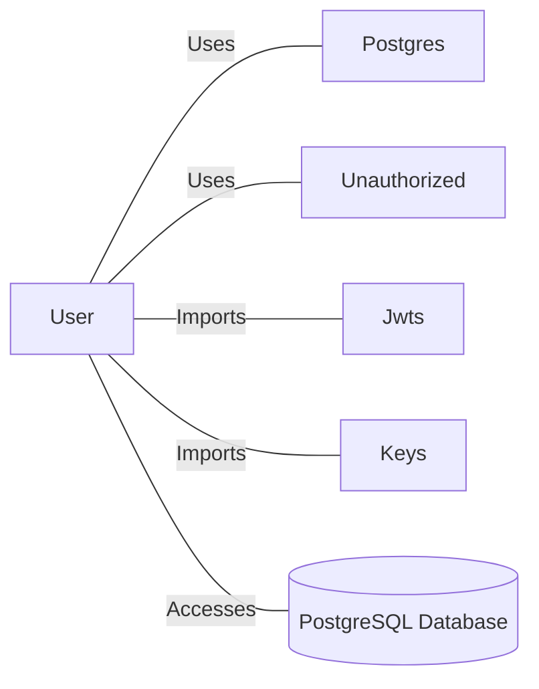

# User.java: Sistema de Autenticação e Gerenciamento de Usuários

## Overview

Esta classe implementa um sistema de autenticação de usuários utilizando JWT (JSON Web Tokens) e integração com banco de dados PostgreSQL. A classe é responsável por representar usuários, gerar tokens de autenticação, validar tokens e buscar informações de usuários no banco de dados.

## Process Flow

## Insights

- A classe utiliza JWT com algoritmo HS256 para autenticação baseada em tokens
- Implementa busca de usuários no banco de dados com prepared statements
- Armazena senhas em formato hash para segurança
- Utiliza conexão com PostgreSQL através da classe `Postgres`
- Método `assertAuth` valida tokens e lança exceção `Unauthorized` em caso de falha
- O método `fetch` é estático, permitindo busca de usuários sem instanciar a classe
- Tratamento de exceções SQL com impressão de stack trace para debug

## Dependencies

- `Postgres`: Classe para gerenciamento de conexões com banco de dados PostgreSQL
- `Unauthorized`: Classe de exceção customizada para erros de autenticação
- `Jwts`: Biblioteca para criação e parsing de tokens JWT
- `Keys`: Utilitário para geração de chaves criptográficas
- `PostgreSQL_DB`: Banco de dados PostgreSQL contendo tabela de usuários

## Data Manipulation (SQL)

| Tabela | Operação | Descrição |
|--------|----------|-----------|
| `users` | SELECT | Busca usuário por username com limite de 1 registro, retornando userid, username e password |

### Estrutura da Tabela users

| Campo | Tipo | Descrição |
|-------|------|-----------|
| userid | String | Identificador único do usuário |
| username | String | Nome de usuário para login |
| password | String | Senha do usuário em formato hash |

## Vulnerabilidades

### 1. Chave Secreta Fraca
- A chave JWT é gerada diretamente dos bytes da string secreta sem validação de força
- Recomendação: Usar chaves com pelo menos 256 bits e armazenar de forma segura

### 2. Exposição de Informações Sensíveis
- Stack traces são impressos no console, podendo expor informações do sistema
- Senhas hash são armazenadas em atributos públicos da classe
- Recomendação: Implementar logging seguro e tornar atributos privados

### 3. Tratamento de Exceções Inadequado
- Exceções SQL são capturadas mas não tratadas adequadamente
- Informações de erro podem vazar detalhes da implementação
- Recomendação: Implementar tratamento específico para diferentes tipos de erro

### 4. Falta de Validação de Entrada
- Não há validação dos parâmetros de entrada nos métodos
- Possível injeção SQL se a classe `Postgres` não implementar proteções adequadas
- Recomendação: Adicionar validação de entrada e sanitização de dados
