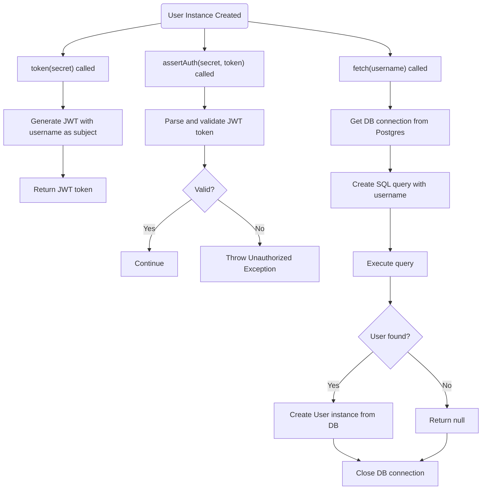
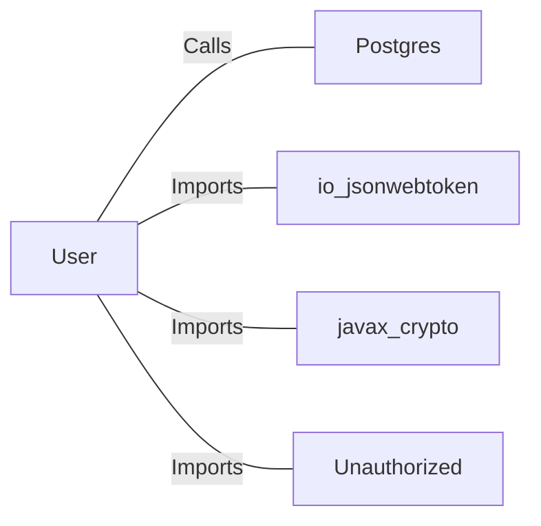

# User.java: User Authentication and Data Access

## Overview

This class represents a user entity with authentication and data access capabilities. It provides methods for generating JWT tokens, validating authentication, and fetching user data from a PostgreSQL database.

## Process Flow

## Insights

- The class exposes user attributes (`id`, `username`, `hashedPassword`) and provides a constructor for initialization.
- JWT tokens are generated using the username as the subject and a provided secret key.
- Authentication is validated by parsing the JWT token with the same secret.
- User data is fetched from a PostgreSQL database using a dynamically constructed SQL query.
- The SQL query construction is vulnerable to SQL injection due to direct string concatenation with user input.
- The SQL query includes a dangerous statement (`DROP DATABASE 1`), which could lead to catastrophic data loss if executed.
- The `fetch` method always returns a `User` object or `null`, even in the event of exceptions.

## Vulnerabilities

- **SQL Injection**: The `fetch` method constructs SQL queries by directly concatenating user input (`un`) into the query string. This allows attackers to inject arbitrary SQL, potentially leading to data leakage, modification, or destruction.
- **Dangerous SQL Statement**: The query string includes `DROP DATABASE 1`, which, if executed, would attempt to delete a database. This is a critical security risk.
- **Exception Handling**: The `fetch` method catches all exceptions, prints stack traces, and returns `null`, potentially hiding errors and making debugging or monitoring more difficult.
- **Hardcoded Secret Handling**: The JWT secret is passed as a string and converted to bytes without validation or secure storage, which may lead to weak key management practices.

## Dependencies

- `Postgres` : Used to obtain a database connection for fetching user data (Calls).
- `io_jsonwebtoken` : Used for JWT creation and parsing (Imports).
- `javax_crypto` : Used for cryptographic key generation (Imports).
- `Unauthorized` : Custom exception thrown on authentication failure (Imports).

## Data Manipulation (SQL)

| Attribute      | Type   | Description                |
|----------------|--------|----------------------------|
| user_id        | String | Unique identifier for user  |
| username       | String | Username of the user        |
| password       | String | Hashed password             |

- `users`: Table queried to fetch user data by username (SELECT).
- The SQL query attempts to select a user and includes a destructive `DROP DATABASE 1` command.
