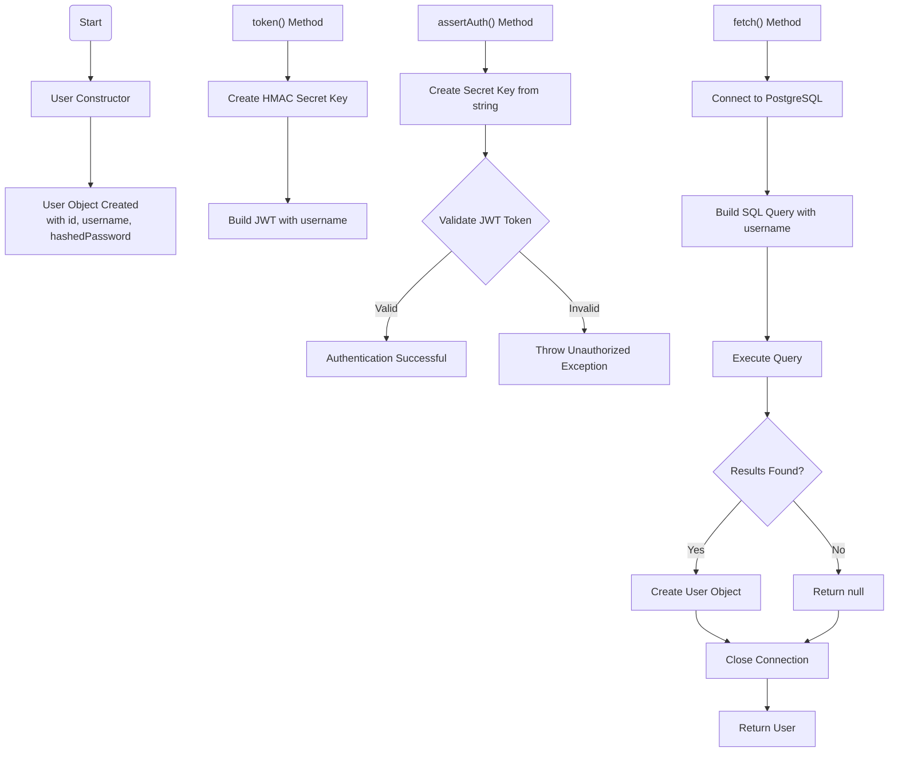
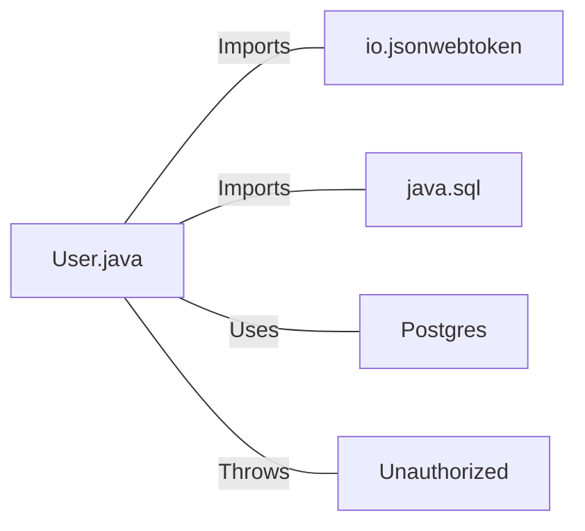

# User.java: User Authentication and Database Access Manager

## Overview
User.java manages user authentication, token generation, and database access for retrieving user information. It provides functionality for creating JWT tokens, validating authentication, and fetching user data from a PostgreSQL database.

## Process Flow

## Insights
- The class handles both user data representation and authentication logic
- JWT (JSON Web Token) is used for authentication with HMAC signing
- The token method appears to be incomplete in the provided code
- Database queries are executed using direct SQL statements
- User passwords are stored in hashed format as indicated by the variable name

## Dependencies

- `java.sql.Connection`, `java.sql.Statement`, `java.sql.ResultSet`: Used for database connectivity and query execution
- `io.jsonwebtoken`: Library used for JWT token generation and validation
- `javax.crypto.SecretKey`: Used for cryptographic key generation
- `Postgres`: Custom class used to establish database connections
- `Unauthorized`: Custom exception class thrown during authentication failures

## Data Manipulation (SQL)
`users`: SELECT operation to retrieve user information by username, including user_id, username, and password fields

## Vulnerabilities
1. **SQL Injection**: The `fetch()` method constructs SQL queries by directly concatenating user input (`un` parameter) without sanitization, making it vulnerable to SQL injection attacks.

2. **Incomplete Token Generation**: The `token()` method is incomplete, ending abruptly at `signWit`, which suggests the code might not be functioning correctly.

3. **Insecure Key Handling**: The JWT secret key is passed as a string parameter and converted to bytes without proper key management practices.

4. **Exception Handling**: The code prints stack traces to standard output, which could leak sensitive information in production environments.

5. **Database Connection Management**: The connection is closed in the try block but not in a finally block, which could lead to connection leaks if exceptions occur.

6. **Password Storage**: While the variable name suggests passwords are hashed, there's no verification of the hashing algorithm's security, and the code doesn't show how passwords are validated.
