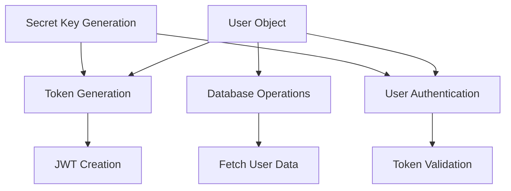
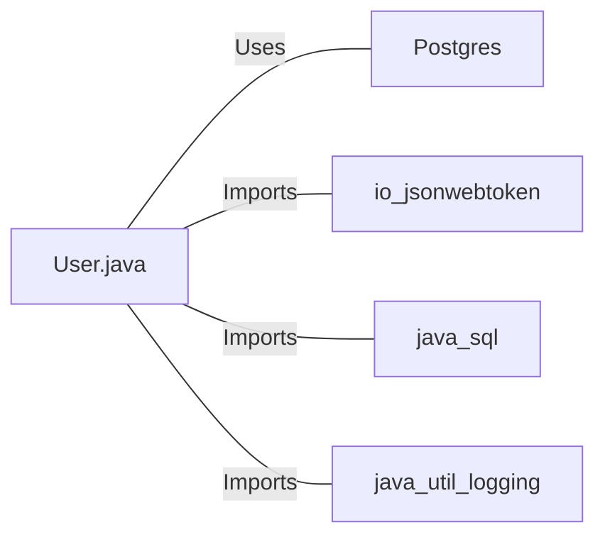

# User.java: User Authentication and Management System

## Overview

This Java class, `User`, is responsible for user authentication, token generation, and database operations related to user management. It includes methods for creating and validating JWT tokens, fetching user data from a database, and generating secret keys for token signing.

## Process Flow

## Insights

- The class uses JWT (JSON Web Tokens) for user authentication.
- Database operations are performed using prepared statements to prevent SQL injection.
- The class implements logging for various operations and error handling.
- User passwords are stored as hashed values in the database.
- The `generateKey` method creates a secret key for JWT signing.
- The class uses a PostgreSQL database for storing user information.

## Dependencies

- `Postgres`: Used for database connection management
- `io.jsonwebtoken`: Library for JWT token creation and validation
- `java.sql`: Used for database operations (Connection, PreparedStatement, ResultSet)
- `java.util.logging`: Used for logging operations and errors

## Data Manipulation (SQL)

| Entity | Attributes | Data Type | Description |
|--------|------------|-----------|-------------|
| users  | user_id    | String    | Unique identifier for the user |
|        | username   | String    | User's username |
|        | password   | String    | Hashed password of the user |

- `users`: SELECT operation to fetch user data based on the username

## Vulnerabilities

1. **Insufficient Error Handling**: The `fetch` method throws a generic `RuntimeException` when a database error occurs. This could potentially expose sensitive information in stack traces if not properly caught and handled in the calling code.

2. **Potential SQL Injection**: While the code uses prepared statements, which generally protect against SQL injection, the `username` parameter in the `fetch` method is directly used in the SQL query. If this method is called with user-supplied input without proper validation, it could still be vulnerable to SQL injection attacks.

3. **Weak Secret Key Generation**: The `generateKey` method uses the raw bytes of the secret string for key generation. This approach might not be secure enough for production use, especially if the secret is not sufficiently long or complex. A more secure key derivation function should be used.

4. **Token Expiration**: The JWT token generated in the `token` method does not include an expiration time. This could lead to tokens being valid indefinitely, which is a security risk.

5. **Password Storage**: While the code refers to a "hashedPassword", there's no indication of salt usage or the strength of the hashing algorithm. Proper password hashing techniques (like bcrypt, scrypt, or Argon2) should be used to securely store passwords.

6. **Logging Sensitive Information**: The `assertAuth` method logs the username from the token. Depending on the log level and where logs are stored, this could potentially expose user information.

7. **Exception Handling in Token Validation**: The `assertAuth` method catches all exceptions and throws a generic `Unauthorized` exception. This could mask specific issues (like token expiration vs. invalid signature) and make debugging more difficult.

8. **Lack of Input Validation**: There's no input validation on the `username` parameter in the `fetch` method. This could lead to unexpected behavior or potential security issues if malformed input is provided.

These vulnerabilities should be addressed to improve the overall security of the application.
