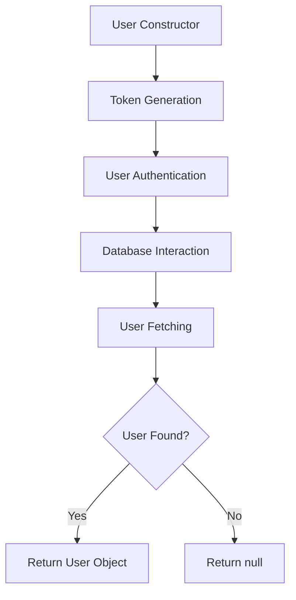
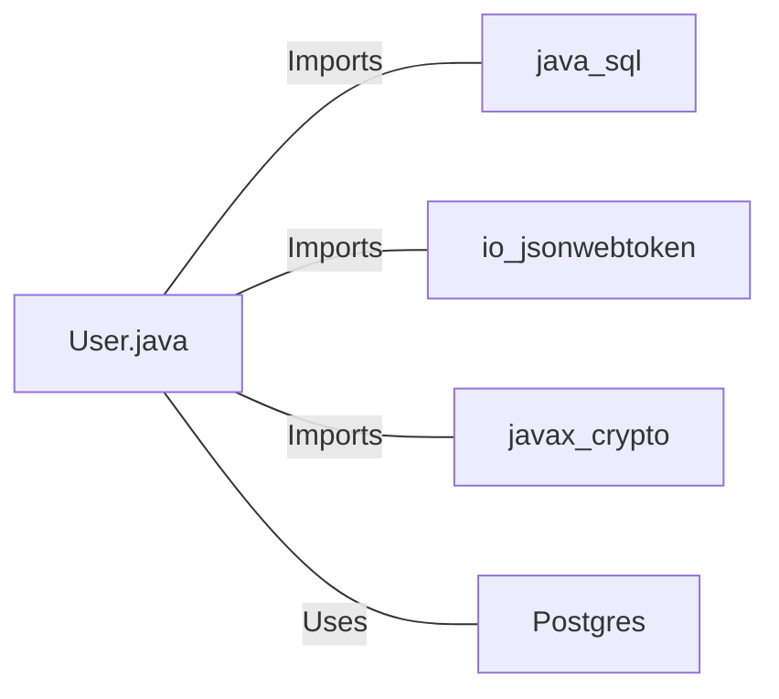

# User.java: User Authentication and Database Interaction

## Overview

This Java class, `User`, manages user authentication, token generation, and database interactions for user retrieval.

## Process Flow

## Insights

- The class uses JWT (JSON Web Tokens) for user authentication.
- Database interaction is performed using raw SQL queries, which is vulnerable to SQL injection attacks.
- The `assertAuth` method is incomplete and contains a syntax error.
- The class directly handles database connections and statements, which may lead to resource leaks if not properly managed.
- Error handling is present but could be improved to provide more specific error messages.

## Dependencies

- `java.sql`: Used for database connections and operations
- `io.jsonwebtoken`: Utilized for JWT token generation and parsing
- `javax.crypto`: Employed for cryptographic operations
- `Postgres`: Custom class used for database connection (not shown in the provided code)

## Data Manipulation (SQL)

`users`: SELECT operation to fetch user details based on the username

| Column Name | Description |
|-------------|-------------|
| user_id     | Unique identifier for the user |
| username    | User's username |
| password    | User's hashed password |

## Vulnerabilities

1. SQL Injection: The `fetch` method constructs an SQL query by directly concatenating user input (`un`) into the query string. This is a severe security vulnerability that allows malicious users to manipulate the query and potentially access or modify unauthorized data.

2. Incomplete Authentication: The `assertAuth` method is incomplete and contains a syntax error. This could lead to authentication bypass or errors in the authentication process.

3. Insecure Password Storage: The `hashedPassword` field suggests that passwords might be stored as hashes, but the implementation details are not visible. Ensure that a secure hashing algorithm with salt is used.

4. Potential Resource Leak: The database connection and statement are not closed in a `finally` block, which could lead to resource leaks, especially in case of exceptions.

5. Weak Error Handling: The catch block prints the stack trace and error message to the console, which might expose sensitive information in production environments.

6. Insecure JWT Usage: The JWT token is generated using a secret provided as a string parameter. The security of this depends on how the secret is managed and stored, which is not visible in this code snippet.

7. Lack of Input Validation: There's no visible input validation for the username or other user data, which could lead to various security issues beyond SQL injection.

To address these vulnerabilities, implement prepared statements for database queries, complete the authentication method, use secure password hashing, properly manage database resources, implement proper error handling, securely manage JWT secrets, and add input validation for all user-supplied data.
