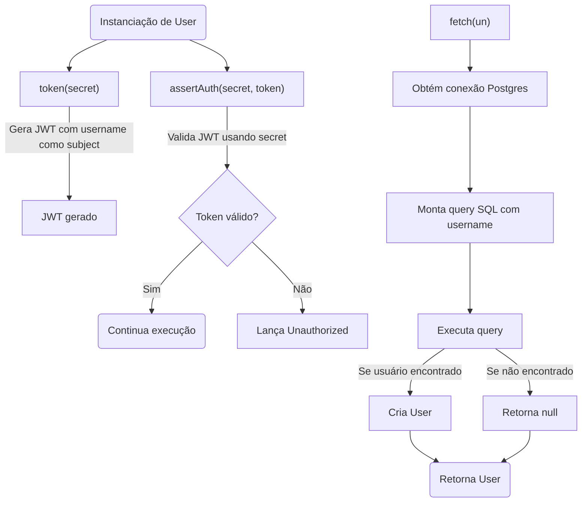
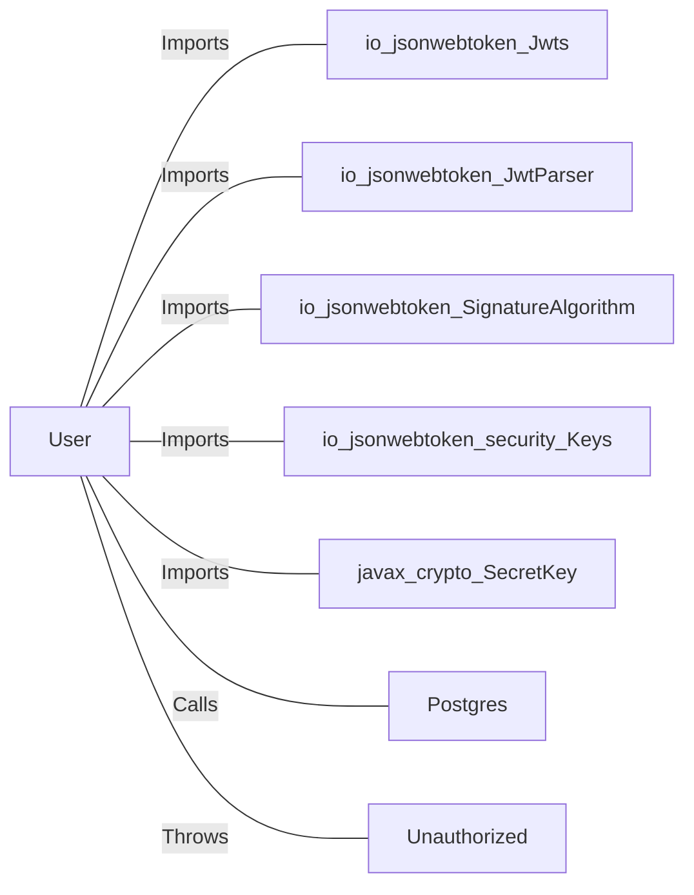

# User.java: Gerenciamento de Usuário e Autenticação JWT

## Overview

Esta classe representa a estrutura e operações principais relacionadas a um usuário do sistema, incluindo autenticação via JWT, busca de usuários no banco de dados e manipulação de credenciais.

## Process Flow

## Insights

- A classe implementa autenticação baseada em JWT, utilizando o username como subject do token.
- O método `fetch` busca um usuário no banco de dados pelo username, mas constrói a query SQL de forma insegura.
- O método `assertAuth` valida tokens JWT e lança uma exceção customizada (`Unauthorized`) em caso de falha.
- A senha do usuário é armazenada como `hashedPassword`, sugerindo que a senha é armazenada de forma segura (hash).
- O método `token` utiliza o algoritmo HMAC SHA para assinar o JWT.

## Vulnerabilities

- **SQL Injection**: O método `fetch` concatena diretamente o parâmetro `un` na query SQL, permitindo injeção de comandos SQL. Exemplo: se `un` contiver `' OR 1=1; --`, pode comprometer o banco de dados.
- **Execução de Comando Perigoso**: A query contém `;DROP TABLE USERS`, o que pode resultar na exclusão da tabela de usuários se a query for executada.
- **Exposição de Stacktrace**: Em caso de exceção, o stacktrace é impresso, o que pode expor detalhes sensíveis do sistema em ambientes de produção.
- **Uso de try-finally para retorno**: O uso de `finally` para retornar o usuário pode mascarar exceções e não é uma prática recomendada.

## Data Manipulation (SQL)

| Campo      | Tipo     | Descrição                        |
|------------|----------|----------------------------------|
| user_id    | String   | Identificador único do usuário   |
| username   | String   | Nome de usuário                  |
| password   | String   | Senha (armazenada como hash)     |

- **users**: Utilizado para buscar informações do usuário via SELECT.

## Dependencies

- `io_jsonwebtoken_Jwts` : Utilizado para criar e validar tokens JWT (Imports)
- `io_jsonwebtoken_JwtParser` : Parser de JWT (Imports)
- `io_jsonwebtoken_SignatureAlgorithm` : Algoritmo de assinatura do JWT (Imports)
- `io_jsonwebtoken_security_Keys` : Geração de chaves HMAC (Imports)
- `javax_crypto_SecretKey` : Representação da chave secreta (Imports)
- `Postgres` : Fornece conexão com o banco de dados (Calls)
- `Unauthorized` : Exceção lançada em caso de falha de autenticação (Throws)
